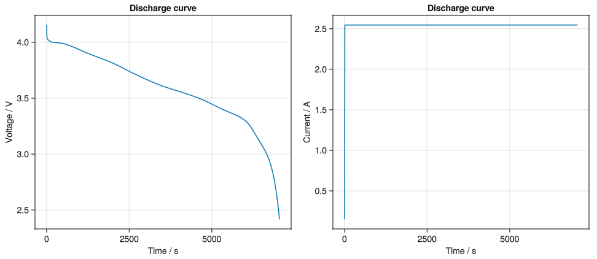

[](https://battmoteam.github.io/BattMo.jl/dev/)
[](https://github.com/battmoteam/BattMo.jl/actions/workflows/CI.yml?query=branch%3Amain)
<a href="https://doi.org/10.5281/zenodo.17313586"></a>

# BattMo.jl is a framework for continuum modelling of lithium-ion batteries written in Julia
> [!TIP]
> Please see the docs for more details, tutorials and examples: https://battmoteam.github.io/BattMo.jl/dev/


The Battery Modelling Toolbox (**BattMo**) is a resource for continuum modelling of electrochemical devices in MATLAB. The initial development features a pseudo X-dimensional (PXD) framework for the Doyle-Fuller-Newman model of lithium-ion battery cells. This is currently a early release that implements a subset of features from the [MATLAB version of BattMo](https://github.com/BattMoTeam/BattMo) with improved numerical performance. **BattMo.jl** is based on [Jutul.jl](https://github.com/sintefmath/Jutul.jl) and uses finite-volume discretizations and automatic differentiation to simulate models in 1D, 2D and 3D.


## Installation

This package is registered in the General Julia registry. To add it to your Julia environment, open Julia and run

```julia
using Pkg; Pkg.add("BattMo")
```

### Getting started

For an example of usage, you can add the GLMakie plotting package:

```julia
using Pkg
Pkg.add("GLMakie")
```

You can then run the following to simulate the predefined `p2d_40` case:

```julia
using BattMo, GLMakie

# BattMo stores cell parameters, cycling protocols and settings in a user-friendly JSON format to facilitate reuse. For our example, we load 
# the cell parameter set from a NMC811 vs Graphite-SiOx cell whose parameters were determined in the [Chen 2020 paper](https://doi.org/10.1149/1945-7111/ab9050). 
# We also load an example cycling protocol for a simple Constant Current Discharge.

cell_parameters = load_cell_parameters(; from_default_set = "chen_2020")
cycling_protocol = load_cycling_protocol(; from_default_set = "cc_discharge")

# Next, we select the Lithium-Ion Battery Model setup with default model settings. 
# The default Lithium-Ion Battery Model Setup selected below corresponds to a basic P2D model setup, where neither current collectors nor thermal effects are considered.

model_setup = LithiumIonBattery()

# Then we setup a Simulation by passing the model, cell parameters and a cycling protocol. 

# We first prepare the simulation: 

sim = Simulation(model_setup, cell_parameters, cycling_protocol);

# When the simulation is prepared, there are some validation checks happening in the background, which verify whether i) the cell parameters, cycling protocol and settings are sensible and complete 

# Now we can run the simulation
output = solve(sim;)

# The output is a SimulationOutput type storing the results of the simulation within multiple dictionaries. Let's plot the cell current and cell voltage over time and make a plot with the GLMakie package.

t = output.time_series["Time"]
E = output.time_series["Voltage"]
I = output.time_series["Current"]

fig = Figure()
ax = Axis(fig[1, 1], ylabel = "Voltage / V", xlabel = "Time / s", title = "Discharge curve")
lines!(ax, t, E)
ax = Axis(fig[1, 2], ylabel = "Current / A", xlabel = "Time / s", title = "Discharge curve")
lines!(ax, t, I)
display(fig)
```

This should produce the following plot:


### 3D simulation example

Run a 3D model and plot the results in an interactive viewer.

```julia
using BattMo

# For our example, we load 
# the cell parameter set from of a commercial Type LP2770120 prismatic LiFePO4/graphite cell whose parameters were determined in the [xU 2015 paper](https://doi.org/10.1016/j.energy.2014.11.073). 
# We also load an example cycling protocol for a simple Constant Current Discharge.

cell_parameters = load_cell_parameters(; from_default_set = "xu_2015")
cycling_protocol = load_cycling_protocol(; from_default_set = "cc_discharge")
model_settings = load_model_settings(; from_default_set = "p4d_pouch")
simulation_settings = load_simulation_settings(; from_default_set = "p4d_pouch")

model_setup = LithiumIonBattery(; model_settings)

sim = Simulation(model_setup, cell_parameters, cycling_protocol; simulation_settings);
output = solve(sim)

plot_3D_results(output)
```


## Acknowledgements

BattMo has received funding from the European Union’s Horizon 2020 innovation program under grant agreement numbers:

- 875527 HYDRA
- 957189 BIG-MAP
- 101104013 BATMAX
- 101103997 DigiBatt
