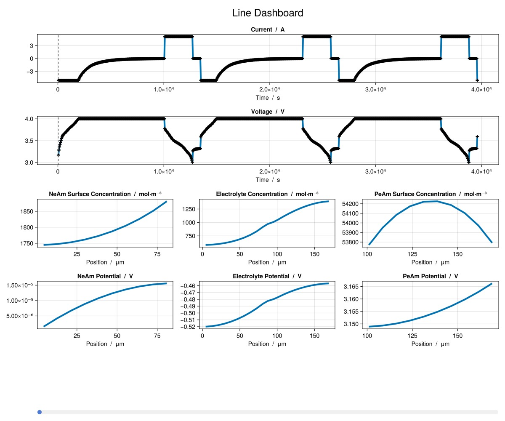

```julia
using BattMo, GLMakie

model_settings = load_model_settings(; from_default_set = "P2D")
model_settings["SEIModel"] = "Bolay"
cell_parameters = load_cell_parameters(; from_default_set = "Chen2020")
cycling_protocol = load_cycling_protocol(; from_default_set = "CCCV")
simulation_settings = load_simulation_settings(; from_default_set = "P2D")

model_setup = LithiumIonBattery(; model_settings)

sim = Simulation(model_setup, cell_parameters, cycling_protocol);

output = solve(sim;)

print_output_overview(output)


time_series = get_output_time_series(output)
states = get_output_states(output)
metrics = get_output_metrics(output)
```


```ansi
(DischargeCapacity = [3.6764157469683036, 3.6764157469683036, 3.6764157469683036, 0.0], CycleNumber = [0, 0, 0, 0, 0, 0, 0, 0, 0, 0  …  2, 2, 2, 2, 2, 2, 2, 2, 2, 3], RoundTripEfficiency = [0.7741284609506469, 0.886738137269977, 0.8863390818941055, NaN], ChargeEnergy = [59700.9758391838, 52080.24253506345, 52073.217656556146, 0.0], DischargeEnergy = [45323.801702863864, 45289.499748504706, 45262.71181943704, 0.0], ChargeCapacity = [-4.292720634462441, -3.6813288676291807, -3.6791398379397506, 0.0])
```


Plot a pre-defined dashboard

```julia
plot_dashboard(output)
```



Or create your own dashboard

```julia
NeAm_end_index = simulation_settings["GridResolution"]["NegativeElectrodeCoating"]

plot_output(
	output,
	[
		["SEIThickness vs Time at Position index 1", "SEIThickness vs Time at Position index $NeAm_end_index"],
		["NeAmConcentration vs Time and Position at Radius index 1"],
	];
	layout = (2, 1),
)
```


## Example on GitHub {#Example-on-GitHub}

If you would like to run this example yourself, it can be downloaded from the BattMo.jl GitHub repository [as a script](https://github.com/BattMoTeam/BattMo.jl/blob/main/examples/example_1d_plotting.jl), or as a [Jupyter Notebook](https://github.com/BattMoTeam/BattMo.jl/blob/gh-pages/dev/final_site/notebooks/example_1d_plotting.ipynb)


---


_This page was generated using [Literate.jl](https://github.com/fredrikekre/Literate.jl)._
