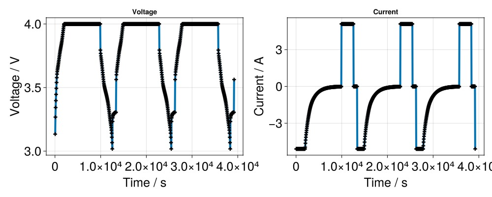

# Cycling a battery 40 times with a constant current constant voltage (CCCV) control {#Cycling-a-battery-40-times-with-a-constant-current-constant-voltage-CCCV-control}

```julia
using BattMo, GLMakie
```


We use the setup provided in the [p2d_40.json](https://github.com/BattMoTeam/BattMo.jl/blob/main/test/data/jsonfiles/p2d_40.json#L152) file. In particular, see the data under the `Control` key.

```julia
file_path_cell = parameter_file_path("cell_parameters", "Chen2020.json")
file_path_model = parameter_file_path("model_settings", "P2D.json")
file_path_cycling = parameter_file_path("cycling_protocols", "CCCV.json")
file_path_simulation = parameter_file_path("simulation_settings", "P2D.json")

cell_parameters = load_cell_parameters(; from_file_path = file_path_cell)
cycling_protocol = load_cycling_protocol(; from_file_path = file_path_cycling)
model_settings = load_model_settings(; from_file_path = file_path_model)
simulation_settings = load_simulation_settings(; from_file_path = file_path_simulation)

model_setup = LithiumIonBattery(; model_settings);

sim = Simulation(model_setup, cell_parameters, cycling_protocol; simulation_settings);
output = solve(sim; info_level = 1)


states = output[:states]

t = [state[:Control][:Controller].time for state in states]
E = [state[:Control][:Phi][1] for state in states]
I = [state[:Control][:Current][1] for state in states]
```


```ansi
✔️ Validation of ModelSettings passed: No issues found.
──────────────────────────────────────────────────
✔️ Validation of CellParameters passed: No issues found.
──────────────────────────────────────────────────
✔️ Validation of CyclingProtocol passed: No issues found.
──────────────────────────────────────────────────
✔️ Validation of SimulationSettings passed: No issues found.
──────────────────────────────────────────────────
Jutul: Simulating 15 hours as 1080 report steps
Step    1/1080: Solving start to 50 seconds, Δt = 50 seconds
Step    2/1080: Solving 50 seconds to 1 minute, 40 seconds, Δt = 50 seconds
Step    3/1080: Solving 1 minute, 40 seconds to 2 minutes, 30 seconds, Δt = 50 seconds
Step    4/1080: Solving 2 minutes, 30 seconds to 3 minutes, 20 seconds, Δt = 50 seconds
Step    5/1080: Solving 3 minutes, 20 seconds to 4 minutes, 10 seconds, Δt = 50 seconds
Step    6/1080: Solving 4 minutes, 10 seconds to 5 minutes, Δt = 50 seconds
Step    7/1080: Solving 5 minutes to 5 minutes, 50 seconds, Δt = 50 seconds
Step    8/1080: Solving 5 minutes, 50 seconds to 6 minutes, 40 seconds, Δt = 50 seconds
Step    9/1080: Solving 6 minutes, 40 seconds to 7 minutes, 30 seconds, Δt = 50 seconds
Step   10/1080: Solving 7 minutes, 30 seconds to 8 minutes, 20 seconds, Δt = 50 seconds
Step   11/1080: Solving 8 minutes, 20 seconds to 9 minutes, 10 seconds, Δt = 50 seconds
Step   12/1080: Solving 9 minutes, 10 seconds to 10 minutes, Δt = 50 seconds
Step   13/1080: Solving 10 minutes to 10 minutes, 50 seconds, Δt = 50 seconds
Step   14/1080: Solving 10 minutes, 50 seconds to 11 minutes, 40 seconds, Δt = 50 seconds
Step   15/1080: Solving 11 minutes, 40 seconds to 12 minutes, 30 seconds, Δt = 50 seconds
Step   16/1080: Solving 12 minutes, 30 seconds to 13 minutes, 20 seconds, Δt = 50 seconds
Step   17/1080: Solving 13 minutes, 20 seconds to 14 minutes, 10 seconds, Δt = 50 seconds
Step   18/1080: Solving 14 minutes, 10 seconds to 15 minutes, Δt = 50 seconds
Step   19/1080: Solving 15 minutes to 15 minutes, 50 seconds, Δt = 50 seconds
Step   20/1080: Solving 15 minutes, 50 seconds to 16 minutes, 40 seconds, Δt = 50 seconds
Step   21/1080: Solving 16 minutes, 40 seconds to 17 minutes, 30 seconds, Δt = 50 seconds
Step   22/1080: Solving 17 minutes, 30 seconds to 18 minutes, 20 seconds, Δt = 50 seconds
Step   23/1080: Solving 18 minutes, 20 seconds to 19 minutes, 10 seconds, Δt = 50 seconds
Step   24/1080: Solving 19 minutes, 10 seconds to 20 minutes, Δt = 50 seconds
Step   25/1080: Solving 20 minutes to 20 minutes, 50 seconds, Δt = 50 seconds
Step   26/1080: Solving 20 minutes, 50 seconds to 21 minutes, 40 seconds, Δt = 50 seconds
Step   27/1080: Solving 21 minutes, 40 seconds to 22 minutes, 30 seconds, Δt = 50 seconds
Step   28/1080: Solving 22 minutes, 30 seconds to 23 minutes, 20 seconds, Δt = 50 seconds
Step   29/1080: Solving 23 minutes, 20 seconds to 24 minutes, 10 seconds, Δt = 50 seconds
Step   30/1080: Solving 24 minutes, 10 seconds to 25 minutes, Δt = 50 seconds
Step   31/1080: Solving 25 minutes to 25 minutes, 50 seconds, Δt = 50 seconds
Step   32/1080: Solving 25 minutes, 50 seconds to 26 minutes, 40 seconds, Δt = 50 seconds
Step   33/1080: Solving 26 minutes, 40 seconds to 27 minutes, 30 seconds, Δt = 50 seconds
Step   34/1080: Solving 27 minutes, 30 seconds to 28 minutes, 20 seconds, Δt = 50 seconds
Step   35/1080: Solving 28 minutes, 20 seconds to 29 minutes, 10 seconds, Δt = 50 seconds
Step   36/1080: Solving 29 minutes, 10 seconds to 30 minutes, Δt = 50 seconds
Step   37/1080: Solving 30 minutes to 30 minutes, 50 seconds, Δt = 50 seconds
Step   38/1080: Solving 30 minutes, 50 seconds to 31 minutes, 40 seconds, Δt = 50 seconds
Step   39/1080: Solving 31 minutes, 40 seconds to 32 minutes, 30 seconds, Δt = 50 seconds
Step   40/1080: Solving 32 minutes, 30 seconds to 33 minutes, 20 seconds, Δt = 50 seconds
Convergence: Report step 40, mini-step #1 (50 seconds) failed to converge. Reducing mini-step.
Convergence: Report step 40, mini-step #3 (25 seconds) failed to converge. Reducing mini-step.
Convergence: Report step 40, mini-step #4 (12 seconds, 500 milliseconds) failed to converge. Reducing mini-step.
Convergence: Report step 40, mini-step #6 (18 seconds, 750 milliseconds) failed to converge. Reducing mini-step.
Convergence: Report step 40, mini-step #7 (9 seconds, 375 milliseconds) failed to converge. Reducing mini-step.
Convergence: Report step 40, mini-step #8 (4 seconds, 687.5 milliseconds) failed to converge. Reducing mini-step.
Step   41/1080: Solving 33 minutes, 20 seconds to 34 minutes, 10 seconds, Δt = 50 seconds
Step   42/1080: Solving 34 minutes, 10 seconds to 35 minutes, Δt = 50 seconds
Step   43/1080: Solving 35 minutes to 35 minutes, 50 seconds, Δt = 50 seconds
Step   44/1080: Solving 35 minutes, 50 seconds to 36 minutes, 40 seconds, Δt = 50 seconds
Step   45/1080: Solving 36 minutes, 40 seconds to 37 minutes, 30 seconds, Δt = 50 seconds
Step   46/1080: Solving 37 minutes, 30 seconds to 38 minutes, 20 seconds, Δt = 50 seconds
Step   47/1080: Solving 38 minutes, 20 seconds to 39 minutes, 10 seconds, Δt = 50 seconds
Step   48/1080: Solving 39 minutes, 10 seconds to 40 minutes, Δt = 50 seconds
Step   49/1080: Solving 40 minutes to 40 minutes, 50 seconds, Δt = 50 seconds
Step   50/1080: Solving 40 minutes, 50 seconds to 41 minutes, 40 seconds, Δt = 50 seconds
Step   51/1080: Solving 41 minutes, 40 seconds to 42 minutes, 30 seconds, Δt = 50 seconds
Step   52/1080: Solving 42 minutes, 30 seconds to 43 minutes, 20 seconds, Δt = 50 seconds
Step   53/1080: Solving 43 minutes, 20 seconds to 44 minutes, 10 seconds, Δt = 50 seconds
Step   54/1080: Solving 44 minutes, 10 seconds to 45 minutes, Δt = 50 seconds
Step   55/1080: Solving 45 minutes to 45 minutes, 50 seconds, Δt = 50 seconds
Step   56/1080: Solving 45 minutes, 50 seconds to 46 minutes, 40 seconds, Δt = 50 seconds
Step   57/1080: Solving 46 minutes, 40 seconds to 47 minutes, 30 seconds, Δt = 50 seconds
Step   58/1080: Solving 47 minutes, 30 seconds to 48 minutes, 20 seconds, Δt = 50 seconds
Step   59/1080: Solving 48 minutes, 20 seconds to 49 minutes, 10 seconds, Δt = 50 seconds
Step   60/1080: Solving 49 minutes, 10 seconds to 50 minutes, Δt = 50 seconds
Step   61/1080: Solving 50 minutes to 50 minutes, 50 seconds, Δt = 50 seconds
Step   62/1080: Solving 50 minutes, 50 seconds to 51 minutes, 40 seconds, Δt = 50 seconds
Step   63/1080: Solving 51 minutes, 40 seconds to 52 minutes, 30 seconds, Δt = 50 seconds
Step   64/1080: Solving 52 minutes, 30 seconds to 53 minutes, 20 seconds, Δt = 50 seconds
Step   65/1080: Solving 53 minutes, 20 seconds to 54 minutes, 10 seconds, Δt = 50 seconds
Step   66/1080: Solving 54 minutes, 10 seconds to 55 minutes, Δt = 50 seconds
Step   67/1080: Solving 55 minutes to 55 minutes, 50 seconds, Δt = 50 seconds
Step   68/1080: Solving 55 minutes, 50 seconds to 56 minutes, 40 seconds, Δt = 50 seconds
Step   69/1080: Solving 56 minutes, 40 seconds to 57 minutes, 30 seconds, Δt = 50 seconds
Step   70/1080: Solving 57 minutes, 30 seconds to 58 minutes, 20 seconds, Δt = 50 seconds
Step   71/1080: Solving 58 minutes, 20 seconds to 59 minutes, 10 seconds, Δt = 50 seconds
Step   72/1080: Solving 59 minutes, 10 seconds to 1 hour, Δt = 50 seconds
Step   73/1080: Solving 1 hour to 1 hour, 50 seconds, Δt = 50 seconds
Step   74/1080: Solving 1 hour, 50 seconds to 1 hour, 1.667 minute, Δt = 50 seconds
Step   75/1080: Solving 1 hour, 1.667 minute to 1 hour, 2.5 minutes, Δt = 50 seconds
Step   76/1080: Solving 1 hour, 2.5 minutes to 1 hour, 3.333 minutes, Δt = 50 seconds
Step   77/1080: Solving 1 hour, 3.333 minutes to 1 hour, 4.167 minutes, Δt = 50 seconds
Step   78/1080: Solving 1 hour, 4.167 minutes to 1 hour, 5 minutes, Δt = 50 seconds
Step   79/1080: Solving 1 hour, 5 minutes to 1 hour, 5.833 minutes, Δt = 50 seconds
Step   80/1080: Solving 1 hour, 5.833 minutes to 1 hour, 6.667 minutes, Δt = 50 seconds
Step   81/1080: Solving 1 hour, 6.667 minutes to 1 hour, 7.5 minutes, Δt = 50 seconds
Step   82/1080: Solving 1 hour, 7.5 minutes to 1 hour, 8.333 minutes, Δt = 50 seconds
Step   83/1080: Solving 1 hour, 8.333 minutes to 1 hour, 9.167 minutes, Δt = 50 seconds
Step   84/1080: Solving 1 hour, 9.167 minutes to 1 hour, 10 minutes, Δt = 50 seconds
Step   85/1080: Solving 1 hour, 10 minutes to 1 hour, 10.83 minutes, Δt = 50 seconds
Step   86/1080: Solving 1 hour, 10.83 minutes to 1 hour, 11.67 minutes, Δt = 50 seconds
Step   87/1080: Solving 1 hour, 11.67 minutes to 1 hour, 12.5 minutes, Δt = 50 seconds
Step   88/1080: Solving 1 hour, 12.5 minutes to 1 hour, 13.33 minutes, Δt = 50 seconds
Step   89/1080: Solving 1 hour, 13.33 minutes to 1 hour, 14.17 minutes, Δt = 50 seconds
Step   90/1080: Solving 1 hour, 14.17 minutes to 1 hour, 15 minutes, Δt = 50 seconds
Step   91/1080: Solving 1 hour, 15 minutes to 1 hour, 15.83 minutes, Δt = 50 seconds
Step   92/1080: Solving 1 hour, 15.83 minutes to 1 hour, 16.67 minutes, Δt = 50 seconds
Step   93/1080: Solving 1 hour, 16.67 minutes to 1 hour, 17.5 minutes, Δt = 50 seconds
Step   94/1080: Solving 1 hour, 17.5 minutes to 1 hour, 18.33 minutes, Δt = 50 seconds
Step   95/1080: Solving 1 hour, 18.33 minutes to 1 hour, 19.17 minutes, Δt = 50 seconds
Step   96/1080: Solving 1 hour, 19.17 minutes to 1 hour, 20 minutes, Δt = 50 seconds
Step   97/1080: Solving 1 hour, 20 minutes to 1 hour, 20.83 minutes, Δt = 50 seconds
Step   98/1080: Solving 1 hour, 20.83 minutes to 1 hour, 21.67 minutes, Δt = 50 seconds
Step   99/1080: Solving 1 hour, 21.67 minutes to 1 hour, 22.5 minutes, Δt = 50 seconds
Step  100/1080: Solving 1 hour, 22.5 minutes to 1 hour, 23.33 minutes, Δt = 50 seconds
Step  101/1080: Solving 1 hour, 23.33 minutes to 1 hour, 24.17 minutes, Δt = 50 seconds
Step  102/1080: Solving 1 hour, 24.17 minutes to 1 hour, 25 minutes, Δt = 50 seconds
Step  103/1080: Solving 1 hour, 25 minutes to 1 hour, 25.83 minutes, Δt = 50 seconds
Step  104/1080: Solving 1 hour, 25.83 minutes to 1 hour, 26.67 minutes, Δt = 50 seconds
Step  105/1080: Solving 1 hour, 26.67 minutes to 1 hour, 27.5 minutes, Δt = 50 seconds
Step  106/1080: Solving 1 hour, 27.5 minutes to 1 hour, 28.33 minutes, Δt = 50 seconds
Step  107/1080: Solving 1 hour, 28.33 minutes to 1 hour, 29.17 minutes, Δt = 50 seconds
Step  108/1080: Solving 1 hour, 29.17 minutes to 1 hour, 30 minutes, Δt = 50 seconds
Step  109/1080: Solving 1 hour, 30 minutes to 1 hour, 30.83 minutes, Δt = 50 seconds
Step  110/1080: Solving 1 hour, 30.83 minutes to 1 hour, 31.67 minutes, Δt = 50 seconds
Step  111/1080: Solving 1 hour, 31.67 minutes to 1 hour, 32.5 minutes, Δt = 50 seconds
Step  112/1080: Solving 1 hour, 32.5 minutes to 1 hour, 33.33 minutes, Δt = 50 seconds
Step  113/1080: Solving 1 hour, 33.33 minutes to 1 hour, 34.17 minutes, Δt = 50 seconds
Step  114/1080: Solving 1 hour, 34.17 minutes to 1 hour, 35 minutes, Δt = 50 seconds
Step  115/1080: Solving 1 hour, 35 minutes to 1 hour, 35.83 minutes, Δt = 50 seconds
Step  116/1080: Solving 1 hour, 35.83 minutes to 1 hour, 36.67 minutes, Δt = 50 seconds
Step  117/1080: Solving 1 hour, 36.67 minutes to 1 hour, 37.5 minutes, Δt = 50 seconds
Step  118/1080: Solving 1 hour, 37.5 minutes to 1 hour, 38.33 minutes, Δt = 50 seconds
Step  119/1080: Solving 1 hour, 38.33 minutes to 1 hour, 39.17 minutes, Δt = 50 seconds
Step  120/1080: Solving 1 hour, 39.17 minutes to 1 hour, 40 minutes, Δt = 50 seconds
Step  121/1080: Solving 1 hour, 40 minutes to 1 hour, 40.83 minutes, Δt = 50 seconds
Step  122/1080: Solving 1 hour, 40.83 minutes to 1 hour, 41.67 minutes, Δt = 50 seconds
Step  123/1080: Solving 1 hour, 41.67 minutes to 1 hour, 42.5 minutes, Δt = 50 seconds
Step  124/1080: Solving 1 hour, 42.5 minutes to 1 hour, 43.33 minutes, Δt = 50 seconds
Step  125/1080: Solving 1 hour, 43.33 minutes to 1 hour, 44.17 minutes, Δt = 50 seconds
Step  126/1080: Solving 1 hour, 44.17 minutes to 1 hour, 45 minutes, Δt = 50 seconds
Step  127/1080: Solving 1 hour, 45 minutes to 1 hour, 45.83 minutes, Δt = 50 seconds
Step  128/1080: Solving 1 hour, 45.83 minutes to 1 hour, 46.67 minutes, Δt = 50 seconds
Step  129/1080: Solving 1 hour, 46.67 minutes to 1 hour, 47.5 minutes, Δt = 50 seconds
Step  130/1080: Solving 1 hour, 47.5 minutes to 1 hour, 48.33 minutes, Δt = 50 seconds
Step  131/1080: Solving 1 hour, 48.33 minutes to 1 hour, 49.17 minutes, Δt = 50 seconds
Step  132/1080: Solving 1 hour, 49.17 minutes to 1 hour, 50 minutes, Δt = 50 seconds
Step  133/1080: Solving 1 hour, 50 minutes to 1 hour, 50.83 minutes, Δt = 50 seconds
Step  134/1080: Solving 1 hour, 50.83 minutes to 1 hour, 51.67 minutes, Δt = 50 seconds
Step  135/1080: Solving 1 hour, 51.67 minutes to 1 hour, 52.5 minutes, Δt = 50 seconds
Step  136/1080: Solving 1 hour, 52.5 minutes to 1 hour, 53.33 minutes, Δt = 50 seconds
Step  137/1080: Solving 1 hour, 53.33 minutes to 1 hour, 54.17 minutes, Δt = 50 seconds
Step  138/1080: Solving 1 hour, 54.17 minutes to 1 hour, 55 minutes, Δt = 50 seconds
Step  139/1080: Solving 1 hour, 55 minutes to 1 hour, 55.83 minutes, Δt = 50 seconds
Step  140/1080: Solving 1 hour, 55.83 minutes to 1 hour, 56.67 minutes, Δt = 50 seconds
Step  141/1080: Solving 1 hour, 56.67 minutes to 1 hour, 57.5 minutes, Δt = 50 seconds
Step  142/1080: Solving 1 hour, 57.5 minutes to 1 hour, 58.33 minutes, Δt = 50 seconds
Step  143/1080: Solving 1 hour, 58.33 minutes to 1 hour, 59.17 minutes, Δt = 50 seconds
Step  144/1080: Solving 1 hour, 59.17 minutes to 2 hours, Δt = 50 seconds
Step  145/1080: Solving 2 hours to 2 hours, 50 seconds, Δt = 50 seconds
Step  146/1080: Solving 2 hours, 50 seconds to 2 hours, 1.667 minute, Δt = 50 seconds
Step  147/1080: Solving 2 hours, 1.667 minute to 2 hours, 2.5 minutes, Δt = 50 seconds
Step  148/1080: Solving 2 hours, 2.5 minutes to 2 hours, 3.333 minutes, Δt = 50 seconds
Step  149/1080: Solving 2 hours, 3.333 minutes to 2 hours, 4.167 minutes, Δt = 50 seconds
Step  150/1080: Solving 2 hours, 4.167 minutes to 2 hours, 5 minutes, Δt = 50 seconds
Step  151/1080: Solving 2 hours, 5 minutes to 2 hours, 5.833 minutes, Δt = 50 seconds
Step  152/1080: Solving 2 hours, 5.833 minutes to 2 hours, 6.667 minutes, Δt = 50 seconds
Step  153/1080: Solving 2 hours, 6.667 minutes to 2 hours, 7.5 minutes, Δt = 50 seconds
Step  154/1080: Solving 2 hours, 7.5 minutes to 2 hours, 8.333 minutes, Δt = 50 seconds
Step  155/1080: Solving 2 hours, 8.333 minutes to 2 hours, 9.167 minutes, Δt = 50 seconds
Step  156/1080: Solving 2 hours, 9.167 minutes to 2 hours, 10 minutes, Δt = 50 seconds
Step  157/1080: Solving 2 hours, 10 minutes to 2 hours, 10.83 minutes, Δt = 50 seconds
Step  158/1080: Solving 2 hours, 10.83 minutes to 2 hours, 11.67 minutes, Δt = 50 seconds
Step  159/1080: Solving 2 hours, 11.67 minutes to 2 hours, 12.5 minutes, Δt = 50 seconds
Step  160/1080: Solving 2 hours, 12.5 minutes to 2 hours, 13.33 minutes, Δt = 50 seconds
Step  161/1080: Solving 2 hours, 13.33 minutes to 2 hours, 14.17 minutes, Δt = 50 seconds
Step  162/1080: Solving 2 hours, 14.17 minutes to 2 hours, 15 minutes, Δt = 50 seconds
Step  163/1080: Solving 2 hours, 15 minutes to 2 hours, 15.83 minutes, Δt = 50 seconds
Step  164/1080: Solving 2 hours, 15.83 minutes to 2 hours, 16.67 minutes, Δt = 50 seconds
Step  165/1080: Solving 2 hours, 16.67 minutes to 2 hours, 17.5 minutes, Δt = 50 seconds
Step  166/1080: Solving 2 hours, 17.5 minutes to 2 hours, 18.33 minutes, Δt = 50 seconds
Step  167/1080: Solving 2 hours, 18.33 minutes to 2 hours, 19.17 minutes, Δt = 50 seconds
Step  168/1080: Solving 2 hours, 19.17 minutes to 2 hours, 20 minutes, Δt = 50 seconds
Step  169/1080: Solving 2 hours, 20 minutes to 2 hours, 20.83 minutes, Δt = 50 seconds
Step  170/1080: Solving 2 hours, 20.83 minutes to 2 hours, 21.67 minutes, Δt = 50 seconds
Step  171/1080: Solving 2 hours, 21.67 minutes to 2 hours, 22.5 minutes, Δt = 50 seconds
Step  172/1080: Solving 2 hours, 22.5 minutes to 2 hours, 23.33 minutes, Δt = 50 seconds
Step  173/1080: Solving 2 hours, 23.33 minutes to 2 hours, 24.17 minutes, Δt = 50 seconds
Step  174/1080: Solving 2 hours, 24.17 minutes to 2 hours, 25 minutes, Δt = 50 seconds
Step  175/1080: Solving 2 hours, 25 minutes to 2 hours, 25.83 minutes, Δt = 50 seconds
Step  176/1080: Solving 2 hours, 25.83 minutes to 2 hours, 26.67 minutes, Δt = 50 seconds
Step  177/1080: Solving 2 hours, 26.67 minutes to 2 hours, 27.5 minutes, Δt = 50 seconds
Step  178/1080: Solving 2 hours, 27.5 minutes to 2 hours, 28.33 minutes, Δt = 50 seconds
Step  179/1080: Solving 2 hours, 28.33 minutes to 2 hours, 29.17 minutes, Δt = 50 seconds
Step  180/1080: Solving 2 hours, 29.17 minutes to 2 hours, 30 minutes, Δt = 50 seconds
Step  181/1080: Solving 2 hours, 30 minutes to 2 hours, 30.83 minutes, Δt = 50 seconds
Step  182/1080: Solving 2 hours, 30.83 minutes to 2 hours, 31.67 minutes, Δt = 50 seconds
Step  183/1080: Solving 2 hours, 31.67 minutes to 2 hours, 32.5 minutes, Δt = 50 seconds
Step  184/1080: Solving 2 hours, 32.5 minutes to 2 hours, 33.33 minutes, Δt = 50 seconds
Step  185/1080: Solving 2 hours, 33.33 minutes to 2 hours, 34.17 minutes, Δt = 50 seconds
Step  186/1080: Solving 2 hours, 34.17 minutes to 2 hours, 35 minutes, Δt = 50 seconds
Step  187/1080: Solving 2 hours, 35 minutes to 2 hours, 35.83 minutes, Δt = 50 seconds
Step  188/1080: Solving 2 hours, 35.83 minutes to 2 hours, 36.67 minutes, Δt = 50 seconds
Step  189/1080: Solving 2 hours, 36.67 minutes to 2 hours, 37.5 minutes, Δt = 50 seconds
Step  190/1080: Solving 2 hours, 37.5 minutes to 2 hours, 38.33 minutes, Δt = 50 seconds
Step  191/1080: Solving 2 hours, 38.33 minutes to 2 hours, 39.17 minutes, Δt = 50 seconds
Step  192/1080: Solving 2 hours, 39.17 minutes to 2 hours, 40 minutes, Δt = 50 seconds
Step  193/1080: Solving 2 hours, 40 minutes to 2 hours, 40.83 minutes, Δt = 50 seconds
Step  194/1080: Solving 2 hours, 40.83 minutes to 2 hours, 41.67 minutes, Δt = 50 seconds
Step  195/1080: Solving 2 hours, 41.67 minutes to 2 hours, 42.5 minutes, Δt = 50 seconds
Step  196/1080: Solving 2 hours, 42.5 minutes to 2 hours, 43.33 minutes, Δt = 50 seconds
Step  197/1080: Solving 2 hours, 43.33 minutes to 2 hours, 44.17 minutes, Δt = 50 seconds
Step  198/1080: Solving 2 hours, 44.17 minutes to 2 hours, 45 minutes, Δt = 50 seconds
Step  199/1080: Solving 2 hours, 45 minutes to 2 hours, 45.83 minutes, Δt = 50 seconds
Step  200/1080: Solving 2 hours, 45.83 minutes to 2 hours, 46.67 minutes, Δt = 50 seconds
Step  201/1080: Solving 2 hours, 46.67 minutes to 2 hours, 47.5 minutes, Δt = 50 seconds
Step  202/1080: Solving 2 hours, 47.5 minutes to 2 hours, 48.33 minutes, Δt = 50 seconds
Step  203/1080: Solving 2 hours, 48.33 minutes to 2 hours, 49.17 minutes, Δt = 50 seconds
Step  204/1080: Solving 2 hours, 49.17 minutes to 2 hours, 50 minutes, Δt = 50 seconds
Step  205/1080: Solving 2 hours, 50 minutes to 2 hours, 50.83 minutes, Δt = 50 seconds
Step  206/1080: Solving 2 hours, 50.83 minutes to 2 hours, 51.67 minutes, Δt = 50 seconds
Step  207/1080: Solving 2 hours, 51.67 minutes to 2 hours, 52.5 minutes, Δt = 50 seconds
Step  208/1080: Solving 2 hours, 52.5 minutes to 2 hours, 53.33 minutes, Δt = 50 seconds
Step  209/1080: Solving 2 hours, 53.33 minutes to 2 hours, 54.17 minutes, Δt = 50 seconds
Step  210/1080: Solving 2 hours, 54.17 minutes to 2 hours, 55 minutes, Δt = 50 seconds
Step  211/1080: Solving 2 hours, 55 minutes to 2 hours, 55.83 minutes, Δt = 50 seconds
Step  212/1080: Solving 2 hours, 55.83 minutes to 2 hours, 56.67 minutes, Δt = 50 seconds
Step  213/1080: Solving 2 hours, 56.67 minutes to 2 hours, 57.5 minutes, Δt = 50 seconds
Step  214/1080: Solving 2 hours, 57.5 minutes to 2 hours, 58.33 minutes, Δt = 50 seconds
Step  215/1080: Solving 2 hours, 58.33 minutes to 2 hours, 59.17 minutes, Δt = 50 seconds
Step  216/1080: Solving 2 hours, 59.17 minutes to 3 hours, Δt = 50 seconds
Step  217/1080: Solving 3 hours to 3 hours, 50 seconds, Δt = 50 seconds
Step  218/1080: Solving 3 hours, 50 seconds to 3 hours, 1.667 minute, Δt = 50 seconds
Step  219/1080: Solving 3 hours, 1.667 minute to 3 hours, 2.5 minutes, Δt = 50 seconds
Step  220/1080: Solving 3 hours, 2.5 minutes to 3 hours, 3.333 minutes, Δt = 50 seconds
Step  221/1080: Solving 3 hours, 3.333 minutes to 3 hours, 4.167 minutes, Δt = 50 seconds
Step  222/1080: Solving 3 hours, 4.167 minutes to 3 hours, 5 minutes, Δt = 50 seconds
Step  223/1080: Solving 3 hours, 5 minutes to 3 hours, 5.833 minutes, Δt = 50 seconds
Step  224/1080: Solving 3 hours, 5.833 minutes to 3 hours, 6.667 minutes, Δt = 50 seconds
Step  225/1080: Solving 3 hours, 6.667 minutes to 3 hours, 7.5 minutes, Δt = 50 seconds
Step  226/1080: Solving 3 hours, 7.5 minutes to 3 hours, 8.333 minutes, Δt = 50 seconds
Step  227/1080: Solving 3 hours, 8.333 minutes to 3 hours, 9.167 minutes, Δt = 50 seconds
Step  228/1080: Solving 3 hours, 9.167 minutes to 3 hours, 10 minutes, Δt = 50 seconds
Step  229/1080: Solving 3 hours, 10 minutes to 3 hours, 10.83 minutes, Δt = 50 seconds
Step  230/1080: Solving 3 hours, 10.83 minutes to 3 hours, 11.67 minutes, Δt = 50 seconds
Step  231/1080: Solving 3 hours, 11.67 minutes to 3 hours, 12.5 minutes, Δt = 50 seconds
Step  232/1080: Solving 3 hours, 12.5 minutes to 3 hours, 13.33 minutes, Δt = 50 seconds
Step  233/1080: Solving 3 hours, 13.33 minutes to 3 hours, 14.17 minutes, Δt = 50 seconds
Step  234/1080: Solving 3 hours, 14.17 minutes to 3 hours, 15 minutes, Δt = 50 seconds
Step  235/1080: Solving 3 hours, 15 minutes to 3 hours, 15.83 minutes, Δt = 50 seconds
Step  236/1080: Solving 3 hours, 15.83 minutes to 3 hours, 16.67 minutes, Δt = 50 seconds
Step  237/1080: Solving 3 hours, 16.67 minutes to 3 hours, 17.5 minutes, Δt = 50 seconds
Step  238/1080: Solving 3 hours, 17.5 minutes to 3 hours, 18.33 minutes, Δt = 50 seconds
Step  239/1080: Solving 3 hours, 18.33 minutes to 3 hours, 19.17 minutes, Δt = 50 seconds
Step  240/1080: Solving 3 hours, 19.17 minutes to 3 hours, 20 minutes, Δt = 50 seconds
Step  241/1080: Solving 3 hours, 20 minutes to 3 hours, 20.83 minutes, Δt = 50 seconds
Step  242/1080: Solving 3 hours, 20.83 minutes to 3 hours, 21.67 minutes, Δt = 50 seconds
Step  243/1080: Solving 3 hours, 21.67 minutes to 3 hours, 22.5 minutes, Δt = 50 seconds
Step  244/1080: Solving 3 hours, 22.5 minutes to 3 hours, 23.33 minutes, Δt = 50 seconds
Step  245/1080: Solving 3 hours, 23.33 minutes to 3 hours, 24.17 minutes, Δt = 50 seconds
Step  246/1080: Solving 3 hours, 24.17 minutes to 3 hours, 25 minutes, Δt = 50 seconds
Step  247/1080: Solving 3 hours, 25 minutes to 3 hours, 25.83 minutes, Δt = 50 seconds
Step  248/1080: Solving 3 hours, 25.83 minutes to 3 hours, 26.67 minutes, Δt = 50 seconds
Step  249/1080: Solving 3 hours, 26.67 minutes to 3 hours, 27.5 minutes, Δt = 50 seconds
Step  250/1080: Solving 3 hours, 27.5 minutes to 3 hours, 28.33 minutes, Δt = 50 seconds
Step  251/1080: Solving 3 hours, 28.33 minutes to 3 hours, 29.17 minutes, Δt = 50 seconds
Step  252/1080: Solving 3 hours, 29.17 minutes to 3 hours, 30 minutes, Δt = 50 seconds
Convergence: Report step 252, mini-step #1 (50 seconds) failed to converge. Reducing mini-step.
Convergence: Report step 252, mini-step #2 (25 seconds) failed to converge. Reducing mini-step.
Convergence: Report step 252, mini-step #4 (37 seconds, 500 milliseconds) failed to converge. Reducing mini-step.
Convergence: Report step 252, mini-step #5 (18 seconds, 750 milliseconds) failed to converge. Reducing mini-step.
Convergence: Report step 252, mini-step #6 (9 seconds, 375 milliseconds) failed to converge. Reducing mini-step.
Step  253/1080: Solving 3 hours, 30 minutes to 3 hours, 30.83 minutes, Δt = 50 seconds
Step  254/1080: Solving 3 hours, 30.83 minutes to 3 hours, 31.67 minutes, Δt = 50 seconds
Step  255/1080: Solving 3 hours, 31.67 minutes to 3 hours, 32.5 minutes, Δt = 50 seconds
Step  256/1080: Solving 3 hours, 32.5 minutes to 3 hours, 33.33 minutes, Δt = 50 seconds
Step  257/1080: Solving 3 hours, 33.33 minutes to 3 hours, 34.17 minutes, Δt = 50 seconds
Step  258/1080: Solving 3 hours, 34.17 minutes to 3 hours, 35 minutes, Δt = 50 seconds
Step  259/1080: Solving 3 hours, 35 minutes to 3 hours, 35.83 minutes, Δt = 50 seconds
Step  260/1080: Solving 3 hours, 35.83 minutes to 3 hours, 36.67 minutes, Δt = 50 seconds
Step  261/1080: Solving 3 hours, 36.67 minutes to 3 hours, 37.5 minutes, Δt = 50 seconds
Step  262/1080: Solving 3 hours, 37.5 minutes to 3 hours, 38.33 minutes, Δt = 50 seconds
Step  263/1080: Solving 3 hours, 38.33 minutes to 3 hours, 39.17 minutes, Δt = 50 seconds
Step  264/1080: Solving 3 hours, 39.17 minutes to 3 hours, 40 minutes, Δt = 50 seconds
Step  265/1080: Solving 3 hours, 40 minutes to 3 hours, 40.83 minutes, Δt = 50 seconds
Step  266/1080: Solving 3 hours, 40.83 minutes to 3 hours, 41.67 minutes, Δt = 50 seconds
Step  267/1080: Solving 3 hours, 41.67 minutes to 3 hours, 42.5 minutes, Δt = 50 seconds
Step  268/1080: Solving 3 hours, 42.5 minutes to 3 hours, 43.33 minutes, Δt = 50 seconds
Step  269/1080: Solving 3 hours, 43.33 minutes to 3 hours, 44.17 minutes, Δt = 50 seconds
Step  270/1080: Solving 3 hours, 44.17 minutes to 3 hours, 45 minutes, Δt = 50 seconds
Step  271/1080: Solving 3 hours, 45 minutes to 3 hours, 45.83 minutes, Δt = 50 seconds
Step  272/1080: Solving 3 hours, 45.83 minutes to 3 hours, 46.67 minutes, Δt = 50 seconds
Step  273/1080: Solving 3 hours, 46.67 minutes to 3 hours, 47.5 minutes, Δt = 50 seconds
Step  274/1080: Solving 3 hours, 47.5 minutes to 3 hours, 48.33 minutes, Δt = 50 seconds
Step  275/1080: Solving 3 hours, 48.33 minutes to 3 hours, 49.17 minutes, Δt = 50 seconds
Step  276/1080: Solving 3 hours, 49.17 minutes to 3 hours, 50 minutes, Δt = 50 seconds
Step  277/1080: Solving 3 hours, 50 minutes to 3 hours, 50.83 minutes, Δt = 50 seconds
Step  278/1080: Solving 3 hours, 50.83 minutes to 3 hours, 51.67 minutes, Δt = 50 seconds
Step  279/1080: Solving 3 hours, 51.67 minutes to 3 hours, 52.5 minutes, Δt = 50 seconds
Step  280/1080: Solving 3 hours, 52.5 minutes to 3 hours, 53.33 minutes, Δt = 50 seconds
Step  281/1080: Solving 3 hours, 53.33 minutes to 3 hours, 54.17 minutes, Δt = 50 seconds
Step  282/1080: Solving 3 hours, 54.17 minutes to 3 hours, 55 minutes, Δt = 50 seconds
Step  283/1080: Solving 3 hours, 55 minutes to 3 hours, 55.83 minutes, Δt = 50 seconds
Step  284/1080: Solving 3 hours, 55.83 minutes to 3 hours, 56.67 minutes, Δt = 50 seconds
Step  285/1080: Solving 3 hours, 56.67 minutes to 3 hours, 57.5 minutes, Δt = 50 seconds
Step  286/1080: Solving 3 hours, 57.5 minutes to 3 hours, 58.33 minutes, Δt = 50 seconds
Step  287/1080: Solving 3 hours, 58.33 minutes to 3 hours, 59.17 minutes, Δt = 50 seconds
Step  288/1080: Solving 3 hours, 59.17 minutes to 4 hours, Δt = 50 seconds
Step  289/1080: Solving 4 hours to 4 hours, 50 seconds, Δt = 50 seconds
Step  290/1080: Solving 4 hours, 50 seconds to 4 hours, 1.667 minute, Δt = 50 seconds
Step  291/1080: Solving 4 hours, 1.667 minute to 4 hours, 2.5 minutes, Δt = 50 seconds
Step  292/1080: Solving 4 hours, 2.5 minutes to 4 hours, 3.333 minutes, Δt = 50 seconds
Step  293/1080: Solving 4 hours, 3.333 minutes to 4 hours, 4.167 minutes, Δt = 50 seconds
Step  294/1080: Solving 4 hours, 4.167 minutes to 4 hours, 5 minutes, Δt = 50 seconds
Step  295/1080: Solving 4 hours, 5 minutes to 4 hours, 5.833 minutes, Δt = 50 seconds
Step  296/1080: Solving 4 hours, 5.833 minutes to 4 hours, 6.667 minutes, Δt = 50 seconds
Step  297/1080: Solving 4 hours, 6.667 minutes to 4 hours, 7.5 minutes, Δt = 50 seconds
Step  298/1080: Solving 4 hours, 7.5 minutes to 4 hours, 8.333 minutes, Δt = 50 seconds
Step  299/1080: Solving 4 hours, 8.333 minutes to 4 hours, 9.167 minutes, Δt = 50 seconds
Convergence: Report step 299, mini-step #1 (50 seconds) failed to converge. Reducing mini-step.
Convergence: Report step 299, mini-step #2 (25 seconds) failed to converge. Reducing mini-step.
Convergence: Report step 299, mini-step #4 (37 seconds, 500 milliseconds) failed to converge. Reducing mini-step.
Convergence: Report step 299, mini-step #5 (18 seconds, 750 milliseconds) failed to converge. Reducing mini-step.
Convergence: Report step 299, mini-step #6 (9 seconds, 375 milliseconds) failed to converge. Reducing mini-step.
Step  300/1080: Solving 4 hours, 9.167 minutes to 4 hours, 10 minutes, Δt = 50 seconds
Step  301/1080: Solving 4 hours, 10 minutes to 4 hours, 10.83 minutes, Δt = 50 seconds
Step  302/1080: Solving 4 hours, 10.83 minutes to 4 hours, 11.67 minutes, Δt = 50 seconds
Step  303/1080: Solving 4 hours, 11.67 minutes to 4 hours, 12.5 minutes, Δt = 50 seconds
Step  304/1080: Solving 4 hours, 12.5 minutes to 4 hours, 13.33 minutes, Δt = 50 seconds
Step  305/1080: Solving 4 hours, 13.33 minutes to 4 hours, 14.17 minutes, Δt = 50 seconds
Step  306/1080: Solving 4 hours, 14.17 minutes to 4 hours, 15 minutes, Δt = 50 seconds
Step  307/1080: Solving 4 hours, 15 minutes to 4 hours, 15.83 minutes, Δt = 50 seconds
Step  308/1080: Solving 4 hours, 15.83 minutes to 4 hours, 16.67 minutes, Δt = 50 seconds
Step  309/1080: Solving 4 hours, 16.67 minutes to 4 hours, 17.5 minutes, Δt = 50 seconds
Step  310/1080: Solving 4 hours, 17.5 minutes to 4 hours, 18.33 minutes, Δt = 50 seconds
Step  311/1080: Solving 4 hours, 18.33 minutes to 4 hours, 19.17 minutes, Δt = 50 seconds
Step  312/1080: Solving 4 hours, 19.17 minutes to 4 hours, 20 minutes, Δt = 50 seconds
Step  313/1080: Solving 4 hours, 20 minutes to 4 hours, 20.83 minutes, Δt = 50 seconds
Step  314/1080: Solving 4 hours, 20.83 minutes to 4 hours, 21.67 minutes, Δt = 50 seconds
Step  315/1080: Solving 4 hours, 21.67 minutes to 4 hours, 22.5 minutes, Δt = 50 seconds
Step  316/1080: Solving 4 hours, 22.5 minutes to 4 hours, 23.33 minutes, Δt = 50 seconds
Step  317/1080: Solving 4 hours, 23.33 minutes to 4 hours, 24.17 minutes, Δt = 50 seconds
Step  318/1080: Solving 4 hours, 24.17 minutes to 4 hours, 25 minutes, Δt = 50 seconds
Step  319/1080: Solving 4 hours, 25 minutes to 4 hours, 25.83 minutes, Δt = 50 seconds
Step  320/1080: Solving 4 hours, 25.83 minutes to 4 hours, 26.67 minutes, Δt = 50 seconds
Step  321/1080: Solving 4 hours, 26.67 minutes to 4 hours, 27.5 minutes, Δt = 50 seconds
Step  322/1080: Solving 4 hours, 27.5 minutes to 4 hours, 28.33 minutes, Δt = 50 seconds
Step  323/1080: Solving 4 hours, 28.33 minutes to 4 hours, 29.17 minutes, Δt = 50 seconds
Step  324/1080: Solving 4 hours, 29.17 minutes to 4 hours, 30 minutes, Δt = 50 seconds
Step  325/1080: Solving 4 hours, 30 minutes to 4 hours, 30.83 minutes, Δt = 50 seconds
Step  326/1080: Solving 4 hours, 30.83 minutes to 4 hours, 31.67 minutes, Δt = 50 seconds
Step  327/1080: Solving 4 hours, 31.67 minutes to 4 hours, 32.5 minutes, Δt = 50 seconds
Step  328/1080: Solving 4 hours, 32.5 minutes to 4 hours, 33.33 minutes, Δt = 50 seconds
Step  329/1080: Solving 4 hours, 33.33 minutes to 4 hours, 34.17 minutes, Δt = 50 seconds
Step  330/1080: Solving 4 hours, 34.17 minutes to 4 hours, 35 minutes, Δt = 50 seconds
Step  331/1080: Solving 4 hours, 35 minutes to 4 hours, 35.83 minutes, Δt = 50 seconds
Step  332/1080: Solving 4 hours, 35.83 minutes to 4 hours, 36.67 minutes, Δt = 50 seconds
Step  333/1080: Solving 4 hours, 36.67 minutes to 4 hours, 37.5 minutes, Δt = 50 seconds
Step  334/1080: Solving 4 hours, 37.5 minutes to 4 hours, 38.33 minutes, Δt = 50 seconds
Step  335/1080: Solving 4 hours, 38.33 minutes to 4 hours, 39.17 minutes, Δt = 50 seconds
Step  336/1080: Solving 4 hours, 39.17 minutes to 4 hours, 40 minutes, Δt = 50 seconds
Step  337/1080: Solving 4 hours, 40 minutes to 4 hours, 40.83 minutes, Δt = 50 seconds
Step  338/1080: Solving 4 hours, 40.83 minutes to 4 hours, 41.67 minutes, Δt = 50 seconds
Step  339/1080: Solving 4 hours, 41.67 minutes to 4 hours, 42.5 minutes, Δt = 50 seconds
Step  340/1080: Solving 4 hours, 42.5 minutes to 4 hours, 43.33 minutes, Δt = 50 seconds
Step  341/1080: Solving 4 hours, 43.33 minutes to 4 hours, 44.17 minutes, Δt = 50 seconds
Step  342/1080: Solving 4 hours, 44.17 minutes to 4 hours, 45 minutes, Δt = 50 seconds
Step  343/1080: Solving 4 hours, 45 minutes to 4 hours, 45.83 minutes, Δt = 50 seconds
Step  344/1080: Solving 4 hours, 45.83 minutes to 4 hours, 46.67 minutes, Δt = 50 seconds
Step  345/1080: Solving 4 hours, 46.67 minutes to 4 hours, 47.5 minutes, Δt = 50 seconds
Step  346/1080: Solving 4 hours, 47.5 minutes to 4 hours, 48.33 minutes, Δt = 50 seconds
Step  347/1080: Solving 4 hours, 48.33 minutes to 4 hours, 49.17 minutes, Δt = 50 seconds
Step  348/1080: Solving 4 hours, 49.17 minutes to 4 hours, 50 minutes, Δt = 50 seconds
Step  349/1080: Solving 4 hours, 50 minutes to 4 hours, 50.83 minutes, Δt = 50 seconds
Step  350/1080: Solving 4 hours, 50.83 minutes to 4 hours, 51.67 minutes, Δt = 50 seconds
Step  351/1080: Solving 4 hours, 51.67 minutes to 4 hours, 52.5 minutes, Δt = 50 seconds
Step  352/1080: Solving 4 hours, 52.5 minutes to 4 hours, 53.33 minutes, Δt = 50 seconds
Step  353/1080: Solving 4 hours, 53.33 minutes to 4 hours, 54.17 minutes, Δt = 50 seconds
Step  354/1080: Solving 4 hours, 54.17 minutes to 4 hours, 55 minutes, Δt = 50 seconds
Step  355/1080: Solving 4 hours, 55 minutes to 4 hours, 55.83 minutes, Δt = 50 seconds
Step  356/1080: Solving 4 hours, 55.83 minutes to 4 hours, 56.67 minutes, Δt = 50 seconds
Step  357/1080: Solving 4 hours, 56.67 minutes to 4 hours, 57.5 minutes, Δt = 50 seconds
Step  358/1080: Solving 4 hours, 57.5 minutes to 4 hours, 58.33 minutes, Δt = 50 seconds
Step  359/1080: Solving 4 hours, 58.33 minutes to 4 hours, 59.17 minutes, Δt = 50 seconds
Step  360/1080: Solving 4 hours, 59.17 minutes to 5 hours, Δt = 50 seconds
Step  361/1080: Solving 5 hours to 5 hours, 50 seconds, Δt = 50 seconds
Step  362/1080: Solving 5 hours, 50 seconds to 5 hours, 1.667 minute, Δt = 50 seconds
Step  363/1080: Solving 5 hours, 1.667 minute to 5 hours, 2.5 minutes, Δt = 50 seconds
Step  364/1080: Solving 5 hours, 2.5 minutes to 5 hours, 3.333 minutes, Δt = 50 seconds
Step  365/1080: Solving 5 hours, 3.333 minutes to 5 hours, 4.167 minutes, Δt = 50 seconds
Step  366/1080: Solving 5 hours, 4.167 minutes to 5 hours, 5 minutes, Δt = 50 seconds
Step  367/1080: Solving 5 hours, 5 minutes to 5 hours, 5.833 minutes, Δt = 50 seconds
Step  368/1080: Solving 5 hours, 5.833 minutes to 5 hours, 6.667 minutes, Δt = 50 seconds
Step  369/1080: Solving 5 hours, 6.667 minutes to 5 hours, 7.5 minutes, Δt = 50 seconds
Step  370/1080: Solving 5 hours, 7.5 minutes to 5 hours, 8.333 minutes, Δt = 50 seconds
Step  371/1080: Solving 5 hours, 8.333 minutes to 5 hours, 9.167 minutes, Δt = 50 seconds
Step  372/1080: Solving 5 hours, 9.167 minutes to 5 hours, 10 minutes, Δt = 50 seconds
Step  373/1080: Solving 5 hours, 10 minutes to 5 hours, 10.83 minutes, Δt = 50 seconds
Step  374/1080: Solving 5 hours, 10.83 minutes to 5 hours, 11.67 minutes, Δt = 50 seconds
Step  375/1080: Solving 5 hours, 11.67 minutes to 5 hours, 12.5 minutes, Δt = 50 seconds
Step  376/1080: Solving 5 hours, 12.5 minutes to 5 hours, 13.33 minutes, Δt = 50 seconds
Step  377/1080: Solving 5 hours, 13.33 minutes to 5 hours, 14.17 minutes, Δt = 50 seconds
Step  378/1080: Solving 5 hours, 14.17 minutes to 5 hours, 15 minutes, Δt = 50 seconds
Step  379/1080: Solving 5 hours, 15 minutes to 5 hours, 15.83 minutes, Δt = 50 seconds
Step  380/1080: Solving 5 hours, 15.83 minutes to 5 hours, 16.67 minutes, Δt = 50 seconds
Step  381/1080: Solving 5 hours, 16.67 minutes to 5 hours, 17.5 minutes, Δt = 50 seconds
Step  382/1080: Solving 5 hours, 17.5 minutes to 5 hours, 18.33 minutes, Δt = 50 seconds
Step  383/1080: Solving 5 hours, 18.33 minutes to 5 hours, 19.17 minutes, Δt = 50 seconds
Step  384/1080: Solving 5 hours, 19.17 minutes to 5 hours, 20 minutes, Δt = 50 seconds
Step  385/1080: Solving 5 hours, 20 minutes to 5 hours, 20.83 minutes, Δt = 50 seconds
Step  386/1080: Solving 5 hours, 20.83 minutes to 5 hours, 21.67 minutes, Δt = 50 seconds
Step  387/1080: Solving 5 hours, 21.67 minutes to 5 hours, 22.5 minutes, Δt = 50 seconds
Step  388/1080: Solving 5 hours, 22.5 minutes to 5 hours, 23.33 minutes, Δt = 50 seconds
Step  389/1080: Solving 5 hours, 23.33 minutes to 5 hours, 24.17 minutes, Δt = 50 seconds
Step  390/1080: Solving 5 hours, 24.17 minutes to 5 hours, 25 minutes, Δt = 50 seconds
Step  391/1080: Solving 5 hours, 25 minutes to 5 hours, 25.83 minutes, Δt = 50 seconds
Step  392/1080: Solving 5 hours, 25.83 minutes to 5 hours, 26.67 minutes, Δt = 50 seconds
Step  393/1080: Solving 5 hours, 26.67 minutes to 5 hours, 27.5 minutes, Δt = 50 seconds
Step  394/1080: Solving 5 hours, 27.5 minutes to 5 hours, 28.33 minutes, Δt = 50 seconds
Step  395/1080: Solving 5 hours, 28.33 minutes to 5 hours, 29.17 minutes, Δt = 50 seconds
Step  396/1080: Solving 5 hours, 29.17 minutes to 5 hours, 30 minutes, Δt = 50 seconds
Step  397/1080: Solving 5 hours, 30 minutes to 5 hours, 30.83 minutes, Δt = 50 seconds
Step  398/1080: Solving 5 hours, 30.83 minutes to 5 hours, 31.67 minutes, Δt = 50 seconds
Step  399/1080: Solving 5 hours, 31.67 minutes to 5 hours, 32.5 minutes, Δt = 50 seconds
Step  400/1080: Solving 5 hours, 32.5 minutes to 5 hours, 33.33 minutes, Δt = 50 seconds
Step  401/1080: Solving 5 hours, 33.33 minutes to 5 hours, 34.17 minutes, Δt = 50 seconds
Step  402/1080: Solving 5 hours, 34.17 minutes to 5 hours, 35 minutes, Δt = 50 seconds
Step  403/1080: Solving 5 hours, 35 minutes to 5 hours, 35.83 minutes, Δt = 50 seconds
Step  404/1080: Solving 5 hours, 35.83 minutes to 5 hours, 36.67 minutes, Δt = 50 seconds
Step  405/1080: Solving 5 hours, 36.67 minutes to 5 hours, 37.5 minutes, Δt = 50 seconds
Step  406/1080: Solving 5 hours, 37.5 minutes to 5 hours, 38.33 minutes, Δt = 50 seconds
Step  407/1080: Solving 5 hours, 38.33 minutes to 5 hours, 39.17 minutes, Δt = 50 seconds
Step  408/1080: Solving 5 hours, 39.17 minutes to 5 hours, 40 minutes, Δt = 50 seconds
Step  409/1080: Solving 5 hours, 40 minutes to 5 hours, 40.83 minutes, Δt = 50 seconds
Step  410/1080: Solving 5 hours, 40.83 minutes to 5 hours, 41.67 minutes, Δt = 50 seconds
Step  411/1080: Solving 5 hours, 41.67 minutes to 5 hours, 42.5 minutes, Δt = 50 seconds
Step  412/1080: Solving 5 hours, 42.5 minutes to 5 hours, 43.33 minutes, Δt = 50 seconds
Step  413/1080: Solving 5 hours, 43.33 minutes to 5 hours, 44.17 minutes, Δt = 50 seconds
Step  414/1080: Solving 5 hours, 44.17 minutes to 5 hours, 45 minutes, Δt = 50 seconds
Step  415/1080: Solving 5 hours, 45 minutes to 5 hours, 45.83 minutes, Δt = 50 seconds
Step  416/1080: Solving 5 hours, 45.83 minutes to 5 hours, 46.67 minutes, Δt = 50 seconds
Step  417/1080: Solving 5 hours, 46.67 minutes to 5 hours, 47.5 minutes, Δt = 50 seconds
Step  418/1080: Solving 5 hours, 47.5 minutes to 5 hours, 48.33 minutes, Δt = 50 seconds
Step  419/1080: Solving 5 hours, 48.33 minutes to 5 hours, 49.17 minutes, Δt = 50 seconds
Step  420/1080: Solving 5 hours, 49.17 minutes to 5 hours, 50 minutes, Δt = 50 seconds
Step  421/1080: Solving 5 hours, 50 minutes to 5 hours, 50.83 minutes, Δt = 50 seconds
Step  422/1080: Solving 5 hours, 50.83 minutes to 5 hours, 51.67 minutes, Δt = 50 seconds
Step  423/1080: Solving 5 hours, 51.67 minutes to 5 hours, 52.5 minutes, Δt = 50 seconds
Step  424/1080: Solving 5 hours, 52.5 minutes to 5 hours, 53.33 minutes, Δt = 50 seconds
Step  425/1080: Solving 5 hours, 53.33 minutes to 5 hours, 54.17 minutes, Δt = 50 seconds
Step  426/1080: Solving 5 hours, 54.17 minutes to 5 hours, 55 minutes, Δt = 50 seconds
Step  427/1080: Solving 5 hours, 55 minutes to 5 hours, 55.83 minutes, Δt = 50 seconds
Step  428/1080: Solving 5 hours, 55.83 minutes to 5 hours, 56.67 minutes, Δt = 50 seconds
Step  429/1080: Solving 5 hours, 56.67 minutes to 5 hours, 57.5 minutes, Δt = 50 seconds
Step  430/1080: Solving 5 hours, 57.5 minutes to 5 hours, 58.33 minutes, Δt = 50 seconds
Step  431/1080: Solving 5 hours, 58.33 minutes to 5 hours, 59.17 minutes, Δt = 50 seconds
Step  432/1080: Solving 5 hours, 59.17 minutes to 6 hours, Δt = 50 seconds
Step  433/1080: Solving 6 hours to 6 hours, 50 seconds, Δt = 50 seconds
Step  434/1080: Solving 6 hours, 50 seconds to 6 hours, 1.667 minute, Δt = 50 seconds
Step  435/1080: Solving 6 hours, 1.667 minute to 6 hours, 2.5 minutes, Δt = 50 seconds
Step  436/1080: Solving 6 hours, 2.5 minutes to 6 hours, 3.333 minutes, Δt = 50 seconds
Step  437/1080: Solving 6 hours, 3.333 minutes to 6 hours, 4.167 minutes, Δt = 50 seconds
Step  438/1080: Solving 6 hours, 4.167 minutes to 6 hours, 5 minutes, Δt = 50 seconds
Step  439/1080: Solving 6 hours, 5 minutes to 6 hours, 5.833 minutes, Δt = 50 seconds
Step  440/1080: Solving 6 hours, 5.833 minutes to 6 hours, 6.667 minutes, Δt = 50 seconds
Step  441/1080: Solving 6 hours, 6.667 minutes to 6 hours, 7.5 minutes, Δt = 50 seconds
Step  442/1080: Solving 6 hours, 7.5 minutes to 6 hours, 8.333 minutes, Δt = 50 seconds
Step  443/1080: Solving 6 hours, 8.333 minutes to 6 hours, 9.167 minutes, Δt = 50 seconds
Step  444/1080: Solving 6 hours, 9.167 minutes to 6 hours, 10 minutes, Δt = 50 seconds
Step  445/1080: Solving 6 hours, 10 minutes to 6 hours, 10.83 minutes, Δt = 50 seconds
Step  446/1080: Solving 6 hours, 10.83 minutes to 6 hours, 11.67 minutes, Δt = 50 seconds
Step  447/1080: Solving 6 hours, 11.67 minutes to 6 hours, 12.5 minutes, Δt = 50 seconds
Step  448/1080: Solving 6 hours, 12.5 minutes to 6 hours, 13.33 minutes, Δt = 50 seconds
Step  449/1080: Solving 6 hours, 13.33 minutes to 6 hours, 14.17 minutes, Δt = 50 seconds
Step  450/1080: Solving 6 hours, 14.17 minutes to 6 hours, 15 minutes, Δt = 50 seconds
Step  451/1080: Solving 6 hours, 15 minutes to 6 hours, 15.83 minutes, Δt = 50 seconds
Step  452/1080: Solving 6 hours, 15.83 minutes to 6 hours, 16.67 minutes, Δt = 50 seconds
Step  453/1080: Solving 6 hours, 16.67 minutes to 6 hours, 17.5 minutes, Δt = 50 seconds
Step  454/1080: Solving 6 hours, 17.5 minutes to 6 hours, 18.33 minutes, Δt = 50 seconds
Step  455/1080: Solving 6 hours, 18.33 minutes to 6 hours, 19.17 minutes, Δt = 50 seconds
Step  456/1080: Solving 6 hours, 19.17 minutes to 6 hours, 20 minutes, Δt = 50 seconds
Step  457/1080: Solving 6 hours, 20 minutes to 6 hours, 20.83 minutes, Δt = 50 seconds
Step  458/1080: Solving 6 hours, 20.83 minutes to 6 hours, 21.67 minutes, Δt = 50 seconds
Step  459/1080: Solving 6 hours, 21.67 minutes to 6 hours, 22.5 minutes, Δt = 50 seconds
Step  460/1080: Solving 6 hours, 22.5 minutes to 6 hours, 23.33 minutes, Δt = 50 seconds
Step  461/1080: Solving 6 hours, 23.33 minutes to 6 hours, 24.17 minutes, Δt = 50 seconds
Step  462/1080: Solving 6 hours, 24.17 minutes to 6 hours, 25 minutes, Δt = 50 seconds
Step  463/1080: Solving 6 hours, 25 minutes to 6 hours, 25.83 minutes, Δt = 50 seconds
Step  464/1080: Solving 6 hours, 25.83 minutes to 6 hours, 26.67 minutes, Δt = 50 seconds
Step  465/1080: Solving 6 hours, 26.67 minutes to 6 hours, 27.5 minutes, Δt = 50 seconds
Step  466/1080: Solving 6 hours, 27.5 minutes to 6 hours, 28.33 minutes, Δt = 50 seconds
Step  467/1080: Solving 6 hours, 28.33 minutes to 6 hours, 29.17 minutes, Δt = 50 seconds
Step  468/1080: Solving 6 hours, 29.17 minutes to 6 hours, 30 minutes, Δt = 50 seconds
Step  469/1080: Solving 6 hours, 30 minutes to 6 hours, 30.83 minutes, Δt = 50 seconds
Step  470/1080: Solving 6 hours, 30.83 minutes to 6 hours, 31.67 minutes, Δt = 50 seconds
Step  471/1080: Solving 6 hours, 31.67 minutes to 6 hours, 32.5 minutes, Δt = 50 seconds
Step  472/1080: Solving 6 hours, 32.5 minutes to 6 hours, 33.33 minutes, Δt = 50 seconds
Step  473/1080: Solving 6 hours, 33.33 minutes to 6 hours, 34.17 minutes, Δt = 50 seconds
Step  474/1080: Solving 6 hours, 34.17 minutes to 6 hours, 35 minutes, Δt = 50 seconds
Step  475/1080: Solving 6 hours, 35 minutes to 6 hours, 35.83 minutes, Δt = 50 seconds
Step  476/1080: Solving 6 hours, 35.83 minutes to 6 hours, 36.67 minutes, Δt = 50 seconds
Step  477/1080: Solving 6 hours, 36.67 minutes to 6 hours, 37.5 minutes, Δt = 50 seconds
Step  478/1080: Solving 6 hours, 37.5 minutes to 6 hours, 38.33 minutes, Δt = 50 seconds
Step  479/1080: Solving 6 hours, 38.33 minutes to 6 hours, 39.17 minutes, Δt = 50 seconds
Step  480/1080: Solving 6 hours, 39.17 minutes to 6 hours, 40 minutes, Δt = 50 seconds
Step  481/1080: Solving 6 hours, 40 minutes to 6 hours, 40.83 minutes, Δt = 50 seconds
Step  482/1080: Solving 6 hours, 40.83 minutes to 6 hours, 41.67 minutes, Δt = 50 seconds
Step  483/1080: Solving 6 hours, 41.67 minutes to 6 hours, 42.5 minutes, Δt = 50 seconds
Step  484/1080: Solving 6 hours, 42.5 minutes to 6 hours, 43.33 minutes, Δt = 50 seconds
Step  485/1080: Solving 6 hours, 43.33 minutes to 6 hours, 44.17 minutes, Δt = 50 seconds
Step  486/1080: Solving 6 hours, 44.17 minutes to 6 hours, 45 minutes, Δt = 50 seconds
Step  487/1080: Solving 6 hours, 45 minutes to 6 hours, 45.83 minutes, Δt = 50 seconds
Step  488/1080: Solving 6 hours, 45.83 minutes to 6 hours, 46.67 minutes, Δt = 50 seconds
Step  489/1080: Solving 6 hours, 46.67 minutes to 6 hours, 47.5 minutes, Δt = 50 seconds
Step  490/1080: Solving 6 hours, 47.5 minutes to 6 hours, 48.33 minutes, Δt = 50 seconds
Step  491/1080: Solving 6 hours, 48.33 minutes to 6 hours, 49.17 minutes, Δt = 50 seconds
Step  492/1080: Solving 6 hours, 49.17 minutes to 6 hours, 50 minutes, Δt = 50 seconds
Step  493/1080: Solving 6 hours, 50 minutes to 6 hours, 50.83 minutes, Δt = 50 seconds
Step  494/1080: Solving 6 hours, 50.83 minutes to 6 hours, 51.67 minutes, Δt = 50 seconds
Step  495/1080: Solving 6 hours, 51.67 minutes to 6 hours, 52.5 minutes, Δt = 50 seconds
Step  496/1080: Solving 6 hours, 52.5 minutes to 6 hours, 53.33 minutes, Δt = 50 seconds
Step  497/1080: Solving 6 hours, 53.33 minutes to 6 hours, 54.17 minutes, Δt = 50 seconds
Step  498/1080: Solving 6 hours, 54.17 minutes to 6 hours, 55 minutes, Δt = 50 seconds
Step  499/1080: Solving 6 hours, 55 minutes to 6 hours, 55.83 minutes, Δt = 50 seconds
Step  500/1080: Solving 6 hours, 55.83 minutes to 6 hours, 56.67 minutes, Δt = 50 seconds
Step  501/1080: Solving 6 hours, 56.67 minutes to 6 hours, 57.5 minutes, Δt = 50 seconds
Step  502/1080: Solving 6 hours, 57.5 minutes to 6 hours, 58.33 minutes, Δt = 50 seconds
Step  503/1080: Solving 6 hours, 58.33 minutes to 6 hours, 59.17 minutes, Δt = 50 seconds
Step  504/1080: Solving 6 hours, 59.17 minutes to 7 hours, Δt = 50 seconds
Step  505/1080: Solving 7 hours to 7 hours, 50 seconds, Δt = 50 seconds
Step  506/1080: Solving 7 hours, 50 seconds to 7 hours, 1.667 minute, Δt = 50 seconds
Step  507/1080: Solving 7 hours, 1.667 minute to 7 hours, 2.5 minutes, Δt = 50 seconds
Step  508/1080: Solving 7 hours, 2.5 minutes to 7 hours, 3.333 minutes, Δt = 50 seconds
Step  509/1080: Solving 7 hours, 3.333 minutes to 7 hours, 4.167 minutes, Δt = 50 seconds
Step  510/1080: Solving 7 hours, 4.167 minutes to 7 hours, 5 minutes, Δt = 50 seconds
Convergence: Report step 510, mini-step #1 (50 seconds) failed to converge. Reducing mini-step.
Convergence: Report step 510, mini-step #2 (25 seconds) failed to converge. Reducing mini-step.
Convergence: Report step 510, mini-step #4 (37 seconds, 500 milliseconds) failed to converge. Reducing mini-step.
Convergence: Report step 510, mini-step #5 (18 seconds, 750 milliseconds) failed to converge. Reducing mini-step.
Convergence: Report step 510, mini-step #6 (9 seconds, 375 milliseconds) failed to converge. Reducing mini-step.
Step  511/1080: Solving 7 hours, 5 minutes to 7 hours, 5.833 minutes, Δt = 50 seconds
Step  512/1080: Solving 7 hours, 5.833 minutes to 7 hours, 6.667 minutes, Δt = 50 seconds
Step  513/1080: Solving 7 hours, 6.667 minutes to 7 hours, 7.5 minutes, Δt = 50 seconds
Step  514/1080: Solving 7 hours, 7.5 minutes to 7 hours, 8.333 minutes, Δt = 50 seconds
Step  515/1080: Solving 7 hours, 8.333 minutes to 7 hours, 9.167 minutes, Δt = 50 seconds
Step  516/1080: Solving 7 hours, 9.167 minutes to 7 hours, 10 minutes, Δt = 50 seconds
Step  517/1080: Solving 7 hours, 10 minutes to 7 hours, 10.83 minutes, Δt = 50 seconds
Step  518/1080: Solving 7 hours, 10.83 minutes to 7 hours, 11.67 minutes, Δt = 50 seconds
Step  519/1080: Solving 7 hours, 11.67 minutes to 7 hours, 12.5 minutes, Δt = 50 seconds
Step  520/1080: Solving 7 hours, 12.5 minutes to 7 hours, 13.33 minutes, Δt = 50 seconds
Step  521/1080: Solving 7 hours, 13.33 minutes to 7 hours, 14.17 minutes, Δt = 50 seconds
Step  522/1080: Solving 7 hours, 14.17 minutes to 7 hours, 15 minutes, Δt = 50 seconds
Step  523/1080: Solving 7 hours, 15 minutes to 7 hours, 15.83 minutes, Δt = 50 seconds
Step  524/1080: Solving 7 hours, 15.83 minutes to 7 hours, 16.67 minutes, Δt = 50 seconds
Step  525/1080: Solving 7 hours, 16.67 minutes to 7 hours, 17.5 minutes, Δt = 50 seconds
Step  526/1080: Solving 7 hours, 17.5 minutes to 7 hours, 18.33 minutes, Δt = 50 seconds
Step  527/1080: Solving 7 hours, 18.33 minutes to 7 hours, 19.17 minutes, Δt = 50 seconds
Step  528/1080: Solving 7 hours, 19.17 minutes to 7 hours, 20 minutes, Δt = 50 seconds
Step  529/1080: Solving 7 hours, 20 minutes to 7 hours, 20.83 minutes, Δt = 50 seconds
Step  530/1080: Solving 7 hours, 20.83 minutes to 7 hours, 21.67 minutes, Δt = 50 seconds
Step  531/1080: Solving 7 hours, 21.67 minutes to 7 hours, 22.5 minutes, Δt = 50 seconds
Step  532/1080: Solving 7 hours, 22.5 minutes to 7 hours, 23.33 minutes, Δt = 50 seconds
Step  533/1080: Solving 7 hours, 23.33 minutes to 7 hours, 24.17 minutes, Δt = 50 seconds
Step  534/1080: Solving 7 hours, 24.17 minutes to 7 hours, 25 minutes, Δt = 50 seconds
Step  535/1080: Solving 7 hours, 25 minutes to 7 hours, 25.83 minutes, Δt = 50 seconds
Step  536/1080: Solving 7 hours, 25.83 minutes to 7 hours, 26.67 minutes, Δt = 50 seconds
Step  537/1080: Solving 7 hours, 26.67 minutes to 7 hours, 27.5 minutes, Δt = 50 seconds
Step  538/1080: Solving 7 hours, 27.5 minutes to 7 hours, 28.33 minutes, Δt = 50 seconds
Step  539/1080: Solving 7 hours, 28.33 minutes to 7 hours, 29.17 minutes, Δt = 50 seconds
Step  540/1080: Solving 7 hours, 29.17 minutes to 7 hours, 30 minutes, Δt = 50 seconds
Step  541/1080: Solving 7 hours, 30 minutes to 7 hours, 30.83 minutes, Δt = 50 seconds
Step  542/1080: Solving 7 hours, 30.83 minutes to 7 hours, 31.67 minutes, Δt = 50 seconds
Step  543/1080: Solving 7 hours, 31.67 minutes to 7 hours, 32.5 minutes, Δt = 50 seconds
Step  544/1080: Solving 7 hours, 32.5 minutes to 7 hours, 33.33 minutes, Δt = 50 seconds
Step  545/1080: Solving 7 hours, 33.33 minutes to 7 hours, 34.17 minutes, Δt = 50 seconds
Step  546/1080: Solving 7 hours, 34.17 minutes to 7 hours, 35 minutes, Δt = 50 seconds
Step  547/1080: Solving 7 hours, 35 minutes to 7 hours, 35.83 minutes, Δt = 50 seconds
Step  548/1080: Solving 7 hours, 35.83 minutes to 7 hours, 36.67 minutes, Δt = 50 seconds
Step  549/1080: Solving 7 hours, 36.67 minutes to 7 hours, 37.5 minutes, Δt = 50 seconds
Step  550/1080: Solving 7 hours, 37.5 minutes to 7 hours, 38.33 minutes, Δt = 50 seconds
Step  551/1080: Solving 7 hours, 38.33 minutes to 7 hours, 39.17 minutes, Δt = 50 seconds
Step  552/1080: Solving 7 hours, 39.17 minutes to 7 hours, 40 minutes, Δt = 50 seconds
Step  553/1080: Solving 7 hours, 40 minutes to 7 hours, 40.83 minutes, Δt = 50 seconds
Step  554/1080: Solving 7 hours, 40.83 minutes to 7 hours, 41.67 minutes, Δt = 50 seconds
Step  555/1080: Solving 7 hours, 41.67 minutes to 7 hours, 42.5 minutes, Δt = 50 seconds
Step  556/1080: Solving 7 hours, 42.5 minutes to 7 hours, 43.33 minutes, Δt = 50 seconds
Step  557/1080: Solving 7 hours, 43.33 minutes to 7 hours, 44.17 minutes, Δt = 50 seconds
Convergence: Report step 557, mini-step #1 (50 seconds) failed to converge. Reducing mini-step.
Convergence: Report step 557, mini-step #2 (25 seconds) failed to converge. Reducing mini-step.
Convergence: Report step 557, mini-step #4 (37 seconds, 500 milliseconds) failed to converge. Reducing mini-step.
Convergence: Report step 557, mini-step #5 (18 seconds, 750 milliseconds) failed to converge. Reducing mini-step.
Convergence: Report step 557, mini-step #6 (9 seconds, 375 milliseconds) failed to converge. Reducing mini-step.
Step  558/1080: Solving 7 hours, 44.17 minutes to 7 hours, 45 minutes, Δt = 50 seconds
Step  559/1080: Solving 7 hours, 45 minutes to 7 hours, 45.83 minutes, Δt = 50 seconds
Step  560/1080: Solving 7 hours, 45.83 minutes to 7 hours, 46.67 minutes, Δt = 50 seconds
Step  561/1080: Solving 7 hours, 46.67 minutes to 7 hours, 47.5 minutes, Δt = 50 seconds
Step  562/1080: Solving 7 hours, 47.5 minutes to 7 hours, 48.33 minutes, Δt = 50 seconds
Step  563/1080: Solving 7 hours, 48.33 minutes to 7 hours, 49.17 minutes, Δt = 50 seconds
Step  564/1080: Solving 7 hours, 49.17 minutes to 7 hours, 50 minutes, Δt = 50 seconds
Step  565/1080: Solving 7 hours, 50 minutes to 7 hours, 50.83 minutes, Δt = 50 seconds
Step  566/1080: Solving 7 hours, 50.83 minutes to 7 hours, 51.67 minutes, Δt = 50 seconds
Step  567/1080: Solving 7 hours, 51.67 minutes to 7 hours, 52.5 minutes, Δt = 50 seconds
Step  568/1080: Solving 7 hours, 52.5 minutes to 7 hours, 53.33 minutes, Δt = 50 seconds
Step  569/1080: Solving 7 hours, 53.33 minutes to 7 hours, 54.17 minutes, Δt = 50 seconds
Step  570/1080: Solving 7 hours, 54.17 minutes to 7 hours, 55 minutes, Δt = 50 seconds
Step  571/1080: Solving 7 hours, 55 minutes to 7 hours, 55.83 minutes, Δt = 50 seconds
Step  572/1080: Solving 7 hours, 55.83 minutes to 7 hours, 56.67 minutes, Δt = 50 seconds
Step  573/1080: Solving 7 hours, 56.67 minutes to 7 hours, 57.5 minutes, Δt = 50 seconds
Step  574/1080: Solving 7 hours, 57.5 minutes to 7 hours, 58.33 minutes, Δt = 50 seconds
Step  575/1080: Solving 7 hours, 58.33 minutes to 7 hours, 59.17 minutes, Δt = 50 seconds
Step  576/1080: Solving 7 hours, 59.17 minutes to 8 hours, Δt = 50 seconds
Step  577/1080: Solving 8 hours to 8 hours, 50 seconds, Δt = 50 seconds
Step  578/1080: Solving 8 hours, 50 seconds to 8 hours, 1.667 minute, Δt = 50 seconds
Step  579/1080: Solving 8 hours, 1.667 minute to 8 hours, 2.5 minutes, Δt = 50 seconds
Step  580/1080: Solving 8 hours, 2.5 minutes to 8 hours, 3.333 minutes, Δt = 50 seconds
Step  581/1080: Solving 8 hours, 3.333 minutes to 8 hours, 4.167 minutes, Δt = 50 seconds
Step  582/1080: Solving 8 hours, 4.167 minutes to 8 hours, 5 minutes, Δt = 50 seconds
Step  583/1080: Solving 8 hours, 5 minutes to 8 hours, 5.833 minutes, Δt = 50 seconds
Step  584/1080: Solving 8 hours, 5.833 minutes to 8 hours, 6.667 minutes, Δt = 50 seconds
Step  585/1080: Solving 8 hours, 6.667 minutes to 8 hours, 7.5 minutes, Δt = 50 seconds
Step  586/1080: Solving 8 hours, 7.5 minutes to 8 hours, 8.333 minutes, Δt = 50 seconds
Step  587/1080: Solving 8 hours, 8.333 minutes to 8 hours, 9.167 minutes, Δt = 50 seconds
Step  588/1080: Solving 8 hours, 9.167 minutes to 8 hours, 10 minutes, Δt = 50 seconds
Step  589/1080: Solving 8 hours, 10 minutes to 8 hours, 10.83 minutes, Δt = 50 seconds
Step  590/1080: Solving 8 hours, 10.83 minutes to 8 hours, 11.67 minutes, Δt = 50 seconds
Step  591/1080: Solving 8 hours, 11.67 minutes to 8 hours, 12.5 minutes, Δt = 50 seconds
Step  592/1080: Solving 8 hours, 12.5 minutes to 8 hours, 13.33 minutes, Δt = 50 seconds
Step  593/1080: Solving 8 hours, 13.33 minutes to 8 hours, 14.17 minutes, Δt = 50 seconds
Step  594/1080: Solving 8 hours, 14.17 minutes to 8 hours, 15 minutes, Δt = 50 seconds
Step  595/1080: Solving 8 hours, 15 minutes to 8 hours, 15.83 minutes, Δt = 50 seconds
Step  596/1080: Solving 8 hours, 15.83 minutes to 8 hours, 16.67 minutes, Δt = 50 seconds
Step  597/1080: Solving 8 hours, 16.67 minutes to 8 hours, 17.5 minutes, Δt = 50 seconds
Step  598/1080: Solving 8 hours, 17.5 minutes to 8 hours, 18.33 minutes, Δt = 50 seconds
Step  599/1080: Solving 8 hours, 18.33 minutes to 8 hours, 19.17 minutes, Δt = 50 seconds
Step  600/1080: Solving 8 hours, 19.17 minutes to 8 hours, 20 minutes, Δt = 50 seconds
Step  601/1080: Solving 8 hours, 20 minutes to 8 hours, 20.83 minutes, Δt = 50 seconds
Step  602/1080: Solving 8 hours, 20.83 minutes to 8 hours, 21.67 minutes, Δt = 50 seconds
Step  603/1080: Solving 8 hours, 21.67 minutes to 8 hours, 22.5 minutes, Δt = 50 seconds
Step  604/1080: Solving 8 hours, 22.5 minutes to 8 hours, 23.33 minutes, Δt = 50 seconds
Step  605/1080: Solving 8 hours, 23.33 minutes to 8 hours, 24.17 minutes, Δt = 50 seconds
Step  606/1080: Solving 8 hours, 24.17 minutes to 8 hours, 25 minutes, Δt = 50 seconds
Step  607/1080: Solving 8 hours, 25 minutes to 8 hours, 25.83 minutes, Δt = 50 seconds
Step  608/1080: Solving 8 hours, 25.83 minutes to 8 hours, 26.67 minutes, Δt = 50 seconds
Step  609/1080: Solving 8 hours, 26.67 minutes to 8 hours, 27.5 minutes, Δt = 50 seconds
Step  610/1080: Solving 8 hours, 27.5 minutes to 8 hours, 28.33 minutes, Δt = 50 seconds
Step  611/1080: Solving 8 hours, 28.33 minutes to 8 hours, 29.17 minutes, Δt = 50 seconds
Step  612/1080: Solving 8 hours, 29.17 minutes to 8 hours, 30 minutes, Δt = 50 seconds
Step  613/1080: Solving 8 hours, 30 minutes to 8 hours, 30.83 minutes, Δt = 50 seconds
Step  614/1080: Solving 8 hours, 30.83 minutes to 8 hours, 31.67 minutes, Δt = 50 seconds
Step  615/1080: Solving 8 hours, 31.67 minutes to 8 hours, 32.5 minutes, Δt = 50 seconds
Step  616/1080: Solving 8 hours, 32.5 minutes to 8 hours, 33.33 minutes, Δt = 50 seconds
Step  617/1080: Solving 8 hours, 33.33 minutes to 8 hours, 34.17 minutes, Δt = 50 seconds
Step  618/1080: Solving 8 hours, 34.17 minutes to 8 hours, 35 minutes, Δt = 50 seconds
Step  619/1080: Solving 8 hours, 35 minutes to 8 hours, 35.83 minutes, Δt = 50 seconds
Step  620/1080: Solving 8 hours, 35.83 minutes to 8 hours, 36.67 minutes, Δt = 50 seconds
Step  621/1080: Solving 8 hours, 36.67 minutes to 8 hours, 37.5 minutes, Δt = 50 seconds
Step  622/1080: Solving 8 hours, 37.5 minutes to 8 hours, 38.33 minutes, Δt = 50 seconds
Step  623/1080: Solving 8 hours, 38.33 minutes to 8 hours, 39.17 minutes, Δt = 50 seconds
Step  624/1080: Solving 8 hours, 39.17 minutes to 8 hours, 40 minutes, Δt = 50 seconds
Step  625/1080: Solving 8 hours, 40 minutes to 8 hours, 40.83 minutes, Δt = 50 seconds
Step  626/1080: Solving 8 hours, 40.83 minutes to 8 hours, 41.67 minutes, Δt = 50 seconds
Step  627/1080: Solving 8 hours, 41.67 minutes to 8 hours, 42.5 minutes, Δt = 50 seconds
Step  628/1080: Solving 8 hours, 42.5 minutes to 8 hours, 43.33 minutes, Δt = 50 seconds
Step  629/1080: Solving 8 hours, 43.33 minutes to 8 hours, 44.17 minutes, Δt = 50 seconds
Step  630/1080: Solving 8 hours, 44.17 minutes to 8 hours, 45 minutes, Δt = 50 seconds
Step  631/1080: Solving 8 hours, 45 minutes to 8 hours, 45.83 minutes, Δt = 50 seconds
Step  632/1080: Solving 8 hours, 45.83 minutes to 8 hours, 46.67 minutes, Δt = 50 seconds
Step  633/1080: Solving 8 hours, 46.67 minutes to 8 hours, 47.5 minutes, Δt = 50 seconds
Step  634/1080: Solving 8 hours, 47.5 minutes to 8 hours, 48.33 minutes, Δt = 50 seconds
Step  635/1080: Solving 8 hours, 48.33 minutes to 8 hours, 49.17 minutes, Δt = 50 seconds
Step  636/1080: Solving 8 hours, 49.17 minutes to 8 hours, 50 minutes, Δt = 50 seconds
Step  637/1080: Solving 8 hours, 50 minutes to 8 hours, 50.83 minutes, Δt = 50 seconds
Step  638/1080: Solving 8 hours, 50.83 minutes to 8 hours, 51.67 minutes, Δt = 50 seconds
Step  639/1080: Solving 8 hours, 51.67 minutes to 8 hours, 52.5 minutes, Δt = 50 seconds
Step  640/1080: Solving 8 hours, 52.5 minutes to 8 hours, 53.33 minutes, Δt = 50 seconds
Step  641/1080: Solving 8 hours, 53.33 minutes to 8 hours, 54.17 minutes, Δt = 50 seconds
Step  642/1080: Solving 8 hours, 54.17 minutes to 8 hours, 55 minutes, Δt = 50 seconds
Step  643/1080: Solving 8 hours, 55 minutes to 8 hours, 55.83 minutes, Δt = 50 seconds
Step  644/1080: Solving 8 hours, 55.83 minutes to 8 hours, 56.67 minutes, Δt = 50 seconds
Step  645/1080: Solving 8 hours, 56.67 minutes to 8 hours, 57.5 minutes, Δt = 50 seconds
Step  646/1080: Solving 8 hours, 57.5 minutes to 8 hours, 58.33 minutes, Δt = 50 seconds
Step  647/1080: Solving 8 hours, 58.33 minutes to 8 hours, 59.17 minutes, Δt = 50 seconds
Step  648/1080: Solving 8 hours, 59.17 minutes to 9 hours, Δt = 50 seconds
Step  649/1080: Solving 9 hours to 9 hours, 50 seconds, Δt = 50 seconds
Step  650/1080: Solving 9 hours, 50 seconds to 9 hours, 1.667 minute, Δt = 50 seconds
Step  651/1080: Solving 9 hours, 1.667 minute to 9 hours, 2.5 minutes, Δt = 50 seconds
Step  652/1080: Solving 9 hours, 2.5 minutes to 9 hours, 3.333 minutes, Δt = 50 seconds
Step  653/1080: Solving 9 hours, 3.333 minutes to 9 hours, 4.167 minutes, Δt = 50 seconds
Step  654/1080: Solving 9 hours, 4.167 minutes to 9 hours, 5 minutes, Δt = 50 seconds
Step  655/1080: Solving 9 hours, 5 minutes to 9 hours, 5.833 minutes, Δt = 50 seconds
Step  656/1080: Solving 9 hours, 5.833 minutes to 9 hours, 6.667 minutes, Δt = 50 seconds
Step  657/1080: Solving 9 hours, 6.667 minutes to 9 hours, 7.5 minutes, Δt = 50 seconds
Step  658/1080: Solving 9 hours, 7.5 minutes to 9 hours, 8.333 minutes, Δt = 50 seconds
Step  659/1080: Solving 9 hours, 8.333 minutes to 9 hours, 9.167 minutes, Δt = 50 seconds
Step  660/1080: Solving 9 hours, 9.167 minutes to 9 hours, 10 minutes, Δt = 50 seconds
Step  661/1080: Solving 9 hours, 10 minutes to 9 hours, 10.83 minutes, Δt = 50 seconds
Step  662/1080: Solving 9 hours, 10.83 minutes to 9 hours, 11.67 minutes, Δt = 50 seconds
Step  663/1080: Solving 9 hours, 11.67 minutes to 9 hours, 12.5 minutes, Δt = 50 seconds
Step  664/1080: Solving 9 hours, 12.5 minutes to 9 hours, 13.33 minutes, Δt = 50 seconds
Step  665/1080: Solving 9 hours, 13.33 minutes to 9 hours, 14.17 minutes, Δt = 50 seconds
Step  666/1080: Solving 9 hours, 14.17 minutes to 9 hours, 15 minutes, Δt = 50 seconds
Step  667/1080: Solving 9 hours, 15 minutes to 9 hours, 15.83 minutes, Δt = 50 seconds
Step  668/1080: Solving 9 hours, 15.83 minutes to 9 hours, 16.67 minutes, Δt = 50 seconds
Step  669/1080: Solving 9 hours, 16.67 minutes to 9 hours, 17.5 minutes, Δt = 50 seconds
Step  670/1080: Solving 9 hours, 17.5 minutes to 9 hours, 18.33 minutes, Δt = 50 seconds
Step  671/1080: Solving 9 hours, 18.33 minutes to 9 hours, 19.17 minutes, Δt = 50 seconds
Step  672/1080: Solving 9 hours, 19.17 minutes to 9 hours, 20 minutes, Δt = 50 seconds
Step  673/1080: Solving 9 hours, 20 minutes to 9 hours, 20.83 minutes, Δt = 50 seconds
Step  674/1080: Solving 9 hours, 20.83 minutes to 9 hours, 21.67 minutes, Δt = 50 seconds
Step  675/1080: Solving 9 hours, 21.67 minutes to 9 hours, 22.5 minutes, Δt = 50 seconds
Step  676/1080: Solving 9 hours, 22.5 minutes to 9 hours, 23.33 minutes, Δt = 50 seconds
Step  677/1080: Solving 9 hours, 23.33 minutes to 9 hours, 24.17 minutes, Δt = 50 seconds
Step  678/1080: Solving 9 hours, 24.17 minutes to 9 hours, 25 minutes, Δt = 50 seconds
Step  679/1080: Solving 9 hours, 25 minutes to 9 hours, 25.83 minutes, Δt = 50 seconds
Step  680/1080: Solving 9 hours, 25.83 minutes to 9 hours, 26.67 minutes, Δt = 50 seconds
Step  681/1080: Solving 9 hours, 26.67 minutes to 9 hours, 27.5 minutes, Δt = 50 seconds
Step  682/1080: Solving 9 hours, 27.5 minutes to 9 hours, 28.33 minutes, Δt = 50 seconds
Step  683/1080: Solving 9 hours, 28.33 minutes to 9 hours, 29.17 minutes, Δt = 50 seconds
Step  684/1080: Solving 9 hours, 29.17 minutes to 9 hours, 30 minutes, Δt = 50 seconds
Step  685/1080: Solving 9 hours, 30 minutes to 9 hours, 30.83 minutes, Δt = 50 seconds
Step  686/1080: Solving 9 hours, 30.83 minutes to 9 hours, 31.67 minutes, Δt = 50 seconds
Step  687/1080: Solving 9 hours, 31.67 minutes to 9 hours, 32.5 minutes, Δt = 50 seconds
Step  688/1080: Solving 9 hours, 32.5 minutes to 9 hours, 33.33 minutes, Δt = 50 seconds
Step  689/1080: Solving 9 hours, 33.33 minutes to 9 hours, 34.17 minutes, Δt = 50 seconds
Step  690/1080: Solving 9 hours, 34.17 minutes to 9 hours, 35 minutes, Δt = 50 seconds
Step  691/1080: Solving 9 hours, 35 minutes to 9 hours, 35.83 minutes, Δt = 50 seconds
Step  692/1080: Solving 9 hours, 35.83 minutes to 9 hours, 36.67 minutes, Δt = 50 seconds
Step  693/1080: Solving 9 hours, 36.67 minutes to 9 hours, 37.5 minutes, Δt = 50 seconds
Step  694/1080: Solving 9 hours, 37.5 minutes to 9 hours, 38.33 minutes, Δt = 50 seconds
Step  695/1080: Solving 9 hours, 38.33 minutes to 9 hours, 39.17 minutes, Δt = 50 seconds
Step  696/1080: Solving 9 hours, 39.17 minutes to 9 hours, 40 minutes, Δt = 50 seconds
Step  697/1080: Solving 9 hours, 40 minutes to 9 hours, 40.83 minutes, Δt = 50 seconds
Step  698/1080: Solving 9 hours, 40.83 minutes to 9 hours, 41.67 minutes, Δt = 50 seconds
Step  699/1080: Solving 9 hours, 41.67 minutes to 9 hours, 42.5 minutes, Δt = 50 seconds
Step  700/1080: Solving 9 hours, 42.5 minutes to 9 hours, 43.33 minutes, Δt = 50 seconds
Step  701/1080: Solving 9 hours, 43.33 minutes to 9 hours, 44.17 minutes, Δt = 50 seconds
Step  702/1080: Solving 9 hours, 44.17 minutes to 9 hours, 45 minutes, Δt = 50 seconds
Step  703/1080: Solving 9 hours, 45 minutes to 9 hours, 45.83 minutes, Δt = 50 seconds
Step  704/1080: Solving 9 hours, 45.83 minutes to 9 hours, 46.67 minutes, Δt = 50 seconds
Step  705/1080: Solving 9 hours, 46.67 minutes to 9 hours, 47.5 minutes, Δt = 50 seconds
Step  706/1080: Solving 9 hours, 47.5 minutes to 9 hours, 48.33 minutes, Δt = 50 seconds
Step  707/1080: Solving 9 hours, 48.33 minutes to 9 hours, 49.17 minutes, Δt = 50 seconds
Step  708/1080: Solving 9 hours, 49.17 minutes to 9 hours, 50 minutes, Δt = 50 seconds
Step  709/1080: Solving 9 hours, 50 minutes to 9 hours, 50.83 minutes, Δt = 50 seconds
Step  710/1080: Solving 9 hours, 50.83 minutes to 9 hours, 51.67 minutes, Δt = 50 seconds
Step  711/1080: Solving 9 hours, 51.67 minutes to 9 hours, 52.5 minutes, Δt = 50 seconds
Step  712/1080: Solving 9 hours, 52.5 minutes to 9 hours, 53.33 minutes, Δt = 50 seconds
Step  713/1080: Solving 9 hours, 53.33 minutes to 9 hours, 54.17 minutes, Δt = 50 seconds
Step  714/1080: Solving 9 hours, 54.17 minutes to 9 hours, 55 minutes, Δt = 50 seconds
Step  715/1080: Solving 9 hours, 55 minutes to 9 hours, 55.83 minutes, Δt = 50 seconds
Step  716/1080: Solving 9 hours, 55.83 minutes to 9 hours, 56.67 minutes, Δt = 50 seconds
Step  717/1080: Solving 9 hours, 56.67 minutes to 9 hours, 57.5 minutes, Δt = 50 seconds
Step  718/1080: Solving 9 hours, 57.5 minutes to 9 hours, 58.33 minutes, Δt = 50 seconds
Step  719/1080: Solving 9 hours, 58.33 minutes to 9 hours, 59.17 minutes, Δt = 50 seconds
Step  720/1080: Solving 9 hours, 59.17 minutes to 10 hours, Δt = 50 seconds
Step  721/1080: Solving 10 hours to 10 hours, 50 seconds, Δt = 50 seconds
Step  722/1080: Solving 10 hours, 50 seconds to 10 hours, 1.667 minute, Δt = 50 seconds
Step  723/1080: Solving 10 hours, 1.667 minute to 10 hours, 2.5 minutes, Δt = 50 seconds
Step  724/1080: Solving 10 hours, 2.5 minutes to 10 hours, 3.333 minutes, Δt = 50 seconds
Step  725/1080: Solving 10 hours, 3.333 minutes to 10 hours, 4.167 minutes, Δt = 50 seconds
Step  726/1080: Solving 10 hours, 4.167 minutes to 10 hours, 5 minutes, Δt = 50 seconds
Step  727/1080: Solving 10 hours, 5 minutes to 10 hours, 5.833 minutes, Δt = 50 seconds
Step  728/1080: Solving 10 hours, 5.833 minutes to 10 hours, 6.667 minutes, Δt = 50 seconds
Step  729/1080: Solving 10 hours, 6.667 minutes to 10 hours, 7.5 minutes, Δt = 50 seconds
Step  730/1080: Solving 10 hours, 7.5 minutes to 10 hours, 8.333 minutes, Δt = 50 seconds
Step  731/1080: Solving 10 hours, 8.333 minutes to 10 hours, 9.167 minutes, Δt = 50 seconds
Step  732/1080: Solving 10 hours, 9.167 minutes to 10 hours, 10 minutes, Δt = 50 seconds
Step  733/1080: Solving 10 hours, 10 minutes to 10 hours, 10.83 minutes, Δt = 50 seconds
Step  734/1080: Solving 10 hours, 10.83 minutes to 10 hours, 11.67 minutes, Δt = 50 seconds
Step  735/1080: Solving 10 hours, 11.67 minutes to 10 hours, 12.5 minutes, Δt = 50 seconds
Step  736/1080: Solving 10 hours, 12.5 minutes to 10 hours, 13.33 minutes, Δt = 50 seconds
Step  737/1080: Solving 10 hours, 13.33 minutes to 10 hours, 14.17 minutes, Δt = 50 seconds
Step  738/1080: Solving 10 hours, 14.17 minutes to 10 hours, 15 minutes, Δt = 50 seconds
Step  739/1080: Solving 10 hours, 15 minutes to 10 hours, 15.83 minutes, Δt = 50 seconds
Step  740/1080: Solving 10 hours, 15.83 minutes to 10 hours, 16.67 minutes, Δt = 50 seconds
Step  741/1080: Solving 10 hours, 16.67 minutes to 10 hours, 17.5 minutes, Δt = 50 seconds
Step  742/1080: Solving 10 hours, 17.5 minutes to 10 hours, 18.33 minutes, Δt = 50 seconds
Step  743/1080: Solving 10 hours, 18.33 minutes to 10 hours, 19.17 minutes, Δt = 50 seconds
Step  744/1080: Solving 10 hours, 19.17 minutes to 10 hours, 20 minutes, Δt = 50 seconds
Step  745/1080: Solving 10 hours, 20 minutes to 10 hours, 20.83 minutes, Δt = 50 seconds
Step  746/1080: Solving 10 hours, 20.83 minutes to 10 hours, 21.67 minutes, Δt = 50 seconds
Step  747/1080: Solving 10 hours, 21.67 minutes to 10 hours, 22.5 minutes, Δt = 50 seconds
Step  748/1080: Solving 10 hours, 22.5 minutes to 10 hours, 23.33 minutes, Δt = 50 seconds
Step  749/1080: Solving 10 hours, 23.33 minutes to 10 hours, 24.17 minutes, Δt = 50 seconds
Step  750/1080: Solving 10 hours, 24.17 minutes to 10 hours, 25 minutes, Δt = 50 seconds
Step  751/1080: Solving 10 hours, 25 minutes to 10 hours, 25.83 minutes, Δt = 50 seconds
Step  752/1080: Solving 10 hours, 25.83 minutes to 10 hours, 26.67 minutes, Δt = 50 seconds
Step  753/1080: Solving 10 hours, 26.67 minutes to 10 hours, 27.5 minutes, Δt = 50 seconds
Step  754/1080: Solving 10 hours, 27.5 minutes to 10 hours, 28.33 minutes, Δt = 50 seconds
Step  755/1080: Solving 10 hours, 28.33 minutes to 10 hours, 29.17 minutes, Δt = 50 seconds
Step  756/1080: Solving 10 hours, 29.17 minutes to 10 hours, 30 minutes, Δt = 50 seconds
Step  757/1080: Solving 10 hours, 30 minutes to 10 hours, 30.83 minutes, Δt = 50 seconds
Step  758/1080: Solving 10 hours, 30.83 minutes to 10 hours, 31.67 minutes, Δt = 50 seconds
Step  759/1080: Solving 10 hours, 31.67 minutes to 10 hours, 32.5 minutes, Δt = 50 seconds
Step  760/1080: Solving 10 hours, 32.5 minutes to 10 hours, 33.33 minutes, Δt = 50 seconds
Step  761/1080: Solving 10 hours, 33.33 minutes to 10 hours, 34.17 minutes, Δt = 50 seconds
Step  762/1080: Solving 10 hours, 34.17 minutes to 10 hours, 35 minutes, Δt = 50 seconds
Step  763/1080: Solving 10 hours, 35 minutes to 10 hours, 35.83 minutes, Δt = 50 seconds
Step  764/1080: Solving 10 hours, 35.83 minutes to 10 hours, 36.67 minutes, Δt = 50 seconds
Step  765/1080: Solving 10 hours, 36.67 minutes to 10 hours, 37.5 minutes, Δt = 50 seconds
Step  766/1080: Solving 10 hours, 37.5 minutes to 10 hours, 38.33 minutes, Δt = 50 seconds
Step  767/1080: Solving 10 hours, 38.33 minutes to 10 hours, 39.17 minutes, Δt = 50 seconds
Step  768/1080: Solving 10 hours, 39.17 minutes to 10 hours, 40 minutes, Δt = 50 seconds
Convergence: Report step 768, mini-step #1 (50 seconds) failed to converge. Reducing mini-step.
Convergence: Report step 768, mini-step #2 (25 seconds) failed to converge. Reducing mini-step.
Convergence: Report step 768, mini-step #4 (37 seconds, 500 milliseconds) failed to converge. Reducing mini-step.
Convergence: Report step 768, mini-step #5 (18 seconds, 750 milliseconds) failed to converge. Reducing mini-step.
Convergence: Report step 768, mini-step #6 (9 seconds, 375 milliseconds) failed to converge. Reducing mini-step.
Step  769/1080: Solving 10 hours, 40 minutes to 10 hours, 40.83 minutes, Δt = 50 seconds
Step  770/1080: Solving 10 hours, 40.83 minutes to 10 hours, 41.67 minutes, Δt = 50 seconds
Step  771/1080: Solving 10 hours, 41.67 minutes to 10 hours, 42.5 minutes, Δt = 50 seconds
Step  772/1080: Solving 10 hours, 42.5 minutes to 10 hours, 43.33 minutes, Δt = 50 seconds
Step  773/1080: Solving 10 hours, 43.33 minutes to 10 hours, 44.17 minutes, Δt = 50 seconds
Step  774/1080: Solving 10 hours, 44.17 minutes to 10 hours, 45 minutes, Δt = 50 seconds
Step  775/1080: Solving 10 hours, 45 minutes to 10 hours, 45.83 minutes, Δt = 50 seconds
Step  776/1080: Solving 10 hours, 45.83 minutes to 10 hours, 46.67 minutes, Δt = 50 seconds
Step  777/1080: Solving 10 hours, 46.67 minutes to 10 hours, 47.5 minutes, Δt = 50 seconds
Step  778/1080: Solving 10 hours, 47.5 minutes to 10 hours, 48.33 minutes, Δt = 50 seconds
Step  779/1080: Solving 10 hours, 48.33 minutes to 10 hours, 49.17 minutes, Δt = 50 seconds
Step  780/1080: Solving 10 hours, 49.17 minutes to 10 hours, 50 minutes, Δt = 50 seconds
Step  781/1080: Solving 10 hours, 50 minutes to 10 hours, 50.83 minutes, Δt = 50 seconds
Step  782/1080: Solving 10 hours, 50.83 minutes to 10 hours, 51.67 minutes, Δt = 50 seconds
Step  783/1080: Solving 10 hours, 51.67 minutes to 10 hours, 52.5 minutes, Δt = 50 seconds
Step  784/1080: Solving 10 hours, 52.5 minutes to 10 hours, 53.33 minutes, Δt = 50 seconds
Step  785/1080: Solving 10 hours, 53.33 minutes to 10 hours, 54.17 minutes, Δt = 50 seconds
Simulation complete: Completed 785 report steps in 12 seconds, 830 milliseconds, 394.7 microseconds and 2157 iterations.
╭────────────────┬───────────┬───────────────┬────────────╮
│ Iteration type │  Avg/step │  Avg/ministep │      Total │
│                │ 785 steps │ 829 ministeps │   (wasted) │
├────────────────┼───────────┼───────────────┼────────────┤
│ Newton         │   2.74777 │       2.60193 │ 2157 (465) │
│ Linearization  │   3.80382 │       3.60193 │ 2986 (496) │
│ Linear solver  │   2.74777 │       2.60193 │ 2157 (465) │
│ Precond apply  │       0.0 │           0.0 │      0 (0) │
╰────────────────┴───────────┴───────────────┴────────────╯
╭───────────────┬────────┬────────────┬─────────╮
│ Timing type   │   Each │   Relative │   Total │
│               │     ms │ Percentage │       s │
├───────────────┼────────┼────────────┼─────────┤
│ Properties    │ 0.0468 │     0.79 % │  0.1009 │
│ Equations     │ 1.7455 │    40.62 % │  5.2119 │
│ Assembly      │ 0.3695 │     8.60 % │  1.1034 │
│ Linear solve  │ 0.3378 │     5.68 % │  0.7287 │
│ Linear setup  │ 0.0000 │     0.00 % │  0.0000 │
│ Precond apply │ 0.0000 │     0.00 % │  0.0000 │
│ Update        │ 0.2758 │     4.64 % │  0.5949 │
│ Convergence   │ 0.5643 │    13.13 % │  1.6850 │
│ Input/Output  │ 0.1124 │     0.73 % │  0.0932 │
│ Other         │ 1.5356 │    25.82 % │  3.3123 │
├───────────────┼────────┼────────────┼─────────┤
│ Total         │ 5.9483 │   100.00 % │ 12.8304 │
╰───────────────┴────────┴────────────┴─────────╯
```


## Plot the results {#Plot-the-results}

```julia
f = Figure(size = (1000, 400))

ax = Axis(f[1, 1],
	title = "Voltage",
	xlabel = "Time / s",
	ylabel = "Voltage / V",
	xlabelsize = 25,
	ylabelsize = 25,
	xticklabelsize = 25,
	yticklabelsize = 25,
)

scatterlines!(ax,
	t,
	E;
	linewidth = 4,
	markersize = 10,
	marker = :cross,
	markercolor = :black)

ax = Axis(f[1, 2],
	title = "Current",
	xlabel = "Time / s",
	ylabel = "Current / A",
	xlabelsize = 25,
	ylabelsize = 25,
	xticklabelsize = 25,
	yticklabelsize = 25)

scatterlines!(ax,
	t,
	I;
	linewidth = 4,
	markersize = 10,
	marker = :cross,
	markercolor = :black)

f
```



## Example on GitHub {#Example-on-GitHub}

If you would like to run this example yourself, it can be downloaded from the BattMo.jl GitHub repository [as a script](https://github.com/BattMoTeam/BattMo.jl/blob/main/examples/example_cycle.jl), or as a [Jupyter Notebook](https://github.com/BattMoTeam/BattMo.jl/blob/gh-pages/dev/final_site/notebooks/example_cycle.ipynb)


---


_This page was generated using [Literate.jl](https://github.com/fredrikekre/Literate.jl)._
