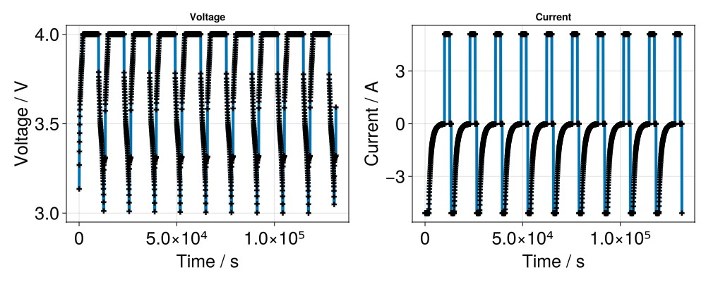
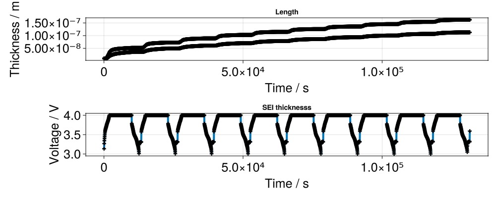

# Example with SEI layer {#Example-with-SEI-layer}

## Preparation of the input {#Preparation-of-the-input}

```julia
using Jutul, BattMo, GLMakie
```


We use the SEI model presented in [[1](/extras/refs#bolay2022)]. We use the json data given in [bolay.json](https://github.com/BattMoTeam/BattMo.jl/blob/main/test/data/jsonfiles/bolay.json#L157) which contains the parameters for the SEI layer.

```julia
cell_parameters = load_cell_parameters(; from_default_set = "Chen2020")
cycling_protocol = load_cycling_protocol(; from_default_set = "CCCV")
simulation_settings = load_simulation_settings(; from_default_set = "P2D")
```


We have a look at the SEI related parameters.

```julia
interphase_parameters = cell_parameters["NegativeElectrode"]["Interphase"]
```


```ansi
Dict{String, Any} with 8 entries:
  "Description"                    => "EC-based SEI, from Bolay2022."
  "ElectronicDiffusionCoefficient" => 1.6e-12
  "InterstitialConcentration"      => 0.015
  "InitialThickness"               => 1.0e-8
  "IonicConductivity"              => 1.0e-5
  "StoichiometricCoefficient"      => 2
  "InitialPotentialDrop"           => 0.5
  "MolarVolume"                    => 9.586e-5
```


## We start the simulation and retrieve the result {#We-start-the-simulation-and-retrieve-the-result}

```julia
model_setup = LithiumIonBattery();

model_settings = model_setup.model_settings
model_settings["SEIModel"] = "Bolay"

cycling_protocol["TotalNumberOfCycles"] = 10

sim = Simulation(model_setup, cell_parameters, cycling_protocol; simulation_settings);

output = solve(sim)

states = output[:states]

t = [state[:Control][:Controller].time for state in states]
E = [state[:Control][:Phi][1] for state in states]
I = [state[:Control][:Current][1] for state in states]
```


```ansi
✔️ Validation of ModelSettings passed: No issues found.
──────────────────────────────────────────────────
✔️ Validation of CellParameters passed: No issues found.
──────────────────────────────────────────────────
✔️ Validation of CyclingProtocol passed: No issues found.
──────────────────────────────────────────────────
✔️ Validation of SimulationSettings passed: No issues found.
──────────────────────────────────────────────────
Jutul: Simulating 2 days, 2 hours as 3600 report steps
╭────────────────┬────────────┬────────────────┬──────────────╮
│ Iteration type │   Avg/step │   Avg/ministep │        Total │
│                │ 2631 steps │ 2788 ministeps │     (wasted) │
├────────────────┼────────────┼────────────────┼──────────────┤
│ Newton         │    2.79095 │        2.63379 │  7343 (1590) │
│ Linearization  │    3.85063 │        3.63379 │ 10131 (1696) │
│ Linear solver  │    2.79095 │        2.63379 │  7343 (1590) │
│ Precond apply  │        0.0 │            0.0 │        0 (0) │
╰────────────────┴────────────┴────────────────┴──────────────╯
╭───────────────┬────────┬────────────┬─────────╮
│ Timing type   │   Each │   Relative │   Total │
│               │     ms │ Percentage │       s │
├───────────────┼────────┼────────────┼─────────┤
│ Properties    │ 0.0519 │     2.09 % │  0.3811 │
│ Equations     │ 0.5568 │    30.92 % │  5.6405 │
│ Assembly      │ 0.2074 │    11.52 % │  2.1015 │
│ Linear solve  │ 0.5177 │    20.84 % │  3.8018 │
│ Linear setup  │ 0.0000 │     0.00 % │  0.0000 │
│ Precond apply │ 0.0000 │     0.00 % │  0.0000 │
│ Update        │ 0.2392 │     9.63 % │  1.7567 │
│ Convergence   │ 0.1779 │     9.88 % │  1.8023 │
│ Input/Output  │ 0.0439 │     0.67 % │  0.1223 │
│ Other         │ 0.3593 │    14.46 % │  2.6387 │
├───────────────┼────────┼────────────┼─────────┤
│ Total         │ 2.4846 │   100.00 % │ 18.2447 │
╰───────────────┴────────┴────────────┴─────────╯
```


## Plot of voltage and current {#Plot-of-voltage-and-current}

```julia
f = Figure(size = (1000, 400))

ax = Axis(f[1, 1],
	title = "Voltage",
	xlabel = "Time / s",
	ylabel = "Voltage / V",
	xlabelsize = 25,
	ylabelsize = 25,
	xticklabelsize = 25,
	yticklabelsize = 25,
)

scatterlines!(ax,
	t,
	E;
	linewidth = 4,
	markersize = 10,
	marker = :cross,
	markercolor = :black,
	label = "Julia",
)

ax = Axis(f[1, 2],
	title = "Current",
	xlabel = "Time / s",
	ylabel = "Current / A",
	xlabelsize = 25,
	ylabelsize = 25,
	xticklabelsize = 25,
	yticklabelsize = 25,
)

scatterlines!(ax,
	t,
	I;
	linewidth = 4,
	markersize = 10,
	marker = :cross,
	markercolor = :black,
	label = "Julia",
)
```



## Plot of SEI thickness {#Plot-of-SEI-thickness}

We recover the SEI thickness from the `state` output

```julia
seilength_x1 = [state[:NeAm][:SEIlength][1] for state in states]
seilength_xend = [state[:NeAm][:SEIlength][end] for state in states]

f = Figure(size = (1000, 400))

ax = Axis(f[1, 1],
	title = "Length",
	xlabel = "Time / s",
	ylabel = "Thickness / m",
	xlabelsize = 25,
	ylabelsize = 25,
	xticklabelsize = 25,
	yticklabelsize = 25,
)

scatterlines!(ax,
	t,
	seilength_x1;
	linewidth = 4,
	markersize = 10,
	marker = :cross,
	markercolor = :black)

scatterlines!(ax,
	t,
	seilength_xend;
	linewidth = 4,
	markersize = 10,
	marker = :cross,
	markercolor = :black)

ax = Axis(f[2, 1],
	title = "SEI thicknesss",
	xlabel = "Time / s",
	ylabel = "Voltage / V",
	xlabelsize = 25,
	ylabelsize = 25,
	xticklabelsize = 25,
	yticklabelsize = 25,
)

scatterlines!(ax,
	t,
	E;
	linewidth = 4,
	markersize = 10,
	marker = :cross,
	markercolor = :black)
```



## Plot of voltage drop {#Plot-of-voltage-drop}

```julia
u_x1 = [state[:NeAm][:SEIvoltageDrop][1] for state in states]
u_xend = [state[:NeAm][:SEIvoltageDrop][end] for state in states]

f = Figure(size = (1000, 400))

ax = Axis(f[1, 1],
	title = "SEI voltage drop",
	xlabel = "Time / s",
	ylabel = "Voltage / V",
	xlabelsize = 25,
	ylabelsize = 25,
	xticklabelsize = 25,
	yticklabelsize = 25,
)

scatterlines!(ax,
	t,
	u_x1;
	linewidth = 4,
	markersize = 10,
	marker = :cross,
	markercolor = :blue,
	label = "xmin")

scatterlines!(ax,
	t,
	u_xend;
	linewidth = 4,
	markersize = 10,
	marker = :cross,
	markercolor = :black,
	label = "xmax")
```


```ansi
Plot{Makie.scatterlines, Tuple{Vector{Point{2, Float64}}}}
```


## Plot of the lithium content {#Plot-of-the-lithium-content}

```julia
u_x1 = [state[:NeAm][:SEIvoltageDrop][1] for state in states]
u_xend = [state[:NeAm][:SEIvoltageDrop][end] for state in states]

f = Figure(size = (1000, 400))

ax = Axis(f[1, 1],
	title = "SEI voltage drop",
	xlabel = "Time / s",
	ylabel = "Voltage / V",
	xlabelsize = 25,
	ylabelsize = 25,
	xticklabelsize = 25,
	yticklabelsize = 25,
)

scatterlines!(ax,
	t,
	u_x1;
	linewidth = 4,
	markersize = 10,
	marker = :cross,
	markercolor = :blue,
	label = "xmin")

scatterlines!(ax,
	t,
	u_xend;
	linewidth = 4,
	markersize = 10,
	marker = :cross,
	markercolor = :black,
	label = "xmax")
```


```ansi
Plot{Makie.scatterlines, Tuple{Vector{Point{2, Float64}}}}
```


## Example on GitHub {#Example-on-GitHub}

If you would like to run this example yourself, it can be downloaded from the BattMo.jl GitHub repository [as a script](https://github.com/BattMoTeam/BattMo.jl/blob/main/examples/example_sei.jl), or as a [Jupyter Notebook](https://github.com/BattMoTeam/BattMo.jl/blob/gh-pages/dev/final_site/notebooks/example_sei.ipynb)


---


_This page was generated using [Literate.jl](https://github.com/fredrikekre/Literate.jl)._
