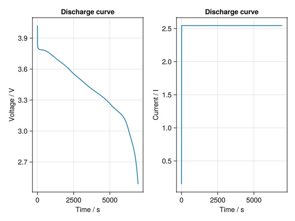
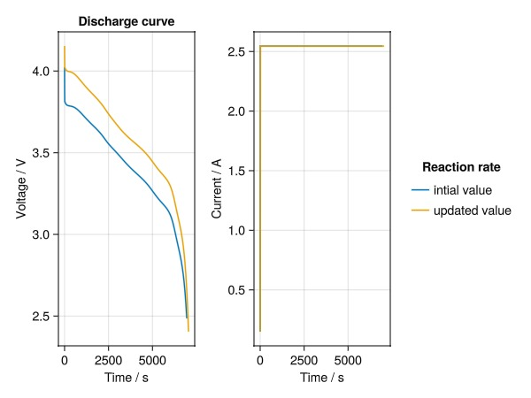

# Handling Cell Parameters {#Handling-Cell-Parameters}

To change cell parameters, cycling protocols and settings, we can modify the JSON files directly, or we can read them into objects in the script and modify them as Dictionaries.

### Load parameter files and initialize Model {#Load-parameter-files-and-initialize-Model}

We begin by loading pre-defined parameters from JSON files:

```julia
using BattMo

cell_parameters = load_cell_parameters(; from_default_set = "Chen2020")
cycling_protocol = load_cycling_protocol(; from_default_set = "CCDischarge")
```


### Access parameters {#Access-parameters}

Cell parameters, cycling protocols, model settings and simulation settings are all Dictionary-like objects, which come with additional handy functions. First, lets list the outermost keys of the cell parameters object.

```julia
keys(cell_parameters)
```


```ansi
KeySet for a Dict{String, Any} with 6 entries. Keys:
  "Electrolyte"
  "Cell"
  "Metadata"
  "PositiveElectrode"
  "Separator"
  "NegativeElectrode"
```


Now we access the Separator key.

```julia
cell_parameters["Separator"]
```


```ansi
Dict{String, Any} with 5 entries:
  "Description"          => "Ceramic-coated Polyolefin"
  "Density"              => 946
  "BruggemanCoefficient" => 1.5
  "Thickness"            => 1.2e-5
  "Porosity"             => 0.47
```


We have a flat list of parameters and values for the separator. In other cases, a key might nest other dictionaries, which can be accessed using the normal dictionary notation. Lets see for instance the  active material parameters of the negative electrode.

```julia
cell_parameters["NegativeElectrode"]["ActiveMaterial"]
```


```ansi
Dict{String, Any} with 16 entries:
  "ActivationEnergyOfDiffusion"       => 5000
  "NumberOfElectronsTransfered"       => 1
  "StoichiometricCoefficientAtSOC0"   => 0.0279
  "OpenCircuitPotential"              => "1.9793 * exp(-39.3631*(c/cmax)) + 0.2…
  "ReactionRateConstant"              => 6.716e-12
  "MassFraction"                      => 1.0
  "StoichiometricCoefficientAtSOC100" => 0.9014
  "ActivationEnergyOfReaction"        => 35000
  "MaximumConcentration"              => 33133.0
  "VolumetricSurfaceArea"             => 383959.0
  "Description"                       => "Graphite-SiOx"
  "DiffusionCoefficient"              => 3.3e-14
  "ParticleRadius"                    => 5.86e-6
  "Density"                           => 2260.0
  "ElectronicConductivity"            => 215
  "ChargeTransferCoefficient"         => 0.5
```


In addition to manipulating parameters as dictionaries, we provide additional handy attributes and functions. For instance, we can display all cell parameters:

```julia
cell_parameters.all
```


```ansi
Dict{String, Any} with 6 entries:
  "Electrolyte"       => {…
  "Cell"              => {…
  "Metadata"          => {…
  "PositiveElectrode" => {…
  "Separator"         => {…
  "NegativeElectrode" => {…
```


However, there are many parameters, nested into dictionaries. Often, we are more interested in a specific subset of parameters. We can find a parameter with the search_parameter function. For example, we&#39;d like to now how electrode related objects and parameters are named:

```julia
search_parameter(cell_parameters, "Electrode")
```


```ansi
1-element Vector{Any}:
 "[Cell][ElectrodeGeometricSurfaceArea] => 0.1027"
```


Another example where we&#39;d like to now which concentration parameters are part of the parameter set:

```julia
search_parameter(cell_parameters, "Concentration")
```


```ansi
4-element Vector{Any}:
 "[NegativeElectrode][ActiveMaterial][MaximumConcentration] => 33133.0"
 "[NegativeElectrode][Interphase][InterstitialConcentration] => 0.015"
 "[PositiveElectrode][ActiveMaterial][MaximumConcentration] => 63104.0"
 "[Electrolyte][Concentration] => 1000"
```


The search function also accepts partial matches and it is case-insentive.

```julia
search_parameter(cell_parameters, "char")
```


```ansi
3-element Vector{Any}:
 "[NegativeElectrode][ActiveMaterial][ChargeTransferCoefficient] => 0.5"
 "[PositiveElectrode][ActiveMaterial][ChargeTransferCoefficient] => 0.5"
 "[Electrolyte][ChargeNumber] => 1"
```


### Editing scalar parameters {#Editing-scalar-parameters}

Parameter that take single numerical values (e.g. real, integers, booleans) can be directly modified. Examples:

```julia
cell_parameters["NegativeElectrode"]["ActiveMaterial"]["ReactionRateConstant"] = 1e-13

cell_parameters["PositiveElectrode"]["ElectrodeCoating"]["Thickness"] = 8.2e-5
```


### Editing non-scalar parameters {#Editing-non-scalar-parameters}

Some parameters are described as functions or arrays, since the parameter value depends on other variables. For instance the Open Circuit Potentials of the Active Materials depend on the lithium stoichiometry and temperature.
> 
> MISSING
> 


### Compare simulations {#Compare-simulations}

After the updates, we instantiate the model and the simulations, verify the simulation to be valid, and run it as in the first tutorial.

```julia
model_setup = LithiumIonBattery()

sim = Simulation(model_setup, cell_parameters, cycling_protocol)

output = solve(sim);

states = output[:states]
t = [state[:Control][:Controller].time for state in states]
E = [state[:Control][:Phi][1] for state in states]
I = [state[:Control][:Current][1] for state in states]
fig = Figure()
ax = Axis(fig[1, 1], ylabel = "Voltage / V", xlabel = "Time / s", title = "Discharge curve")
lines!(ax, t, E)
ax = Axis(fig[1, 2], ylabel = "Current / I", xlabel = "Time / s", title = "Discharge curve")
lines!(ax, t, I)
fig
```



Let’s reload the original parameters and simulate again to compare:

```julia
cell_parameters_2 = load_cell_parameters(; from_default_set = "Chen2020")
sim2 = Simulation(model_setup, cell_parameters_2, cycling_protocol);
output2 = solve(sim2)
```


```ansi
✔️ Validation of CellParameters passed: No issues found.
──────────────────────────────────────────────────
✔️ Validation of CyclingProtocol passed: No issues found.
──────────────────────────────────────────────────
✔️ Validation of SimulationSettings passed: No issues found.
──────────────────────────────────────────────────
Jutul: Simulating 2 hours, 12 minutes as 163 report steps
╭────────────────┬───────────┬───────────────┬──────────╮
│ Iteration type │  Avg/step │  Avg/ministep │    Total │
│                │ 146 steps │ 146 ministeps │ (wasted) │
├────────────────┼───────────┼───────────────┼──────────┤
│ Newton         │   2.32877 │       2.32877 │  340 (0) │
│ Linearization  │   3.32877 │       3.32877 │  486 (0) │
│ Linear solver  │   2.32877 │       2.32877 │  340 (0) │
│ Precond apply  │       0.0 │           0.0 │    0 (0) │
╰────────────────┴───────────┴───────────────┴──────────╯
╭───────────────┬──────────┬────────────┬──────────╮
│ Timing type   │     Each │   Relative │    Total │
│               │       μs │ Percentage │       ms │
├───────────────┼──────────┼────────────┼──────────┤
│ Properties    │  35.3364 │     4.32 % │  12.0144 │
│ Equations     │ 154.0512 │    26.89 % │  74.8689 │
│ Assembly      │  65.0218 │    11.35 % │  31.6006 │
│ Linear solve  │ 291.5627 │    35.61 % │  99.1313 │
│ Linear setup  │   0.0000 │     0.00 % │   0.0000 │
│ Precond apply │   0.0000 │     0.00 % │   0.0000 │
│ Update        │  47.8558 │     5.84 % │  16.2710 │
│ Convergence   │  63.4340 │    11.07 % │  30.8289 │
│ Input/Output  │  22.2285 │     1.17 % │   3.2454 │
│ Other         │  30.6924 │     3.75 % │  10.4354 │
├───────────────┼──────────┼────────────┼──────────┤
│ Total         │ 818.8112 │   100.00 % │ 278.3958 │
╰───────────────┴──────────┴────────────┴──────────╯
```


Now, we plot the original and modified results:

```julia
t2 = [state[:Control][:Controller].time for state in output2[:states]]
E2 = [state[:Control][:Phi][1] for state in output2[:states]]
I2 = [state[:Control][:Current][1] for state in output2[:states]]

fig = Figure()
ax = Axis(fig[1, 1], ylabel = "Voltage / V", xlabel = "Time / s", title = "Discharge curve")
lines!(ax, t, E)
lines!(ax, t2, E2)
ax = Axis(fig[1, 2], ylabel = "Current / A", xlabel = "Time / s")
lines!(ax, t, I, label = "intial value")
lines!(ax, t2, I2, label = "updated value")
fig[1, 3] = Legend(fig, ax, "Reaction rate", framevisible = false)
```



Note that not only the voltage profiles are different but also the currents, even if the cycling protocols have the same DRate. The change in current originates form our change in electrode thickness. By changing this thickness, we have also changed the cell capacity used to translate from DRate to cell current. As a conclusion, we should be mindful that some parameters might influence the simulation in ways we might not anticipate.

## Example on GitHub {#Example-on-GitHub}

If you would like to run this example yourself, it can be downloaded from the BattMo.jl GitHub repository [as a script](https://github.com/BattMoTeam/BattMo.jl/blob/main/examples/6_handle_cell_parameters.jl), or as a [Jupyter Notebook](https://github.com/BattMoTeam/BattMo.jl/blob/gh-pages/dev/final_site/notebooks/6_handle_cell_parameters.ipynb)


---


_This page was generated using [Literate.jl](https://github.com/fredrikekre/Literate.jl)._
