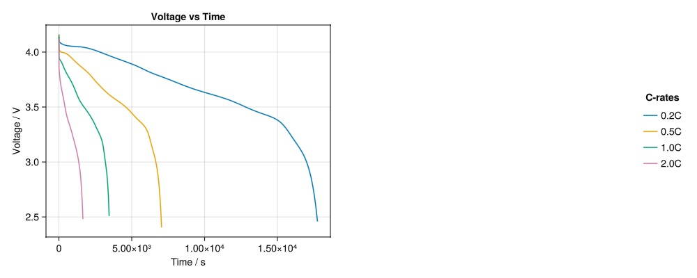

# Handling cycling protocols {#Handling-cycling-protocols}

In this tutorial, we demonstrate functionality to handle cycling protcols. We will illustrate the effect that the DRate has on battery performance during discharge, using a constant-current (CC) discharge protocol.

### Load required packages and data {#Load-required-packages-and-data}

We start by loading the necessary parameters sets and instantiating a model. For the cyling protocol, we&#39;ll start from the default constant current discharge protocol.

```julia
using BattMo, GLMakie, Printf
```


Load cell and model setup

```julia
cell_parameters = load_cell_parameters(; from_default_set = "Chen2020")
cc_discharge_protocol = load_cycling_protocol(; from_default_set = "CCDischarge")
```


```ansi
{
    "TotalNumberOfCycles" => 0
    "InitialControl" => "discharging"
    "InitialStateOfCharge" => 0.99
    "InitialTemperature" => 298.15
    "Metadata" =>     {
        "Description" => "Parameter set for a constant current discharging protocol."
        "Title" => "CCDischarge"
    }
    "DRate" => 0.5
    "LowerVoltageLimit" => 2.4
    "Protocol" => "CC"
    "UpperVoltageLimit" => 4.1
}
```


Load default model

```julia
model_setup = LithiumIonBattery()
```


```ansi
LithiumIonBattery("Setup object for a P2D lithium-ion model", {
    "RampUp" => "Sinusoidal"
    "Metadata" =>     {
        "Description" => "Default model settings for a P2D simulation including a current ramp up, excluding current collectors and SEI effects."
        "Title" => "P2D"
    }
    "TransportInSolid" => "FullDiffusion"
    "ModelFramework" => "P2D"
}, true)
```


### Handle, access and edit cycling protocols {#Handle,-access-and-edit-cycling-protocols}

We manipulate a cycling protocol in the same was as we do cell parameters in the previous tutorial. To list all outermost keys:

```julia
keys(cc_discharge_protocol)
```


```ansi
KeySet for a Dict{String, Any} with 9 entries. Keys:
  "TotalNumberOfCycles"
  "InitialControl"
  "InitialStateOfCharge"
  "InitialTemperature"
  "Metadata"
  "DRate"
  "LowerVoltageLimit"
  "Protocol"
  "UpperVoltageLimit"
```


Show all keys and values

```julia
cc_discharge_protocol.all
```


```ansi
Dict{String, Any} with 9 entries:
  "TotalNumberOfCycles"  => 0
  "InitialControl"       => "discharging"
  "InitialStateOfCharge" => 0.99
  "InitialTemperature"   => 298.15
  "Metadata"             => {…
  "DRate"                => 0.5
  "LowerVoltageLimit"    => 2.4
  "Protocol"             => "CC"
  "UpperVoltageLimit"    => 4.1
```


Search for a specific parameter

```julia
search_parameter(cc_discharge_protocol, "rate")
```


```ansi
1-element Vector{Any}:
 "[DRate] => 0.5"
```


Access a specific parameter

```julia
cc_discharge_protocol["DRate"]
```


```ansi
0.5
```


Change protocol parameters as dicitonaries

```julia
cc_discharge_protocol["DRate"] = 2.0
```


```ansi
2.0
```


### Compare cell performance across DRates {#Compare-cell-performance-across-DRates}

Lets now do something more fun. Since we can edit scalar valued parameters as we edit dictionaries, we can loop through different DRates and run a simulation for each. We can then compare the cell voltage profiles for each DRate.

Let’s define the range of C-rates to explore:

```julia
d_rates = [0.2, 0.5, 1.0, 2.0]
```


```ansi
4-element Vector{Float64}:
 0.2
 0.5
 1.0
 2.0
```


Now loop through these values, update the protocol, and store the results:

```julia
outputs = []

for d_rate in d_rates
	protocol = deepcopy(cc_discharge_protocol)
	protocol["DRate"] = d_rate

	sim = Simulation(model_setup, cell_parameters, protocol)
	output = solve(sim; config_kwargs = (; end_report = false))
	push!(outputs, (d_rate = d_rate, output = output))
end
```


```ansi
✔️ Validation of CellParameters passed: No issues found.
──────────────────────────────────────────────────
✔️ Validation of CyclingProtocol passed: No issues found.
──────────────────────────────────────────────────
✔️ Validation of SimulationSettings passed: No issues found.
──────────────────────────────────────────────────
Jutul: Simulating 5 hours, 30 minutes as 401 report steps
✔️ Validation of CellParameters passed: No issues found.
──────────────────────────────────────────────────
✔️ Validation of CyclingProtocol passed: No issues found.
──────────────────────────────────────────────────
✔️ Validation of SimulationSettings passed: No issues found.
──────────────────────────────────────────────────
Jutul: Simulating 2 hours, 12 minutes as 163 report steps
✔️ Validation of CellParameters passed: No issues found.
──────────────────────────────────────────────────
✔️ Validation of CyclingProtocol passed: No issues found.
──────────────────────────────────────────────────
✔️ Validation of SimulationSettings passed: No issues found.
──────────────────────────────────────────────────
Jutul: Simulating 1 hour, 6 minutes as 84 report steps
✔️ Validation of CellParameters passed: No issues found.
──────────────────────────────────────────────────
✔️ Validation of CyclingProtocol passed: No issues found.
──────────────────────────────────────────────────
✔️ Validation of SimulationSettings passed: No issues found.
──────────────────────────────────────────────────
Jutul: Simulating 33 minutes, 0.0002274 nanoseconds as 44 report steps
```


### Analyze Voltage and Capacity {#Analyze-Voltage-and-Capacity}

We&#39;ll extract the voltage vs. time and delivered capacity for each C-rate:

```julia
fig = Figure(size = (1000, 400))
ax1 = Axis(fig[1, 1], title = "Voltage vs Time", xlabel = "Time / s", ylabel = "Voltage / V")

for result in outputs

	states = result.output[:states]
	t = [state[:Control][:Controller].time for state in states]
	E = [state[:Control][:Phi][1] for state in states]
	I = [state[:Control][:Current][1] for state in states]

	label_str = @sprintf("%.1fC", result.d_rate)
	lines!(ax1, t, E, label = label_str)

end

fig[1, 3] = Legend(fig, ax1, "C-rates", framevisible = false)
fig
```



We see this cell has poor power capabilities since its capacity decreases quite rapidly with DRate.

## Example on GitHub {#Example-on-GitHub}

If you would like to run this example yourself, it can be downloaded from the BattMo.jl GitHub repository [as a script](https://github.com/BattMoTeam/BattMo.jl/blob/main/examples/7_handle_cycling_protocols.jl), or as a [Jupyter Notebook](https://github.com/BattMoTeam/BattMo.jl/blob/gh-pages/dev/final_site/notebooks/7_handle_cycling_protocols.ipynb)


---


_This page was generated using [Literate.jl](https://github.com/fredrikekre/Literate.jl)._
