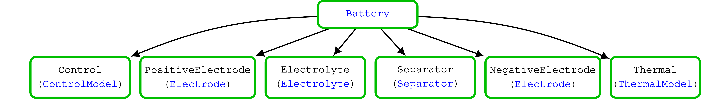

# Physical Parameters

We follow up on the example presented in the first page of the [introduction](../#Getting-started) 

After running

```example physparams
using BattMo # hide
filename = string(dirname(pathof(BattMo)), "/../test/data/jsonfiles/p2d_40.json")
inputparams = readBattMoJsonInputFile(filename)
```

We have an `inputparams` object that corresponds to the json file [p2d_40.json](https://github.com/BattMoTeam/BattMo.jl/blob/main/test/data/jsonfiles/p2d_40.json) which we can investigate directly.

Note that he simulation input is organised hierarchically 

````@raw html
    
    
    
    
````

We can for example inspect the parameters for the electrolyte

```@example physparams
inputparams["Electrolyte"]
```

or of the interface of the negative electrode. At the interface level, we find all the parameters related to the
interface reactions.

```@example physparams
interfaceparams = inputparams["NegativeElectrode"]["Coating"]["ActiveMaterial"]["Interface"]
```

We can directly change one of these parameters. Let us for example change the reaction rate constant,

```@example physparams
interfaceparams["reactionRateConstant"] = 1e-13
nothing # hide
```

We re-run the simulation and observe the impact on the solution

```@example physparams
output = run_battery(inputparams)
states = output[:states]
t = [state[:Control][:ControllerCV].time for state in states]
E = [state[:Control][:Phi][1] for state in states]
I = [state[:Control][:Current][1] for state in states]
using GLMakie # hide
fig = Figure()
ax = Axis(fig[1, 1], ylabel = "Voltage / V", xlabel = "Time / s", title = "Discharge curve")
lines!(ax, t, E)
ax = Axis(fig[1, 2], ylabel = "Current / I", xlabel = "Time / s", title = "Discharge curve")
lines!(ax, t, I)
fig
```

To compare the results, let us reload the previous input file and run it

```@example physparams
inputparams2 = readBattMoJsonInputFile(filename)
output2 = run_battery(inputparams2)
nothing # hide
```

We plot both curves

```@example physparams
t2 = [state[:Control][:ControllerCV].time for state in output2[:states]]
E2 = [state[:Control][:Phi][1] for state in output2[:states]]
I2 = [state[:Control][:Current][1] for state in output2[:states]]

fig = Figure()
ax = Axis(fig[1, 1], ylabel = "Voltage / V", xlabel = "Time / s", title = "Discharge curve")
lines!(ax, t, E)
lines!(ax, t2, E2)
ax = Axis(fig[1, 2], ylabel = "Current / A", xlabel = "Time / s")
lines!(ax, t, I, label = "intial value")
lines!(ax, t2, I2, label = "updated value")
fig[1, 3] = Legend(fig, ax, "Reaction rate", framevisible = false)
fig
```

Then, it becomes clear that the values can be changed programatically. We iterate over a range of reaction rate and
collect the results in the `outputs` list. In the simulation configuration keywords `config_kwargs` we pass to
`run_battery`, we add the options of not printing out the full simulation report at the end of the simulation.

```@example physparams
outputs = []
for r in range(5e-11, 1e-13, length = 5)
    interfaceparams["reactionRateConstant"] = r
    push!(outputs, run_battery(inputparams; config_kwargs = (;end_report = false))))
end
nothing # hide
```

We can then plot the results and observe that reaction rate constant is not really a limiting factor before we reache the value of 1e-13.

```@example physparams
fig = Figure()
ax = Axis(fig[1, 1], ylabel = "Voltage / V", xlabel = "Time / s", title = "Discharge curve")
for output in outputs
    local t = [state[:Control][:ControllerCV].time for state in output[:states]]
    local E = [state[:Control][:Phi][1] for state in output[:states]]
    local r = output[:extra][:inputparams]["NegativeElectrode"]["Coating"]["ActiveMaterial"]["Interface"]["reactionRateConstant"]
    lines!(ax, t, E, label = "$(@sprintf("%g", r))") 
end
fig[1, 2] = Legend(fig, ax, "Reaction rate", framevisible = false)
fig
```

