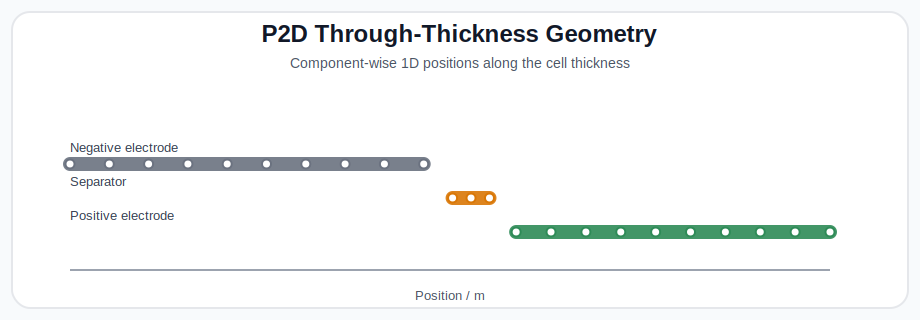
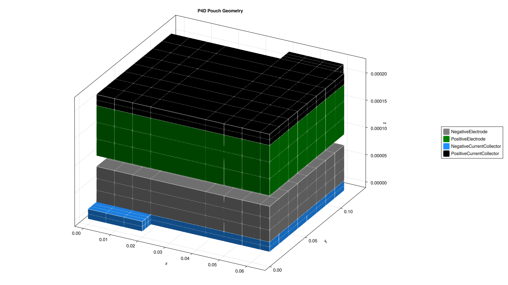
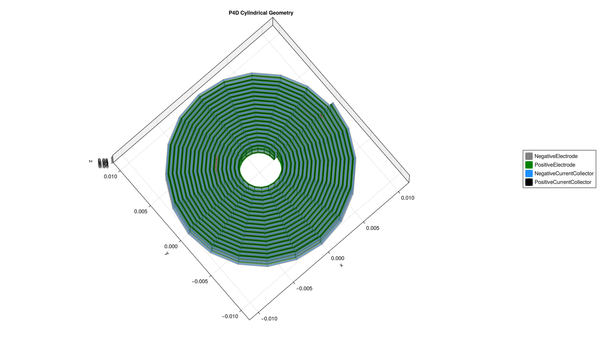

# Geometries

BattMo supports several battery-cell geometries through the `ModelFramework` setting. These geometries determine how the electrochemical model is distributed in space, which grids are constructed, and which component-wise outputs are available.

The currently supported geometry families are:

- `P2D`
- `P4D Pouch`
- `P4D Prismatic`
- `P4D Cylindrical`

## Overview

| Model framework | Cell type | Spatial representation | Typical use |
| --- | --- | --- | --- |
| `P2D` | Through-thickness cell model | 1D across the stack, with radial particle diffusion | Fast cell-level studies, parameter sweeps, cycling analysis |
| `P4D Pouch` | Pouch cell | 3D current-collector / electrode geometry combined with particle diffusion | Tab placement effects, current distribution, pouch thermal/electrical nonuniformity |
| `P4D Prismatic` | Wound prismatic cell | 3D jelly-roll geometry combined with particle diffusion | Wound prismatic tab placement studies and current distribution |
| `P4D Cylindrical` | Cylindrical / jelly-roll cell | Cylindrical wound-cell geometry combined with particle diffusion | Radial and axial heterogeneity in cylindrical cells |

In all three cases, BattMo uses a pseudo-dimensional formulation:

- the electrolyte and solid-phase transport are resolved on the cell geometry
- diffusion inside active-material particles is resolved on a particle-radius coordinate
- component coupling is handled automatically in the assembled multiphysics model

## P2D

`P2D` is the classical Doyle-Fuller-Newman style through-thickness model. The cell is represented as a one-dimensional stack:

- negative electrode
- separator
- positive electrode

If current collectors are enabled, the stack also includes:

- negative current collector
- positive current collector

This is the most efficient option and is usually the right starting point when:

- studying voltage response, concentration profiles, or degradation behavior
- calibrating parameters
- running large parameter sweeps
- current-collector in-plane effects are not important

For `P2D`, BattMo provides:

- a global through-cell position, `output.states["Cell"]["Position"]`
- component-wise positions, such as `output.states["NegativeElectrode"]["ActiveMaterial"]["Position"]`

### Main Cell Parameters

| Input path | Meaning |
| --- | --- |
| `["NegativeElectrode"]["Coating"]["Thickness"]` | Negative electrode coating thickness. |
| `["PositiveElectrode"]["Coating"]["Thickness"]` | Positive electrode coating thickness. |
| `["Separator"]["Thickness"]` | Separator thickness. |
| `["NegativeElectrode"]["CurrentCollector"]["Thickness"]` | Negative current collector thickness, when current collectors are enabled. |
| `["PositiveElectrode"]["CurrentCollector"]["Thickness"]` | Positive current collector thickness, when current collectors are enabled. |

### Main Simulation Settings

| Setting | Meaning |
| --- | --- |
| `NegativeElectrodeCoatingGridPoints` | Number of cells through the negative electrode coating thickness. |
| `PositiveElectrodeCoatingGridPoints` | Number of cells through the positive electrode coating thickness. |
| `SeparatorGridPoints` | Number of cells through the separator thickness. |
| `NegativeElectrodeParticleGridPoints` | Radial resolution inside negative active-material particles. |
| `PositiveElectrodeParticleGridPoints` | Radial resolution inside positive active-material particles. |
| `NegativeElectrodeCurrentCollectorGridPoints` | Number of cells through the negative current collector thickness. |
| `PositiveElectrodeCurrentCollectorGridPoints` | Number of cells through the positive current collector thickness. |



## P4D Pouch

`P4D Pouch` resolves the cell in a pouch-cell geometry. The model keeps the pseudo-dimensional electrochemistry, but the cell components are placed on a multi-dimensional spatial grid so that in-plane current and potential variations can be captured.

This geometry is useful when:

- tab placement matters
- current collectors contribute significantly to the cell response
- you want to visualize spatially varying potentials, concentrations, or currents
- nonuniform utilization across the pouch is important

The main components represented are:

- negative current collector
- negative electrode active material / coating
- separator
- electrolyte
- positive electrode active material / coating
- positive current collector

BattMo provides component-wise mesh positions for these domains in the output, for example:

- `output.states["NegativeElectrode"]["CurrentCollector"]["Position"]`
- `output.states["PositiveElectrode"]["ActiveMaterial"]["Position"]`
- `output.states["Electrolyte"]["Position"]`

### Main Cell Parameters

| Input path | Meaning |
| --- | --- |
| `["Cell"]["ElectrodeWidth"]` | Physical electrode width of the pouch cell. |
| `["Cell"]["ElectrodeLength"]` | Physical electrode length of the pouch cell. |
| `["Cell"]["TabWidth"]` | Width of the pouch tabs. |
| `["Cell"]["TabLength"]` | Length of the pouch tabs. |
| `["Cell"]["TabsOnSameSide"]` | Whether positive and negative tabs are placed on the same side of the pouch. |
| `["NegativeElectrode"]["CurrentCollector"]["TabPositionFraction"]` | Tab position along the negative current collector width, from `0` to `1`. |
| `["PositiveElectrode"]["CurrentCollector"]["TabPositionFraction"]` | Tab position along the positive current collector width, from `0` to `1`. |
| `["NegativeElectrode"]["Coating"]["Thickness"]` | Negative electrode coating thickness. |
| `["PositiveElectrode"]["Coating"]["Thickness"]` | Positive electrode coating thickness. |
| `["Separator"]["Thickness"]` | Separator thickness. |
| `["NegativeElectrode"]["CurrentCollector"]["Thickness"]` | Negative current collector thickness. |
| `["PositiveElectrode"]["CurrentCollector"]["Thickness"]` | Positive current collector thickness. |

### Main Simulation Settings

| Setting | Meaning |
| --- | --- |
| `ElectrodeWidthGridPoints` | In-plane grid resolution along pouch width. |
| `ElectrodeLengthGridPoints` | In-plane grid resolution along pouch length. |
| `TabWidthGridPoints` | In-plane resolution across the pouch tab width. |
| `TabLengthGridPoints` | In-plane resolution along the pouch tab length. |
| `NegativeElectrodeCoatingGridPoints` | Number of cells through the negative electrode coating thickness. |
| `PositiveElectrodeCoatingGridPoints` | Number of cells through the positive electrode coating thickness. |
| `SeparatorGridPoints` | Number of cells through the separator thickness. |
| `NegativeElectrodeParticleGridPoints` | Radial resolution inside negative active-material particles. |
| `PositiveElectrodeParticleGridPoints` | Radial resolution inside positive active-material particles. |
| `NegativeElectrodeCurrentCollectorGridPoints` | Number of cells through the negative current collector thickness. |
| `PositiveElectrodeCurrentCollectorGridPoints` | Number of cells through the positive current collector thickness. |
| `NegativeElectrodeCurrentCollectorTabWidthGridPoints` | Resolution across the negative tab face. |
| `NegativeElectrodeCurrentCollectorTabLengthGridPoints` | Resolution along the negative pouch-tab face length. |
| `PositiveElectrodeCurrentCollectorTabWidthGridPoints` | Resolution across the positive tab face. |
| `PositiveElectrodeCurrentCollectorTabLengthGridPoints` | Resolution along the positive pouch-tab face length. |



See also:

- [3D Pouch example](../../examples/example_3D_pouch.md)

## P4D Prismatic

`P4D Prismatic` targets wound prismatic cells. It uses the same jelly-roll style internal geometry as the cylindrical model, but exposes it through a dedicated framework for prismatic cells packaged in a rectangular can.

This geometry is useful when:

- modelling wound prismatic commercial cells
- studying tab placement and collector-current distribution in a prismatic form factor
- comparing cylindrical and prismatic packaging while keeping the same wound internal structure

Outputs are provided component-wise in the same way as for the cylindrical geometry.

### Main Cell Parameters

| Input path | Meaning |
| --- | --- |
| `["Cell"]["ElectrodeWidth"]` | Axial height of the jelly roll. |
| `["Cell"]["ElectrodeLength"]` | Winding length of the electrode stack used to determine the wound extent. |
| `["Cell"]["InnerRadius"]` | Inner jelly-roll radius. |
| `["Cell"]["CaseWidth"]` | Outer width of the invisible rectangular case used to flatten the wound cross-section. |
| `["Cell"]["CaseThickness"]` | Outer thickness of the invisible rectangular case used to flatten the wound cross-section. |
| `["Cell"]["OuterRadius"]` | Optional fallback outer radius if no winding length is provided. |
| `["NegativeElectrode"]["CurrentCollector"]["TabFractions"]` | Tab placement along the negative current collector as fractions of total spiral length. |
| `["PositiveElectrode"]["CurrentCollector"]["TabFractions"]` | Tab placement along the positive current collector as fractions of total spiral length. |
| `["NegativeElectrode"]["CurrentCollector"]["TabWidth"]` | Width of the negative current-collector tab. |
| `["PositiveElectrode"]["CurrentCollector"]["TabWidth"]` | Width of the positive current-collector tab. |
| `["NegativeElectrode"]["Coating"]["Thickness"]` | Negative electrode coating thickness. |
| `["PositiveElectrode"]["Coating"]["Thickness"]` | Positive electrode coating thickness. |
| `["Separator"]["Thickness"]` | Separator thickness. |
| `["NegativeElectrode"]["CurrentCollector"]["Thickness"]` | Negative current collector thickness. |
| `["PositiveElectrode"]["CurrentCollector"]["Thickness"]` | Positive current collector thickness. |

### Main Simulation Settings

| Setting | Meaning |
| --- | --- |
| `HeightGridPoints` | Number of grid cells along the prismatic-cell height. |
| `AngularGridPoints` | Number of angular sectors used around the wound internal geometry. |
| `NegativeElectrodeCoatingGridPoints` | Number of cells through the negative electrode coating thickness. |
| `PositiveElectrodeCoatingGridPoints` | Number of cells through the positive electrode coating thickness. |
| `SeparatorGridPoints` | Number of cells through the separator thickness. |
| `NegativeElectrodeParticleGridPoints` | Radial resolution inside negative active-material particles. |
| `PositiveElectrodeParticleGridPoints` | Radial resolution inside positive active-material particles. |
| `NegativeElectrodeCurrentCollectorGridPoints` | Number of cells through the negative current collector thickness. |
| `PositiveElectrodeCurrentCollectorGridPoints` | Number of cells through the positive current collector thickness. |
| `NegativeElectrodeCurrentCollectorTabWidthGridPoints` | Resolution across the negative tab face. |
| `PositiveElectrodeCurrentCollectorTabWidthGridPoints` | Resolution across the positive tab face. |

See also:

- [3D prismatic example](../../examples/example_3d_prismatic.md)

## P4D Cylindrical

`P4D Cylindrical` targets cylindrical cells with a jelly-roll type internal structure. It extends the pseudo-dimensional electrochemistry to a cylindrical geometry so that spatial variations around the wound cell can be represented.

This geometry is useful when:

- modelling cylindrical commercial cells
- studying radial and axial nonuniformities
- investigating tab-driven current distribution
- comparing simplified `P2D` behavior with a more spatially resolved cylindrical model

As for the pouch case, outputs are provided component-wise for the resolved domains.

### Main Cell Parameters

| Input path | Meaning |
| --- | --- |
| `["Cell"]["ElectrodeWidth"]` | Axial height of the jelly roll. |
| `["Cell"]["ElectrodeLength"]` | Winding length of the electrode stack used to determine the wound extent. |
| `["Cell"]["InnerRadius"]` | Inner jelly-roll radius. |
| `["Cell"]["OuterRadius"]` | Optional fallback outer radius if no winding length is provided. |
| `["NegativeElectrode"]["CurrentCollector"]["TabFractions"]` | Angular or spiral placement of one or more negative tabs as fractions of total spiral length. |
| `["PositiveElectrode"]["CurrentCollector"]["TabFractions"]` | Angular or spiral placement of one or more positive tabs as fractions of total spiral length. |
| `["NegativeElectrode"]["CurrentCollector"]["TabWidth"]` | Width of the negative current-collector tab. |
| `["PositiveElectrode"]["CurrentCollector"]["TabWidth"]` | Width of the positive current-collector tab. |
| `["NegativeElectrode"]["Coating"]["Thickness"]` | Negative electrode coating thickness. |
| `["PositiveElectrode"]["Coating"]["Thickness"]` | Positive electrode coating thickness. |
| `["Separator"]["Thickness"]` | Separator thickness. |
| `["NegativeElectrode"]["CurrentCollector"]["Thickness"]` | Negative current collector thickness. |
| `["PositiveElectrode"]["CurrentCollector"]["Thickness"]` | Positive current collector thickness. |

### Main Simulation Settings

| Setting | Meaning |
| --- | --- |
| `HeightGridPoints` | Number of grid cells along the cylinder height. |
| `AngularGridPoints` | Number of angular sectors used around the jelly roll. |
| `NegativeElectrodeCoatingGridPoints` | Number of cells through the negative electrode coating thickness. |
| `PositiveElectrodeCoatingGridPoints` | Number of cells through the positive electrode coating thickness. |
| `SeparatorGridPoints` | Number of cells through the separator thickness. |
| `NegativeElectrodeParticleGridPoints` | Radial resolution inside negative active-material particles. |
| `PositiveElectrodeParticleGridPoints` | Radial resolution inside positive active-material particles. |
| `NegativeElectrodeCurrentCollectorGridPoints` | Number of cells through the negative current collector thickness. |
| `PositiveElectrodeCurrentCollectorGridPoints` | Number of cells through the positive current collector thickness. |
| `NegativeElectrodeCurrentCollectorTabWidthGridPoints` | Resolution across the negative tab face. |
| `PositiveElectrodeCurrentCollectorTabWidthGridPoints` | Resolution across the positive tab face. |



See also:

- [3D cylindrical example](../../examples/example_3D_cylindrical.md)

## Choosing A Geometry

As a rule of thumb:

- use `P2D` when speed and robust cell-scale trends are most important
- use `P4D Pouch` for pouch cells with spatially resolved collector/electrode effects
- use `P4D Prismatic` for wound prismatic cells with jelly-roll 3D effects
- use `P4D Cylindrical` for cylindrical cells where wound-cell geometry matters

You select the geometry through the model settings:

```julia
model_settings = load_model_settings(; from_default_set = "p4d_pouch")
model = LithiumIonBattery(; model_settings)
```

or by setting:

```julia
model_settings["ModelFramework"] = "P2D"
```

## Related Pages

- [Lithium ion model](pxd_model.md)
- [Grid parameters](grid_params.md)
- [Simulation output](simulation_output.md)
