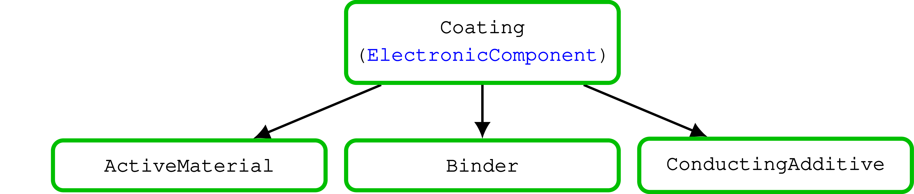

# Physical Parameters

We follow up on the example presented in the first page of the [introduction](../#Getting-started) 

After running

```julia
filename = string(dirname(pathof(BattMo)), "/../test/data/jsonfiles/p2d_40.json")
inputparams = readBattMoJsonInputFile(filename)
```

We have an `inputparams` object that corresponds to the json file [p2d_40.json](https://github.com/BattMoTeam/BattMo.jl/blob/main/test/data/jsonfiles/p2d_40.json) which we can investigate directly.

The simulation input is organised hierarchically 

````@raw html
    
    
    
    
````

We can inspect the parameters for the electrolyte

```@example physparams
using BattMo # hide
filename = string(dirname(pathof(BattMo)), "/../test/data/jsonfiles/p2d_40.json") # hide
inputparams = readBattMoJsonInputFile(filename) # hide
inputparams["Electrolyte"]
```

or of the interface of the negative electrode

```@example physparams
interfaceparams = inputparams["NegativeElectrode"]["Coating"]["ActiveMaterial"]["Interface"]
```

Let us change the reaction rate constant 

```@example physparams
interfaceparams["reactionRateConstant"] = 1e-13
nothing # hide
```

re-run the simulation and observe the impact on the solution

```@example physparams
output = run_battery(inputparams)
states = output[:states]
t = [state[:Control][:ControllerCV].time for state in states]
E = [state[:Control][:Phi][1] for state in states]
I = [state[:Control][:Current][1] for state in states]
using GLMakie # hide
fig = Figure()
ax = Axis(fig[1, 1], ylabel = "Voltage / V", xlabel = "Time / s", title = "Discharge curve")
lines!(ax, t, E)
ax = Axis(fig[1, 2], ylabel = "Voltage / V", xlabel = "Time / s", title = "Discharge curve")
lines!(ax, t, I)
fig
```


