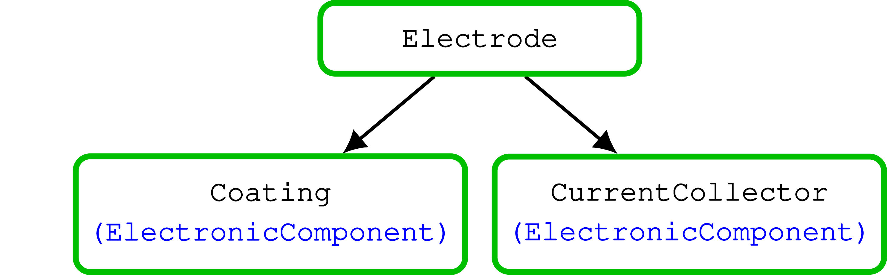
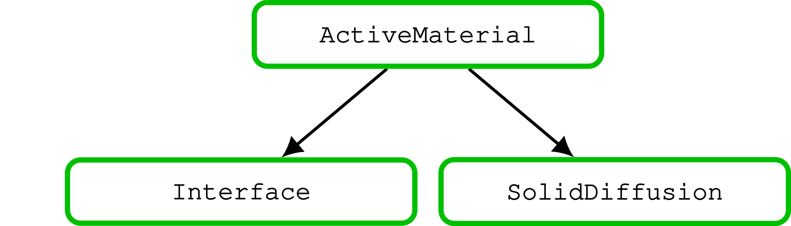

# Public API
The main entry to the simulator is the function [`run_battery`](@ref). 

This function takes an input object which can be generated by a json file using the function
[`readBattMoJsonInputFile`](@ref). We also provide to the possibility to run a simulation from a model setup using
Matlab.

Therefore, a description of the API at the public level consists of the description of the json input file format.

In this [directory](https://github.com/BattMoTeam/BattMo.jl/blob/main/test/data/jsonfiles/), we have collected json
input files.

The reference for all json input is given through [JSON schema](https://json-schema.org/). The schemas are published in
only one place, in this [directory](https://github.com/BattMoTeam/BattMo/blob/main/Utilities/JsonSchemas/), which is in
the Matlab version of BattMo. In this way, we avoid to duplicate them as we are targeting full compatibility between the
two codes. Note that all functionalities are not yet supported in the julia version, in particular not all the
geometries. For that reason, we recommend to look at the directory of the json input files mentioned above, where all
the files are compatible with the julia version.


## Simulation Parameters

The simulation parameters belong to one of the following categories. Each of the category is explicated below and shown in a hierarchical graph.

````@raw html
    
    
    
    
````

- **Model specifications** : This category of parameters describes the model choices. For example, presence or not of current collectors, use of SEI model.
- **Physical parameters** : This category contains all the physical parameters that belong to the P2D model.
- **Control type** : This category contains the parameters describing the control or stimulation that is used (for example CCCV)
- **Geometry** : This category contains the geometrical parameters. At the moment, we cover a julia only a small subset of all the presented parameters here.
- **Initialisation** : This category contains the parameters related to the initialisation of the state in the battery at intial time,
- **Time stepping** : This category contains settings about the time stepping
- **Output** : This category contains the desired content of the output.
- **Solver** : This category contains setup for the solver that is used for the simulation

For many of the parameters, except the physical parameters, default values are provided.

::: details Simulation JSON schema {close}
```json
{
  "$id": "file://./Simulation.schema.json",
  "$schema": "https://json-schema.org/draft/2020-12/schema",
  "description": "Input description for a Battery simulation in BattMo",
  "type": "object",
  "allOf": [
    {
      "$ref": "ModelSpecification.schema.json",
      "description": "Overall model specification. Choice of physics and component that will be included in the model"
    },
    {
      "$ref": "Battery.schema.json",
      "description": "Battery Physical Parameters"
    },
    {
      "$ref": "ControlModel.schema.json",
      "description": "Input for the control type and the corresponding parameters"
    },
    {
      "$ref": "Geometry.schema.json",
      "description": "Specification of the geometry including the discretization parameters"
    },
    {
      "$ref": "StateInitialization.schema.json",
      "description": "Input to setup the initial state of the battery"
    },
    {
      "$ref": "TimeStepping.schema.json",
      "description": "Input for the time stepping"
    },
    {
      "$ref": "Solver.schema.json",
      "description": "Options for the solver"
    },
    {
      "$ref": "Output.schema.json",
      "description": "Input for the choice of outputs the will be returned"
    }
  ]
}
```
:::

## Physical parameters

::: details Battery JSON schema {close}
```json
{
  "$id": "file://./Battery.schema.json",
  "$schema": "https://json-schema.org/draft/2020-12/schema",
  "description": "A standard battery",
  "type": "object",
  "properties": {
    "NegativeElectrode": {
      "$ref": "Electrode.schema.json"
    },
    "PositiveElectrode": {
      "$ref": "Electrode.schema.json"
    },
    "Electrolyte": {
      "$ref": "Electrolyte.schema.json"
    },
    "Separator": {
      "$ref": "Separator.schema.json"
    },
    "ThermalModel": {
      "$ref": "ThermalComponent.schema.json",
      "description": "Battery Physical Parameters required for thermal modelling"
    }
  },
  "allOf": [
    {
      "required": [
        "NegativeElectrode",
        "PositiveElectrode",
        "Electrolyte",
        "Separator"
      ]
    }
  ]
}
```
:::


::: details Electrode JSON schema {close}
```json
{
  "$id": "file://./Electrode.schema.json",
  "$schema": "https://json-schema.org/draft/2020-12/schema",
  "description": "Electrode",
  "type": "object",
  
  "properties" : {
    "Coating" : {"$ref" : "Coating.schema.json"},
    "CurrentCollector" : {"$ref" : "CurrentCollector.schema.json"},
    "use_normed_current_collector" : {"type" : "boolean",
                                    "description" : "Use special solver setup for current collector to avoid floating point error when there are very small voltage difference. It is only needed for the positive electrode. Default is true but we set it to false for the moment when we use an iterative linear solver"}
  }
}
```
:::

::: details Coating JSON schema {close}
```json
{
  "$id": "file://./Coating.schema.json",
  "$schema": "https://json-schema.org/draft/2020-12/schema",
  "description": "Coating",
  "type": "object",
  "allOf": [
    {
      "$ref": "./ElectronicComponent.schema.json"
    },
    {
      "properties": {
        "activeMaterialModelSetup": {
          "type" : "object",
          "properties" : {
            "composite" : {"type" : "boolean",
                           "description" : "default is false. It true, setup a composite material with two active materials, using fields ActiveMaterial1 and ActiveMaterial2"},
            "SEImodel" : {"type" : "string",
                          "enum" : ["none", "Safari", "Bolay"]}}},
        "ActiveMaterial": {
          "$ref": "ActiveMaterial.schema.json"
        },
        "ActiveMaterial1": {
          "$ref": "ActiveMaterial.schema.json"
        },
        "ActiveMaterial2": {
          "$ref": "ActiveMaterial.schema.json"
        },
        "Binder": {
          "$ref": "Binder.schema.json"
        },
        "ConductingAdditive": {
          "$ref": "ConductingAdditive.schema.json"
        },
        "effectiveDensity": {
          "$ref": "PhysicalQuantity.schema.json",
          "description": "the mass density of the material (either in wet or calendared state). The density is computed with respect to the total volume (i.e. including the empty pores)",
          "symbol": "rho"
        },
        "bruggemanCoefficient": {
          "$ref": "PhysicalQuantity.schema.json",
          "description": "the Bruggeman coefficient for effective transport in porous media",
          "symbol": "beta"
        },
        "volumeFraction" : {
          "type": "number",
          "description": "Volume fraction of the coating. This value is, in the default setup, computed from the other parameters (the mass fractions and the densities of the components, and the effictive density). If the value is passed here using this property, it overrides the default setup.",
          "symbol": "vf"
        },
        "volumeFractions" : {
          "type" : "array",
          "items" : {"type" : "number"},
          "minItems": 3,
          "maxItems": 3,
          "description": "Volume fractions for each of the component (active material, binder, conducting additive). As the volume fraction, this value , in the default setup, computed from the other parameters (the mass fractions and the densities of the components, and the effictive density). If the value is passed here using this property, it overrides the default setup. If none of the specific volumes of the components can be computed, then we assume that the volume fraction of the active material is equal to one."
        },
        "effectiveVolumetricHeatCapacity" : {
          "$ref": "PhysicalQuantity.schema.json",
          "description": "the effective volumetric heat capacity, which take into account the volume fraction. This value is in the default setup computed, but the value given here will overwrite the default computed value."
        },
        "effectiveThermalConductivity" : {
          "$ref": "PhysicalQuantity.schema.json",
          "description": "the effective thermal conductivity, which take into account the volume fraction and the bruggeman coefficient. This value is in the default setup computed, but the value given here will overwrite the default computed value."
        }
      }
    },
    {
      "if": {
        "properties": {
          "active_material_type": {
            "enum": ["default"]
          }
        },
        "required": ["active_material_type"]
      },
      "then": {
        "required": [
          "ActiveMaterial"
        ]
      }
    },
    {
      "if": {
        "properties": {
          "active_material_type": {
            "enum": ["composite"]
          }
        },
        "required": ["active_material_type"]
      },
      "then": {
        "required": [
          "ActiveMaterial1",
          "ActiveMaterial2"
        ]
      }
    }

  ]
}

```
:::


::: details ActiveMaterial JSON schema {close}
```json
{
  "$id": "file://./ActiveMaterial.schema.json",
  "$schema": "https://json-schema.org/draft/2020-12/schema",
  "description": "Active Material",
  "type": "object",
  "properties": {
    "SEImodel" : {"type" : "string",
                  "enum" : ["none", "Safari", "Bolay"],
                  "description" : "The default is \"standard\" with no SEI layer model. Two SEI models are implemented Safari (2009) and Bolay et al (2022)"},
    "Interface": {
      "$ref": "Interface.schema.json"
    },
    "diffusionModelType": {
      "type": "string",
      "enum": [
        "full",
        "simple"
      ]
    },
    "electronicConductivity": {
      "$ref": "PhysicalQuantity.schema.json",
      "properties": {
        "rdf_type": {
          "const": "htttp://emmo.info/UUID"
        }
      },
      "description": "the electronic conductivity of the material",
      "symbol": "sigma"
    },
    "density": {
      "$ref": "PhysicalQuantity.schema.json",
      "description": "the mass density of the material",
      "symbol": "rho"
    },
    "massFraction": {
      "$ref": "PhysicalQuantity.schema.json",
      "description": "the ratio of the mass of the material to the total mass of the phase or mixture",
      "symbol": "gamma"
    },
    "thermalConductivity": {
      "$ref": "PhysicalQuantity.schema.json",
      "description": "the intrinsic Thermal conductivity of the active component",
      "symbol": ""
    },
    "specificHeatCapacity": {
      "$ref": "PhysicalQuantity.schema.json",
      "description": "the Specific Heat capacity of the active component",
      "symbol": ""
    }
  },
  "required": [
    "Interface",
    "SolidDiffusion"
  ],
  "anyOf": [
    {
      "if": {
        "properties": {
          "diffusionModelType": {
            "const": "full"
          }
        }
      },
      "then": {
        "properties": {
          "SolidDiffusion": {
            "$ref": "FullSolidDiffusionModel.schema.json"
          }
        }
      },
      "else": {
        "properties": {
          "SolidDiffusion": {
            "$ref": "SimplifiedSolidDiffusionModel.schema.json"
          }
        }
      }
    }
  ]
}
```
:::
