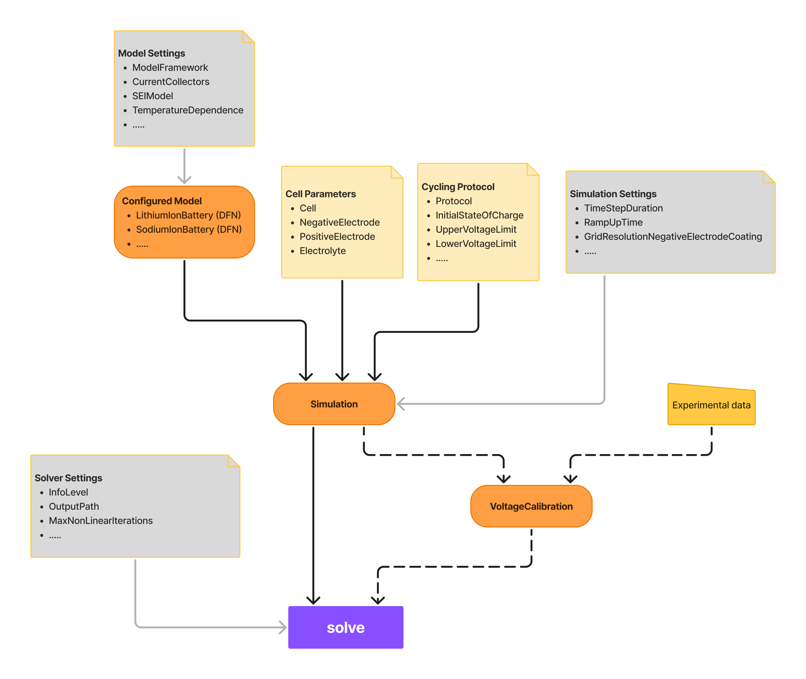
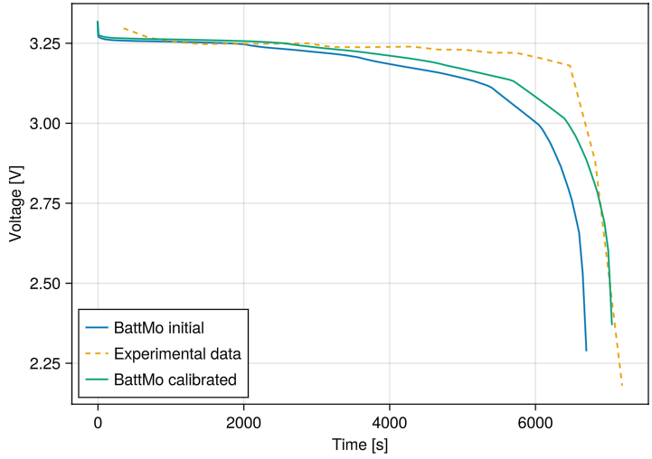

<!-- To compile this file, after installing docker, from this directory, run : docker run --rm --volume $PWD:/data --user $(id -u):$(id -g) --env JOURNAL=joss openjournals/inara  -->
# Summary
This paper introduces BattMo.jl, the Battery Modelling Toolbox, an open-source Julia framework for continuum-scale simulation of electrochemical cells. Using a finite-volume approach, BattMo.jl supports both pseudo-2-dimensional (P2D) models and fully three-dimensional (3D) simulations of realistic geometries such as cylindrical cells and pouch cells. The toolbox combines high-performance solvers, built-in libraries of battery designs and cycling protocols, and an intuitive programmatic and graphical interface. It further includes an adjoint-based optimization framework for parameter estimation and model calibration, enabling close integration of modelling with experimental workflows. The [BattMoTeam](https://batterymodel.com/our-team/) collaborates closely with the [SINTEF Battery Lab](https://www.sintef.no/en/all-laboratories/sintef-battery-lab/), gaining valuable input from experienced battery researchers and helping to bridge the gap between academic modelling and industrial innovation.


# Statement of need
New high-performance battery designs are essential for achieving the goals of the electric energy transition. To reduce costly prototyping and accelerate innovation, both industry and academia increasingly rely on rigorous digital workflows that complement experimental research and provide deeper insights into battery behavior.

Recently, a variety of
open-source battery modelling codes have been released including PyBaMM [@sulzer2021python], cideMOD [@CiriaAylagas2022], LIONSIMBA [@torchio2016lionsimba], PETLion [@Berliner_2021], and MPET, among others. These open-source modelling frameworks help the battery community reduce the cost of model development and help ensure the
validity and the reproducibility of findings. Yet there remains a clear need for tools that (i) address both Li-ion and post-Li-ion chemistries, (ii) support full 3D cell simulations, and (iii) combine computational efficiency with broad accessibility.

BattMo.jl responds to this need by putting effort into creating a flexible model architecture, providing a framework for 3D simulations together with a library of standard battery geometries, offering very short runtimes (e.g., ~500 ms for a standard P2D discharge), and by laying an emphasis on usability and accessibility through its intuitive API and [graphical interface](https://app.batterymodel.com/). In addition, BattMo features an in-house API for adjoint-based optimization, making parameter calibration and design optimization both robust and convenient through a familiar interface.

# High-level Architecture
The high-level architecture of BattMo.jl is designed to be both modular and extensible, enabling users to combine standard battery models with customized physics and workflows. At its core, the framework separates the physical model definition (what equations to solve) from the simulation configuration (what parameters and settings to apply). This design allows researchers to start with standard models, extend them with for example degradation, and scale simulations from simple pseudo-2D cases to realistic 3D geometries, all without restructuring the workflow.

Figure \ref{fig:backend} shows the high-level architecture of some of the core workflows in BattMo.jl. The BattMo framework is configured through five different input sets, all of which can be provided in JSON format:

- Cell parameters: descriptions of the cell geometry, electrodes, and electrolyte materials.
- Cycling protocol: specification of operating conditions, such as current profiles or voltage limits.
- Model settings: configuration of the underlying physical models and optional sub-models.
- Simulation settings: numerical resolution settings, such as timesteps and spatial discretization.
- Solver settings: options controlling solver behavior and verbosity.

The model settings are first passed to the selected base model (e.g., LithiumIonBattery, SodiumIonBattery), which instantiates a configured model. This model defines the set of governing equations and constitutive laws used in the simulation. For both the lithium-ion and sodium-ion battery models, the default representation is based on the Doyle–Fuller–Newman (DFN) model [@Doyle1993ModelingCell], which can be extended with additional physics modules (e.g., SEI growth, temperature dependence) depending on the configuration of the model settings.



The configured model is then combined with the cell parameters, cycling protocol, and simulation settings to form a simulation instance. At this stage, the input data are mapped onto the model equations—for example, by setting up active material models, electrolyte properties, cell geometry and grids, load conditions, initial states, and timestepping. The result is a fully defined simulation object.

This simulation instance can be passed to the `solve` function together with the solver settings, which configure the numerical solver, and execute the simulation. BattMo’s solver leverages automatic differentiation and supports adjoint computations, enabling efficient calculation of parameter sensitivities and gradients of arbitrary objective functions. This allows for powerful gradient-based optimization workflows.

As illustrated in Figure \ref{fig:backend}, one example optimization application is voltage calibration. Here, a simulation instance with initial parameter guesses is combined with experimental data and a calibration configuration (defining which parameters to vary, their bounds, and initial values). The calibration problem is then solved iteratively using the adjoint-enabled solver until the simulated voltage matches the experimental measurements within tolerance.


# Functionalities Overview

- BattINFO-compliant input formats for semantic interoperability.
- P2D and P4D modelling with additional sub models like SEI growth, and temperature dependence.
- Parameter calibration and design optimization.
- Battery cell KPI calculations.
- Automatic validation of model instances, parameters, and settings to prevent unclear errors and unrealistic input values.
- User-friendly API providing guidance for parameter set development
- Tools for debugging simulation failures.
- Convenient tools for inspecting, printing, and plotting cell information and simulation results.
- Headless user interface designed for digital twin integration and web API applications.

# Examples

A P4D constant current discharge simulation of a cylindrical cell using cell parameters from Chen at al. [@chen2020]:


```Julia
using BattMo, GLMakie

# Load cell parameters and cycling protocol
cell_parameters = load_cell_parameters(; from_default_set = "Chen2020")
cycling_protocol = load_cycling_protocol(; from_default_set = "CCDischarge")

# We can use the default model settings configuration for a P4D cylindrical simulation
model_settings = load_model_settings(; from_default_set = "P4D_cylindrical")

# Setup the model
model = LithiumIonBattery(; model_settings)

# Setup the simulation
sim = Simulation(model, cell_parameters, cycling_protocol; simulation_settings);

# Solve the simulation
output = solve(sim)

# Cool interactive plotting of the results in the 3D geometry
plot_interactive_3d(output)
```


Figure \ref{fig:cylindrical} shows zoomed in 3D results of the electrolyte lithium concentration at the end of the discharge. At the beginning and ending of the roll we can we can see an imbalance in lithium concentration. These electrolyte depletions and oversaturations may influence the performance of the cell and would have been overlooked in simplified models, underlining the importance of 3D modelling.

A simple example of a P2D discharge voltage calibration using initial cell parameters and experimental data from Xu at al. [@Xu2015]:


```Julia
using BattMo, Jutul
using CSV
using DataFrames
using GLMakie

# ## Load the experimental data and set up a base case
battmo_base = normpath(joinpath(pathof(BattMo) |> splitdir |> first, ".."))
exdata = joinpath(battmo_base, "examples", "example_data")

# Voltage curve C-rate 0.5
df_05 = CSV.read(joinpath(exdata, "Xu_2015_voltageCurve_05C.csv"), DataFrame)

t_exp_05 = df_05[:, 1]
V_exp_05 = df_05[:, 2]

# Load parameter sets
cell_parameters = load_cell_parameters(; from_default_set = "Xu2015")
cycling_protocol = load_cycling_protocol(; from_default_set = "CCDischarge")

cycling_protocol["LowerVoltageLimit"] = 2.25
cycling_protocol["DRate"] = 0.5

# Setup model and simulation
model = LithiumIonBattery()
sim = Simulation(model, cell_parameters, cycling_protocol)

# Solve initial simulation and retrieve the time series results
output0 = solve(sim)
time_series_0 = get_output_time_series(output0)

# Setup the voltage calibration
cal = VoltageCalibration(t_exp_05, V_exp_05, sim)

# Free the parameters that should be calibrated
free_calibration_parameter!(cal,
	["NegativeElectrode", "ActiveMaterial", "StoichiometricCoefficientAtSOC100"];
	lower_bound = 0.0, upper_bound = 1.0)
free_calibration_parameter!(cal,
	["PositiveElectrode", "ActiveMaterial", "StoichiometricCoefficientAtSOC100"];
	lower_bound = 0.0, upper_bound = 1.0)

# "StoichiometricCoefficientAtSOC0" at both electrodes
free_calibration_parameter!(cal,
	["NegativeElectrode", "ActiveMaterial", "StoichiometricCoefficientAtSOC0"];
	lower_bound = 0.0, upper_bound = 1.0)
free_calibration_parameter!(cal,
	["PositiveElectrode", "ActiveMaterial", "StoichiometricCoefficientAtSOC0"];
	lower_bound = 0.0, upper_bound = 1.0)

#  "MaximumConcentration" of both electrodes
free_calibration_parameter!(cal,
	["NegativeElectrode", "ActiveMaterial", "MaximumConcentration"];
	lower_bound = 10000.0, upper_bound = 1e5)
free_calibration_parameter!(cal,
	["PositiveElectrode", "ActiveMaterial", "MaximumConcentration"];
	lower_bound = 10000.0, upper_bound = 1e5)


# Solve the calibration problem
solve(cal);

# Retrieve the calibrated parameters
cell_parameters_calibrated = cal.calibrated_cell_parameters;

# ## Compare the results of the calibration against the experimental data
sim_opt = Simulation(model, cell_parameters_calibrated, cycling_protocol)
output_opt = solve(sim_opt);
time_series_opt = get_output_time_series(output_opt)

fig = Figure()
ax = Axis(fig[1, 1], title = "CRate = 0.5", xlabel = "Time [s]", ylabel = "Voltage [V]")
lines!(ax, time_series_0.Time, time_series_0.Voltage, label = "BattMo initial")
lines!(ax, t_exp_05, V_exp_05, label = "Experimental data", linestyle = :dash)
lines!(ax, time_series_opt.Time, time_series_opt.Voltage, label = "BattMo calibrated")
axislegend(position = :lb)
fig
```



From the results in figure \ref{fig:calibration} we can see that the calibrated results are closer to the experimental data compared to the initial simulation results. In this case we only did a low rate calibration including parameters like the stoichiometric coefficients and maximum concentrations which have the biggest influence on low rate simulations. In order to retrieve a better fit we need to calibrate additional parameters. Visit our [documentation](https://battmoteam.github.io/BattMo.jl/dev/examples/example_calibration) for a more complete calibration example.


# Future development
Soon to be expected functionalities are:
- Fully flexible cycling protocol creation (already available in MATLAB version, see BattMo Family).
- Fully thermal coupling (already available in MATLAB version, see BattMo Family).
- Composite active materials (already available in MATLAB version, see BattMo Family).
- A user-friendly API for model development and model adaptation.
- Additional tools for parameterization of open circuit potentials, diffusion coefficients, etc.

# Software dependencies

BattMo.jl is built on top of Jutul.jl [@Jutul] which provides a reliable foundation for meshing
intricate geometries, efficiently solving large systems of equations, and visualizing the results. For plotting, BattMo.jl and Jutul.jl rely on Makie.jl [@Makie].


# BattMo Family

The following software include the BattMo Family:
- [BattMo.jl](https://github.com/BattMoTeam/BattMo.jl) (described in this paper)
- [BattMo](https://github.com/BattMoTeam/BattMo) (MATLAB version)
- [PyBattMo](https://github.com/BattMoTeam/BattMo.jl) (Python wrapper around BattMo.jl)
- [BattMoApp](https://app.batterymodel.com/) (Online web-application built on top of BattMo.jl)


# Acknowledgements

We acknowledge contributions from the EU, Grant agreements 101069765, 875527, 101104013, 101103997.

# References