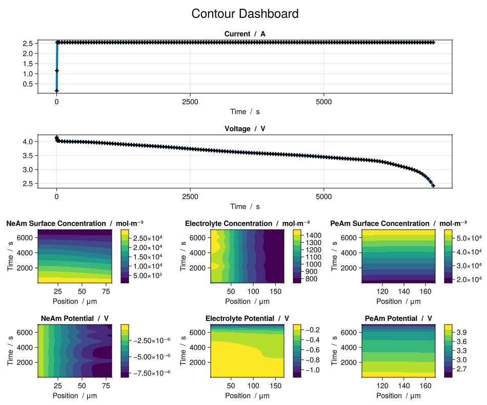
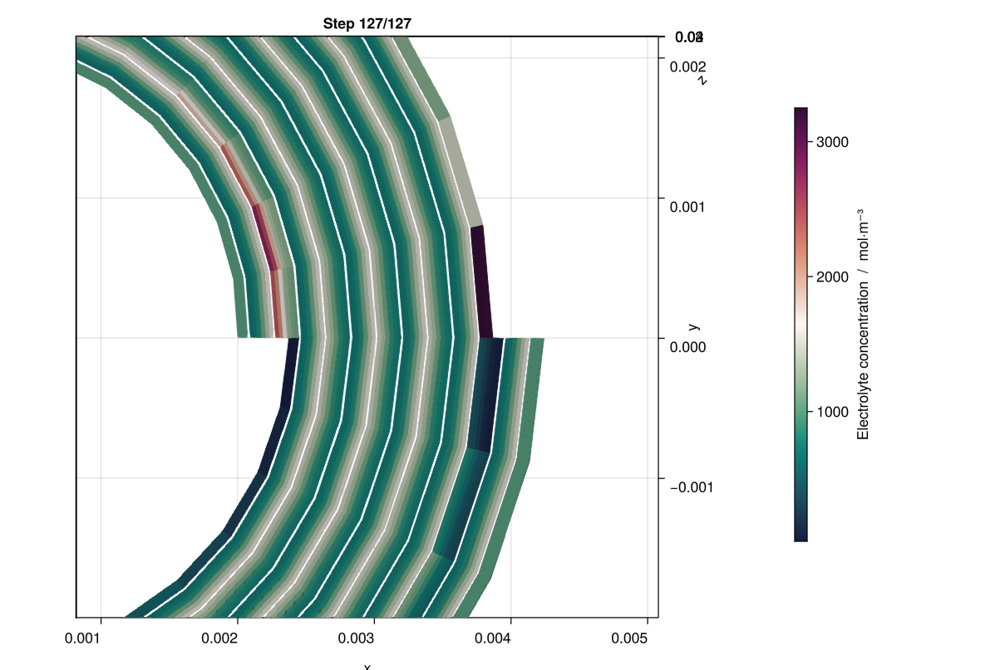
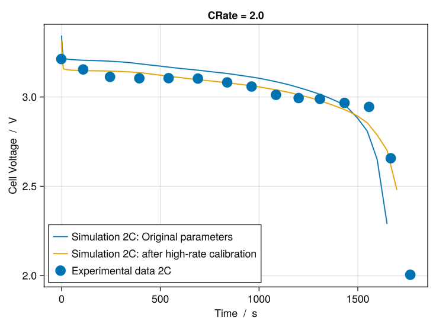

<!-- To compile this file, after installing docker, from this directory, run : docker run --rm --volume $PWD:/data --user $(id -u):$(id -g) --env JOURNAL=joss openjournals/inara  -->
# Summary
This paper introduces BattMo.jl, the Battery Modelling Toolbox, an open-source Julia framework for continuum-scale simulation of electrochemical devices. Using a finite-volume approach, BattMo.jl supports pseudo-2-dimensional (P2D) models for fast screening on a reduced-order mesh, as well as more comprehensive pseudo-four-dimensional (P4D) models that incorporate the 3D design of realistic geometries, including cylindrical cells and pouch cells. The toolbox combines high-performance solvers, built-in libraries of battery designs and cycling protocols, and an intuitive programmatic and graphical interface. It further includes an adjoint-based optimization framework for parameter estimation and model calibration, enabling close integration of modelling with experimental workflows. The [BattMoTeam](https://batterymodel.com/our-team/) collaborates closely with the [SINTEF Battery Lab](https://www.sintef.no/en/all-laboratories/sintef-battery-lab/), gaining valuable input from experienced battery researchers and helping to bridge the gap between academic modelling and industrial innovation. This partnership helps ensure that the toolbox remains relevant and effective in real-world applications, driving innovation and advancing the field of energy storage technology.

# Statement of need
New high-performance and sustainable battery designs are essential for achieving the goals of the energy transition. To reduce costly prototyping and accelerate innovation, both industry and academia increasingly rely on rigorous digital workflows that complement experimental research and provide deeper insights into battery behavior. Accurate models that are fast and efficient are also crucial for their inclusion in battery management systems (BMS), ensuring that devices are operated safely and efficiently.

Recently, a variety of open-source battery modelling codes have been released including PyBaMM [@sulzer2021python], cideMOD [@CiriaAylagas2022], LIONSIMBA [@torchio2016lionsimba], PETLion [@Berliner_2021], and MPET [@mpet_github], among others. These open-source modelling frameworks help the battery community reduce the cost of model development and help ensure the validity and the reproducibility of findings. Yet there remains a clear need for tools that (i) address both Li-ion and other chemistries, (ii) are extensible to other electrochemical devices like electrolyzers and fuel cells, (iii) support full 3D cell simulations, and (iv) combine computational efficiency with broad accessibility.

BattMo.jl responds to these needs by creating a flexible model architecture, providing a framework for 3D simulations together with a library of standard battery geometries, offering very short runtimes (e.g., ~500 ms for a standard P2D discharge), and by laying an emphasis on usability and accessibility through its intuitive API and [graphical interface](https://app.batterymodel.com/). In addition, BattMo.jl features an in-house API for adjoint-based optimization, making parameter calibration and design optimization both robust and convenient through a familiar interface.

# High-level architecture
The high-level architecture of BattMo.jl is designed to be modular and extensible, enabling users to combine standard battery models with customized physics and workflows. The framework separates the physical model definition (which equations to solve) from the simulation configuration (which parameters and settings to apply). This design allows researchers to introduce new mechanisms or scale simulations without restructuring the workflow.

Figure \ref{fig:backend} shows the high-level architecture of some core workflows in BattMo.jl. The BattMo framework is configured through five different input sets, all of which can be provided in JSON format:

- Cell parameters: descriptions of the cell geometry, electrodes, and electrolyte materials.
- Cycling protocol: specification of operating conditions, such as current profiles or voltage limits.
- Model settings: configuration of the underlying physical models and optional sub-models.
- Simulation settings: numerical resolution settings, such as timesteps and spatial discretization.
- Solver settings: options controlling solver behavior and verbosity.

The model settings are passed to the selected base model (e.g., LithiumIonBattery), which instantiates a configured model. This model defines the set of governing equations and constitutive laws used in the simulation. For the lithium-ion battery and other insertion-based batteries, the default model is based on the Doyle–Fuller–Newman (DFN) model [@Doyle1993ModelingCell], which can be extended with additional physics modules (e.g., SEI growth) depending on the configuration of the model settings.


The configured model is combined with the cell parameters, cycling protocol, and simulation settings to form a simulation instance. At this stage, the input parameters are mapped onto the model equations, for example, by setting up active material models, electrolyte properties, cell geometry and grids, load conditions, initial states, and timestepping. The result is a simulation instance, which can be validated against a set of internal requirements.

This simulation instance is passed to the `solve` function together with the solver settings, which configures the numerical solver, and executes the simulation. BattMo.jl’s solver leverages automatic differentiation and supports adjoint computations, enabling efficient calculation of parameter sensitivities and gradients of arbitrary objective functions. This enables gradient-based optimization workflows.

As illustrated in Figure \ref{fig:backend}, one example optimization application is parameter calibration from a voltage curve (VoltageCalibration). Here, a simulation instance with initial parameter guesses is combined with experimental data. The VoltageCalibration instance can be configured to either freeze or free parameters during the calibration and to set the bounds of the parameters that are calibrated. The calibration problem is then solved iteratively using the adjoint-enabled solver until the simulated voltage matches the experimental measurements within tolerance.

The architecture is designed to enhance the user experience and provide a gentler learning curve by organizing core workflows and input parameters into well-defined steps and categories. By making the settings optional, users can initially focus on creating the virtual representation of the cell and defining cycling protocols. Later, they can explore and adjust the settings to personalize configurations as they become more familiar with the software.

# Examples

## P2D example

P2D simulations offer users a way to quickly simulate the performance of electrochemical devices and understand the main mechanisms. This examples shows a simple 1-dimensional constant current discharge simulation of a lithium ion battery cell using cell parameters from Chen at al. [@chen2020].

```Julia
using BattMo, GLMakie

# Load cell parameters and cycling protocol
cell_parameters = load_cell_parameters(; from_default_set = "chen_2020")
cycling_protocol = load_cycling_protocol(; from_default_set = "cc_discharge")

# Setup the model
model_setup = LithiumIonBattery()

# Setup the simulation
sim = Simulation(model_setup, cell_parameters, cycling_protocol);

# Solve the simulation
output = solve(sim);

# Plot a dashboard showing some important state variables
plot_dashboard(output, plot_type = "contour")

```



The contour plots illustrate lithium concentrations and potentials, offering insights into the cell’s kinetic and transport processes. For example, the lithium concentration in the electrolyte shows expected values between 800 mol/m^3 and 1400 mol/m^3. However, the order reduction in P2D models can overlook important geometric effects. P4D models address this limitation by accurately capturing these geometry-dependent phenomena. We can see this in the following example. 

## P4D example

A P4D constant current discharge simulation of a cylindrical cell using cell parameters from Chen at al. [@chen2020]:

```Julia
using BattMo, GLMakie

# Load cell parameters and cycling protocol
cell_parameters = load_cell_parameters(; from_default_set = "chen_2020")
cycling_protocol = load_cycling_protocol(; from_default_set = "cc_discharge")

# We can use the default model settings configuration for a P4D cylindrical simulation
model_settings = load_model_settings(; from_default_set = "p4d_cylindrical")

# Setup the model
model = LithiumIonBattery(; model_settings)

# Setup the simulation
sim = Simulation(model, cell_parameters, cycling_protocol);

# Solve the simulation
output = solve(sim)

# Cool interactive plotting of the results in the 3D geometry
plot_interactive_3d(output)
```



Figure \ref{fig:cylindrical} shows zoomed in 3-dimensional results of the electrolyte lithium concentration at the end of the discharge. At the beginning and ending of the roll we can we can see an imbalance in lithium concentration. These electrolyte depletions and oversaturations may influence the performance of the cell and would have been overlooked in simplified models, underlining the importance of 3-dimensional modelling.

# Calibration example

This is a simple example of a P2D, constant current discharge, voltage calibration using initial cell parameters and experimental data from Xu at al. [@Xu2015]. In this example we perform a high-rate calibration, adjusting parameters such as the reaction rate coefficient and diffusion coefficient of the electrode active materials to account for the over-potentials within the experimental data.


```Julia
using BattMo, Jutul, CSV. DataFrames, GLMakie

# Load the experimental data and set up a base case
df = CSV.read(joinpath(exdata, "Xu_2015_voltageCurve_2C.csv"), DataFrame)

t_exp = df[:, 1]
V_exp = df[:, 2]

# Load parameter sets
cell_parameters = load_cell_parameters(; from_default_set = "xu_2015")
cycling_protocol = load_cycling_protocol(; from_default_set = "cc_discharge")

cycling_protocol["LowerVoltageLimit"] = 2.25
cycling_protocol["DRate"] = 2.0

# Setup model and simulation
model = LithiumIonBattery()
sim = Simulation(model, cell_parameters, cycling_protocol)

# Solve initial simulation and retrieve the time series results
output0 = solve(sim)
time_series_0 = output0.time_series

# Setup the voltage calibration
cal = VoltageCalibration(t_exp, V_exp, sim)

# Free the parameters that should be calibrated
free_calibration_parameter!(calibration_high_rate,
    ["NegativeElectrode","ActiveMaterial", "ReactionRateConstant"];
    lower_bound = 1e-16, upper_bound = 1e-10)
free_calibration_parameter!(calibration_high_rate,
    ["PositiveElectrode","ActiveMaterial", "ReactionRateConstant"];
    lower_bound = 1e-16, upper_bound = 1e-10)

free_calibration_parameter!(calibration_high_rate,
    ["NegativeElectrode","ActiveMaterial", "DiffusionCoefficient"];
    lower_bound = 1e-16, upper_bound = 1e-12)
free_calibration_parameter!(calibration_high_rate,
    ["PositiveElectrode","ActiveMaterial", "DiffusionCoefficient"];
    lower_bound = 1e-16, upper_bound = 1e-12)

# Solve the calibration problem
solve(cal);

# Retrieve the calibrated parameters
cell_parameters_calibrated = cal.calibrated_cell_parameters;

# Simulate the optimized parameters
sim_opt = Simulation(model, cell_parameters_calibrated, cycling_protocol)
output_opt = solve(sim_opt);
time_series_opt = output_opt.time_series

# Plot original model vs calibrated model vs experimental data
fig = Figure()
ax = Axis(fig[1, 1], title = "CRate = 2.0", xlabel = "Time  /  s", ylabel = "Cell Voltage  /  V")
lines!(ax, time_series_0["Time"], time_series_0["Voltage"], label = "Simulation 2C: Original parameters")
lines!(ax, time_series_opt["Time"], time_series_opt["Voltage"], label = "Simulation 2C: after high-rate calibration")
scatter!(ax, t_exp, V_exp, label = "Experimental data 2C", markersize = 20)
axislegend(position = :lb)
fig
```



From the results in Figure \ref{fig:calibration}, it is evident that the calibrated simulations align more closely with the experimental data than the original, uncalibrated results. We can see that the model now represents a more realistic voltage drop and use of capacity.


# Software dependencies

BattMo.jl is built on top of Jutul.jl [@Jutul] which provides a reliable foundation for meshing intricate geometries, efficiently solving large systems of equations, and visualizing the results. For plotting, BattMo.jl and Jutul.jl rely on Makie.jl [@Makie].


# BattMo family

The following software include the BattMo family:

| Software | Description          |
|----------|:---------------:|
| [BattMo.jl](https://github.com/BattMoTeam/BattMo.jl)  | Described in this publication  |
| [BattMo](https://github.com/BattMoTeam/BattMo)      | MATLAB and original version of BattMo |
| [PyBattMo](https://github.com/BattMoTeam/PyBattMo)        | Python wrapper around BattMo.jl    |
| [BattMoApp](https://app.battmo.org/)        | Web-application built on top of BattMo.jl    |


# Acknowledgements

We acknowledge contributions from the European Union, Grant agreements 101069765 (IntelLiGent), 875527 (HYDRA), 957189 (BIG-MAP), 101104013 (BATMAX) and 101103997 (DigiBatt).

# References
