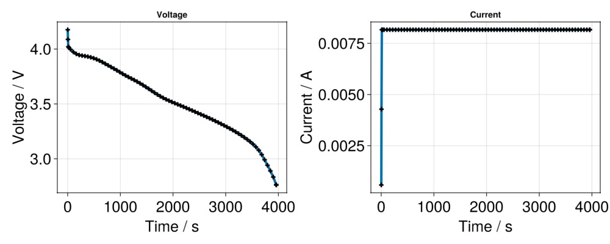
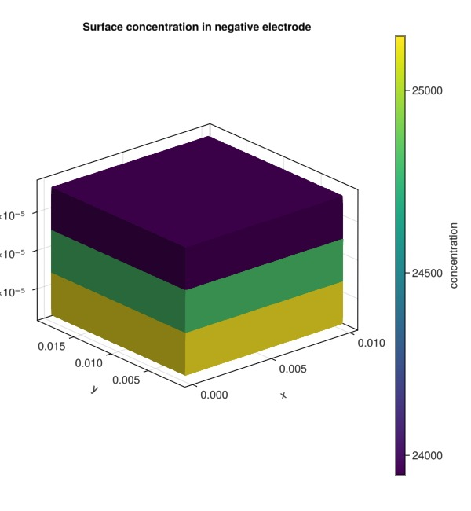

# 3D battery example {#3D-battery-example}

```julia
using Jutul, BattMo, GLMakie
```


## Setup input parameters {#Setup-input-parameters}

```julia
name = "p2d_40_jl_chen2020"

fn = string(dirname(pathof(BattMo)), "/../test/data/jsonfiles/", name, ".json")
inputparams = readBattMoJsonInputFile(fn)

fn = string(dirname(pathof(BattMo)), "/../test/data/jsonfiles/3d_demo_geometry.json")
inputparams_geometry = readBattMoJsonInputFile(fn)

inputparams = mergeInputParams(inputparams_geometry, inputparams)
```


```
InputParams(Dict{String, Any}("include_current_collectors" => true, "use_thermal" => true, "Geometry" => Dict{String, Any}("height" => 0.02, "case" => "3D-demo", "Nh" => 10, "width" => 0.01, "faceArea" => 0.027, "Nw" => 10), "G" => Any[], "Separator" => Dict{String, Any}("density" => 946.0, "thickness" => 5.0e-5, "N" => 3, "bruggemanCoefficient" => 1.5, "thermalConductivity" => 0.334, "specificHeatCapacity" => 1692.0, "porosity" => 0.4), "Control" => Dict{String, Any}("numberOfCycles" => 10, "CRate" => 1.0, "dEdtLimit" => 0.0001, "initialControl" => "discharge", "DRate" => 1.0, "rampupTime" => 10.0, "dIdtLimit" => 0.0001, "controlPolicy" => "CCDischarge", "lowerCutoffVoltage" => 2.4, "upperCutoffVoltage" => 4.1…), "SOC" => 1.0, "Electrolyte" => Dict{String, Any}("ionicConductivity" => Dict{String, Any}("functionname" => "computeElectrolyteConductivity_Chen2020", "argumentlist" => Any["c"], "type" => "function"), "compnames" => Any["Li", "PF6"], "density" => 1200, "diffusionCoefficient" => Dict{String, Any}("functionname" => "computeDiffusionCoefficient_Chen2020", "argumentlist" => Any["c"], "type" => "function"), "initialConcentration" => 1000, "thermalConductivity" => 0.099, "specificHeatCapacity" => 1518.0, "bruggemanCoefficient" => 1.5, "species" => Dict{String, Any}("transferenceNumber" => 0.7406, "nominalConcentration" => 1000, "chargeNumber" => 1)), "Output" => Dict{String, Any}("variables" => Any["energy"]), "PositiveElectrode" => Dict{String, Any}("Coating" => Dict{String, Any}("thickness" => 8.0e-5, "N" => 3, "effectiveDensity" => 3500, "ActiveMaterial" => Dict{String, Any}("diffusionModelType" => "full", "density" => 4950.0, "massFraction" => 0.9, "Interface" => Dict{String, Any}("volumetricSurfaceArea" => 382183.9, "reactionRateConstant" => 3.545e-11, "chargeTransferCoefficient" => 0.5, "density" => 4950.0, "numberOfElectronsTransferred" => 1, "guestStoichiometry100" => 0.2661, "openCircuitPotential" => Dict{String, Any}("functionname" => "computeOCP_NMC811_Chen2020", "argumentlist" => Any["c", "cmax"], "type" => "function"), "guestStoichiometry0" => 0.9084, "saturationConcentration" => 51765.0, "activationEnergyOfReaction" => 17800.0…), "SolidDiffusion" => Dict{String, Any}("activationEnergyOfDiffusion" => 5000.0, "particleRadius" => 1.0e-6, "N" => 10, "referenceDiffusionCoefficient" => 1.0e-14), "thermalConductivity" => 2.1, "specificHeatCapacity" => 700.0, "electronicConductivity" => 100.0), "bruggemanCoefficient" => 1.5, "Binder" => Dict{String, Any}("density" => 1780.0, "massFraction" => 0.05, "thermalConductivity" => 0.165, "specificHeatCapacity" => 1400.0, "electronicConductivity" => 100.0), "ConductingAdditive" => Dict{String, Any}("density" => 1800.0, "massFraction" => 0.05, "thermalConductivity" => 0.5, "specificHeatCapacity" => 300.0, "electronicConductivity" => 100.0)), "CurrentCollector" => Dict{String, Any}("density" => 8960, "thickness" => 1.0e-5, "N" => 2, "tab" => Dict{String, Any}("height" => 0.001, "Nh" => 3, "width" => 0.004, "Nw" => 3), "electronicConductivity" => 5.96e7))…))
```


## Setup and run simulation {#Setup-and-run-simulation}

```julia
output = run_battery(inputparams);
```


```

Simulating 1 hour, 6 minutes as 77 report steps   3%|▏   |  ETA: 0:17:45
  Progress:  Solving step 2/77 (0.13% of time interval complete)
  Stats:     4 iterations in 26.03 s (6.51 s each)






Simulating 1 hour, 6 minutes as 77 report steps  12%|▌   |  ETA: 0:03:42
  Progress:  Solving step 9/77 (6.90% of time interval complete)
  Stats:     33 iterations in 26.50 s (803.04 ms each)






Simulating 1 hour, 6 minutes as 77 report steps  14%|▋   |  ETA: 0:02:57
  Progress:  Solving step 11/77 (9.68% of time interval complete)
  Stats:     40 iterations in 26.61 s (665.16 ms each)






Simulating 1 hour, 6 minutes as 77 report steps  18%|▊   |  ETA: 0:02:13
  Progress:  Solving step 14/77 (13.85% of time interval complete)
  Stats:     50 iterations in 26.76 s (535.22 ms each)






Simulating 1 hour, 6 minutes as 77 report steps  21%|▉   |  ETA: 0:01:54
  Progress:  Solving step 16/77 (16.62% of time interval complete)
  Stats:     58 iterations in 26.90 s (463.78 ms each)






Simulating 1 hour, 6 minutes as 77 report steps  24%|█   |  ETA: 0:01:31
  Progress:  Solving step 19/77 (20.79% of time interval complete)
  Stats:     67 iterations in 27.04 s (403.56 ms each)






Simulating 1 hour, 6 minutes as 77 report steps  28%|█▏  |  ETA: 0:01:15
  Progress:  Solving step 22/77 (24.96% of time interval complete)
  Stats:     76 iterations in 27.18 s (357.58 ms each)






Simulating 1 hour, 6 minutes as 77 report steps  32%|█▎  |  ETA: 0:01:03
  Progress:  Solving step 25/77 (29.12% of time interval complete)
  Stats:     85 iterations in 27.32 s (321.36 ms each)






Simulating 1 hour, 6 minutes as 77 report steps  36%|█▍  |  ETA: 0:00:53
  Progress:  Solving step 28/77 (33.29% of time interval complete)
  Stats:     94 iterations in 27.45 s (292.06 ms each)






Simulating 1 hour, 6 minutes as 77 report steps  40%|█▋  |  ETA: 0:00:45
  Progress:  Solving step 31/77 (37.46% of time interval complete)
  Stats:     103 iterations in 27.59 s (267.88 ms each)






Simulating 1 hour, 6 minutes as 77 report steps  44%|█▊  |  ETA: 0:00:39
  Progress:  Solving step 34/77 (41.62% of time interval complete)
  Stats:     112 iterations in 27.73 s (247.61 ms each)






Simulating 1 hour, 6 minutes as 77 report steps  46%|█▉  |  ETA: 0:00:35
  Progress:  Solving step 36/77 (44.40% of time interval complete)
  Stats:     118 iterations in 27.84 s (235.95 ms each)






Simulating 1 hour, 6 minutes as 77 report steps  50%|██  |  ETA: 0:00:30
  Progress:  Solving step 39/77 (48.57% of time interval complete)
  Stats:     127 iterations in 27.98 s (220.31 ms each)






Simulating 1 hour, 6 minutes as 77 report steps  54%|██▏ |  ETA: 0:00:26
  Progress:  Solving step 42/77 (52.73% of time interval complete)
  Stats:     136 iterations in 28.12 s (206.77 ms each)






Simulating 1 hour, 6 minutes as 77 report steps  58%|██▎ |  ETA: 0:00:22
  Progress:  Solving step 45/77 (56.90% of time interval complete)
  Stats:     145 iterations in 28.26 s (194.90 ms each)






Simulating 1 hour, 6 minutes as 77 report steps  62%|██▌ |  ETA: 0:00:19
  Progress:  Solving step 48/77 (61.07% of time interval complete)
  Stats:     154 iterations in 28.40 s (184.42 ms each)






Simulating 1 hour, 6 minutes as 77 report steps  65%|██▋ |  ETA: 0:00:16
  Progress:  Solving step 51/77 (65.23% of time interval complete)
  Stats:     163 iterations in 28.54 s (175.09 ms each)






Simulating 1 hour, 6 minutes as 77 report steps  69%|██▊ |  ETA: 0:00:14
  Progress:  Solving step 54/77 (69.40% of time interval complete)
  Stats:     172 iterations in 28.68 s (166.74 ms each)






Simulating 1 hour, 6 minutes as 77 report steps  73%|██▉ |  ETA: 0:00:12
  Progress:  Solving step 57/77 (73.57% of time interval complete)
  Stats:     181 iterations in 28.82 s (159.22 ms each)






Simulating 1 hour, 6 minutes as 77 report steps  76%|███ |  ETA: 0:00:10
  Progress:  Solving step 59/77 (76.35% of time interval complete)
  Stats:     187 iterations in 28.93 s (154.69 ms each)






Simulating 1 hour, 6 minutes as 77 report steps  79%|███▏|  ETA: 0:00:08
  Progress:  Solving step 62/77 (80.51% of time interval complete)
  Stats:     196 iterations in 29.07 s (148.30 ms each)






Simulating 1 hour, 6 minutes as 77 report steps  83%|███▍|  ETA: 0:00:06
  Progress:  Solving step 65/77 (84.68% of time interval complete)
  Stats:     205 iterations in 29.21 s (142.47 ms each)






Simulating 1 hour, 6 minutes as 77 report steps  87%|███▌|  ETA: 0:00:05
  Progress:  Solving step 68/77 (88.85% of time interval complete)
  Stats:     215 iterations in 29.36 s (136.57 ms each)






Simulating 1 hour, 6 minutes as 77 report steps  90%|███▋|  ETA: 0:00:04
  Progress:  Solving step 70/77 (91.62% of time interval complete)
  Stats:     223 iterations in 29.49 s (132.23 ms each)






Simulating 1 hour, 6 minutes as 77 report steps  92%|███▊|  ETA: 0:00:03
  Progress:  Solving step 72/77 (94.40% of time interval complete)
  Stats:     231 iterations in 29.61 s (128.18 ms each)






Simulating 1 hour, 6 minutes as 77 report steps  95%|███▊|  ETA: 0:00:02
  Progress:  Solving step 74/77 (97.18% of time interval complete)
  Stats:     239 iterations in 29.73 s (124.41 ms each)






Simulating 1 hour, 6 minutes as 77 report steps  97%|███▉|  ETA: 0:00:01
  Progress:  Solving step 76/77 (99.96% of time interval complete)
  Stats:     246 iterations in 29.84 s (121.31 ms each)






Simulating 1 hour, 6 minutes as 77 report steps 100%|████| Time: 0:00:32
  Progress:  Solved step 77/77
  Stats:     252 iterations in 29.95 s (118.86 ms each)
╭────────────────┬──────────┬──────────────┬──────────╮
│ Iteration type │ Avg/step │ Avg/ministep │    Total │
│                │ 77 steps │ 77 ministeps │ (wasted) │
├────────────────┼──────────┼──────────────┼──────────┤
│ Newton         │  3.27273 │      3.27273 │  252 (0) │
│ Linearization  │  4.27273 │      4.27273 │  329 (0) │
│ Linear solver  │  3.27273 │      3.27273 │  252 (0) │
│ Precond apply  │      0.0 │          0.0 │    0 (0) │
╰────────────────┴──────────┴──────────────┴──────────╯
╭───────────────┬──────────┬────────────┬─────────╮
│ Timing type   │     Each │   Relative │   Total │
│               │       ms │ Percentage │       s │
├───────────────┼──────────┼────────────┼─────────┤
│ Properties    │   0.2157 │     0.18 % │  0.0543 │
│ Equations     │  23.7350 │    26.07 % │  7.8088 │
│ Assembly      │  13.6655 │    15.01 % │  4.4959 │
│ Linear solve  │  14.3048 │    12.03 % │  3.6048 │
│ Linear setup  │   0.0000 │     0.00 % │  0.0000 │
│ Precond apply │   0.0000 │     0.00 % │  0.0000 │
│ Update        │   5.7869 │     4.87 % │  1.4583 │
│ Convergence   │  21.3921 │    23.50 % │  7.0380 │
│ Input/Output  │   4.2372 │     1.09 % │  0.3263 │
│ Other         │  20.5047 │    17.25 % │  5.1672 │
├───────────────┼──────────┼────────────┼─────────┤
│ Total         │ 118.8637 │   100.00 % │ 29.9537 │
╰───────────────┴──────────┴────────────┴─────────╯
```


## Plot discharge curve {#Plot-discharge-curve}

```julia
states = output[:states]
model  = output[:extra][:model]

t = [state[:Control][:ControllerCV].time for state in states]
E = [state[:Control][:Phi][1] for state in states]
I = [state[:Control][:Current][1] for state in states]

f = Figure(size = (1000, 400))

ax = Axis(f[1, 1],
          title     = "Voltage",
          xlabel    = "Time / s",
          ylabel    = "Voltage / V",
          xlabelsize = 25,
          ylabelsize = 25,
          xticklabelsize = 25,
          yticklabelsize = 25)

scatterlines!(ax,
              t,
              E;
              linewidth = 4,
              markersize = 10,
              marker = :cross,
              markercolor = :black,
              )

ax = Axis(f[1, 2],
          title     = "Current",
          xlabel    = "Time / s",
          ylabel    = "Current / A",
          xlabelsize = 25,
          ylabelsize = 25,
          xticklabelsize = 25,
          yticklabelsize = 25
          )

scatterlines!(ax,
              t,
              I;
              linewidth = 4,
              markersize = 10,
              marker = :cross,
              markercolor = :black)

display(f)
f
```



## Plot potential on grid at last time step {#Plot-potential-on-grid-at-last-time-step}

```julia
state = states[10]

function plot_potential(am, cc, label)
    f3D = Figure(size = (600, 650))
    ax3d = Axis3(f3D[1, 1];
                 title = "Potential in $label electrode (coating and active material)")

    maxPhi = maximum([maximum(state[cc][:Phi]), maximum(state[am][:Phi])])
    minPhi = minimum([minimum(state[cc][:Phi]), minimum(state[am][:Phi])])

    colorrange = [0, maxPhi - minPhi]

    components = [am, cc]
    for component in components
        g = model[component].domain.representation
        phi = state[component][:Phi]
        Jutul.plot_cell_data!(ax3d, g, phi .- minPhi; colormap = :viridis, colorrange = colorrange)
    end

    cbar = GLMakie.Colorbar(f3D[1, 2];
                            colormap = :viridis,
                            colorrange = colorrange .+ minPhi,
                            label = "potential")
    display(GLMakie.Screen(), f3D)
    return f3D
end
#
plot_potential(:PeAm, :PeCc, "positive")
#
plot_potential(:NeAm, :NeCc, "negative")
```


## Plot surface concentration on grid at last time step {#Plot-surface-concentration-on-grid-at-last-time-step}

```julia
function plot_surface_concentration(component, label)
    f3D = Figure(size = (600, 650))
    ax3d = Axis3(f3D[1, 1];
                 title = "Surface concentration in $label electrode")

    cs = state[component][:Cs]
    maxcs = maximum(cs)
    mincs = minimum(cs)

    colorrange = [0, maxcs - mincs]
    g = model[component].domain.representation
    Jutul.plot_cell_data!(ax3d, g, cs .- mincs;
                          colormap = :viridis,
                          colorrange = colorrange)

    cbar = GLMakie.Colorbar(f3D[1, 2];
                            colormap = :viridis,
                            colorrange = colorrange .+ mincs,
                            label = "concentration")
    display(GLMakie.Screen(), f3D)
    return f3D
end
```


```
plot_surface_concentration (generic function with 1 method)
```


## Positive

```julia
plot_surface_concentration(:PeAm, "positive")
```


## Negative

```julia
plot_surface_concentration(:NeAm, "negative")
```



## Plot electrolyte concentration and potential on grid at last time step {#Plot-electrolyte-concentration-and-potential-on-grid-at-last-time-step}

```julia
function plot_elyte(var, label)
    f3D = Figure(size = (600, 650))
    ax3d = Axis3(f3D[1, 1]; title = "$label in electrolyte")

    val = state[:Elyte][var]
    maxval = maximum(val)
    minval = minimum(val)

    colorrange = [0, maxval - minval]

    g = model[:Elyte].domain.representation
    Jutul.plot_cell_data!(ax3d, g, val .- minval;
                          colormap = :viridis,
                          colorrange = colorrange)

    cbar = GLMakie.Colorbar(f3D[1, 2];
                            colormap = :viridis,
                            colorrange = colorrange .+ minval,
                            label = "$label")
    display(GLMakie.Screen(), f3D)
    f3D
end

#
plot_elyte(:C, "concentration")
#
plot_elyte(:Phi, "potential")
```


## Example on GitHub {#Example-on-GitHub}

If you would like to run this example yourself, it can be downloaded from the BattMo.jl GitHub repository [as a script](https://https://github.com/BattMoTeam/BattMo.jl/blob/main/examples/example_3d_demo.jl), or as a [Jupyter Notebook](https://https://github.com/BattMoTeam/BattMo.jl/blob/gh-pages/dev/final_site/notebooks/example_3d_demo.ipynb)


---


_This page was generated using [Literate.jl](https://github.com/fredrikekre/Literate.jl)._
