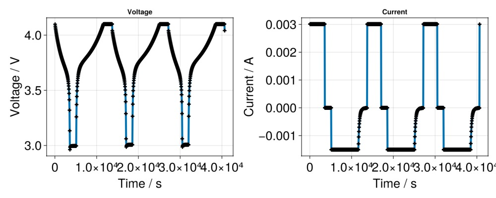

# Cycling a battery 40 times with a constant current constant voltage (CCCV) control {#Cycling-a-battery-40-times-with-a-constant-current-constant-voltage-(CCCV)-control}

```julia
using BattMo, GLMakie
name = "p2d_40_cccv"
fn = string(dirname(pathof(BattMo)), "/../test/data/jsonfiles/", name, ".json")
inputparams = readBattMoJsonInputFile(fn)
```


```
InputParams(Dict{String, Any}("include_current_collectors" => false, "use_thermal" => false, "Geometry" => Dict{String, Any}("case" => "1D", "faceArea" => 0.0001), "Separator" => Dict{String, Any}("density" => 946, "thickness" => 1.5e-5, "N" => 10, "bruggemanCoefficient" => 1.5, "thermalConductivity" => 0.334, "specificHeatCapacity" => 1978, "porosity" => 0.55), "Control" => Dict{String, Any}("numberOfCycles" => 3, "CRate" => 0.5, "dEdtLimit" => 1.0e-7, "initialControl" => "discharging", "DRate" => 1, "dIdtLimit" => 1.0e-7, "controlPolicy" => "CCCV", "lowerCutoffVoltage" => 2.8, "upperCutoffVoltage" => 4.1), "TimeStepping" => Dict{String, Any}("useRampup" => true, "numberOfRampupSteps" => 5, "timeStepDuration" => 50), "G" => Any[], "SOC" => 0.99, "Electrolyte" => Dict{String, Any}("ionicConductivity" => Dict{String, Any}("functionname" => "computeElectrolyteConductivity_default", "argumentlist" => Any["concentration", "temperature"], "type" => "function"), "density" => 1200, "diffusionCoefficient" => Dict{String, Any}("functionname" => "computeDiffusionCoefficient_default", "argumentlist" => Any["concentration", "temperature"], "type" => "function"), "initialConcentration" => 1000, "thermalConductivity" => 0.6, "specificHeatCapacity" => 2055, "bruggemanCoefficient" => 1.5, "species" => Dict{String, Any}("transferenceNumber" => 0.2594, "nominalConcentration" => 1000, "chargeNumber" => 1)), "Output" => Dict{String, Any}("variables" => Any["energy"])…))
```


## Run base case and plot the results against BattMo-MRST reference {#Run-base-case-and-plot-the-results-against-BattMo-MRST-reference}

```julia
output = run_battery(inputparams);

states = output[:states]

t = [state[:Control][:ControllerCV].time for state in states]
E = [state[:Control][:Phi][1] for state in states]
I = [state[:Control][:Current][1] for state in states]
```


```
813-element Vector{Float64}:
  0.0030114763294004296
  0.0030114763294004296
  0.0030114763294004296
  0.0030114763294004296
  0.0030114763294004296
  0.0030114763294004296
  0.0030114763294004296
  0.0030114763294004296
  0.0030114763294004296
  0.0030114763294004296
  ⋮
 -1.0969813367932491e-5
 -1.0037165351451463e-5
 -9.18938381475013e-6
 -8.417612184836037e-6
 -7.714137718397524e-6
 -7.072206406452961e-6
 -6.485872962694905e-6
 -5.949878697323734e-6
  0.0030060167995133655
```


## Plot the results {#Plot-the-results}

```julia
f = Figure(size = (1000, 400))

ax = Axis(f[1, 1],
          title     = "Voltage",
          xlabel    = "Time / s",
          ylabel    = "Voltage / V",
          xlabelsize = 25,
          ylabelsize = 25,
          xticklabelsize = 25,
          yticklabelsize = 25
          )

scatterlines!(ax,
              t,
              E;
              linewidth = 4,
              markersize = 10,
              marker = :cross,
              markercolor = :black)

ax = Axis(f[1, 2],
          title     = "Current",
          xlabel    = "Time / s",
          ylabel    = "Current / A",
          xlabelsize = 25,
          ylabelsize = 25,
          xticklabelsize = 25,
          yticklabelsize = 25)

scatterlines!(ax,
              t,
              I;
              linewidth = 4,
              markersize = 10,
              marker = :cross,
              markercolor = :black)

f
```



## Example on GitHub {#Example-on-GitHub}

If you would like to run this example yourself, it can be downloaded from the BattMo.jl GitHub repository [as a script](https://github.com/BattMoTeam/BattMo.jl/blob/main/examples/example_cycle.jl), or as a [Jupyter Notebook](https://github.com/BattMoTeam/BattMo.jl/blob/gh-pages/dev/final_site/notebooks/example_cycle.ipynb)


---


_This page was generated using [Literate.jl](https://github.com/fredrikekre/Literate.jl)._
