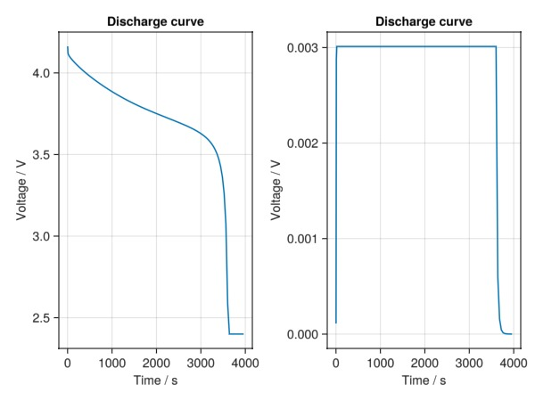

---
# https://vitepress.dev/reference/default-theme-home-page
layout: home

hero:
  name: BattMo
  text: Framework for continuum modelling of lithium-ion batteries written in Julia
  image:
    src: battmologo_stacked.png
    alt: BattMo
  tagline: 
  actions:
    - theme: brand
      text: Getting started
      link: /man/intro
    - theme: alt
      text: View on Github
      link: https://github.com/sintefmath/BattMo.jl
    - theme: alt
      text: Run a battery cycle
      link: /examples/example_cycle

features:
  - icon: 🔋
    title: Feature 1
    details: Details 1
    link: /examples

  - icon: ⏳
    title: Feature 2
    details: Details 2
    link: /examples

  - icon: ⚡
    title: Details 3
    details: We have dark mode
    link: /man/advanced
---


# BattMo.jl is a framework for continuum modelling of lithium-ion batteries written in Julia {#BattMo.jl-is-a-framework-for-continuum-modelling-of-lithium-ion-batteries-written-in-Julia}

The Battery Modelling Toolbox (**BattMo**) is a resource for continuum modelling of electrochemical devices in MATLAB. The initial development features a pseudo X-dimensional (PXD) framework for the Doyle-Fuller-Newman model of lithium-ion battery cells. This is currently a early release that implements a subset of features from the [MATLAB version of BattMo](https://github.com/BattMoTeam/BattMo) with improved numerical performance. **BattMo.jl** is based on [Jutul.jl](https://github.com/sintefmath/Jutul.jl) and uses finite-volume discretizations and automatic differentiation to simulate models in 1D, 2D and 3D.

The current implementation has two options for setting up simulation cases:
- You can read in input data prepared in the MATLAB version of BattMo (general 3D grids)
  
- Or you can use the common BattMo JSON format to run cases (primarily 1D grids)
  

## Installation

This package is registered in the General Julia registry. To add it to your Julia environment, open Julia and run

```julia
using Pkg; Pkg.add("BattMo")
```


### Getting started {#Getting-started}

For an example of usage, you can add the GLMakie plotting package:

```julia
using Pkg
Pkg.add("GLMakie")
```


You can then run the following to simulate the predefined `p2d_40` case:

```julia
using BattMo
# Simulate case
filename = string(dirname(pathof(BattMo)), "/../test/data/jsonfiles/p2d_40.json")
# Read input from json file
inputparams = readBattMoJsonInputFile(filename)
# run simulation from given input
output = run_battery(inputparams);
# Plot result
using GLMakie
states = output[:states]
t = [state[:Control][:ControllerCV].time for state in states]
E = [state[:Control][:Phi][1] for state in states]
I = [state[:Control][:Current][1] for state in states]
fig = Figure()
ax = Axis(fig[1, 1], ylabel = "Voltage / V", xlabel = "Time / s", title = "Discharge curve")
lines!(ax, t, E)
ax = Axis(fig[1, 2], ylabel = "Voltage / V", xlabel = "Time / s", title = "Discharge curve")
lines!(ax, t, I)
fig
```



## Acknowledgements

BattMo has received funding from the European Union’s Horizon 2020 innovation program under grant agreement numbers:
- 875527 HYDRA
  
- 957189 BIG-MAP
  
- 101104013 BATMAX
  
- 101103997 DigiBatt
  
