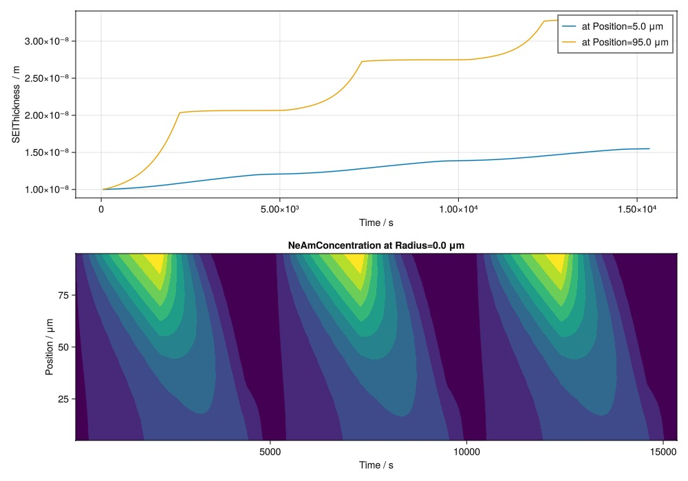

```julia
using BattMo, GLMakie

model_settings = load_model_settings(; from_default_set = "P2D")
model_settings["SEIModel"] = "Bolay"
cell_parameters = load_cell_parameters(; from_default_set = "SEI_example")
cycling_protocol = load_cycling_protocol(; from_default_set = "CCCV")
simulation_settings = load_simulation_settings(; from_default_set = "P2D")

model_setup = LithiumIonBattery(; model_settings)

sim = Simulation(model_setup, cell_parameters, cycling_protocol);

output = solve(sim;)

time_series = get_output_time_series(output)
states = get_output_states(output)
metrics = get_output_metrics(output)

NeAm_end_index = simulation_settings["GridPoints"]["NegativeElectrodeCoating"]

plot_output(
	output,
	[
		["SEIThickness vs Time at Position index 1", "SEIThickness vs Time at Position index $NeAm_end_index"],
		["NeAmConcentration vs Time and Position at Radius index 1"],
	];
	layout = (2, 1),
)
```



plot_dashboard(output; plot_type = &quot;line&quot;)

t = time_series[:Time] I = time_series[:Current] E = time_series[:Voltage]

NeAmC_t10 = states[:NeAmSurfaceConcentration][10, :, 1] PeAmCSurf_t10 = states[:PeAmSurfaceConcentration][10, :] ElyteC_t10 = states[:ElectrolyteConcentration][10, :]

f = Figure() ax = Axis(f[1, 1], title = &quot;Concentrations&quot;, xlabel = &quot;Distance [m]&quot;, ylabel = &quot;Concentration&quot;) lines!(ax, states.x, NeAmC_t10, color = :red, linewidth = 2, label = &quot;NeAm Surface Conc&quot;) lines!(ax, states.x, PeAmCSurf_t10, color = :blue, linewidth = 2, label = &quot;PeAm Surface Conc&quot;) lines!(ax, states.x, ElyteC_t10, color = :green, linewidth = 2, label = &quot;Elyte Conc&quot;) axislegend(ax, position = :rt, valign = :center)

display(f)

## Example on GitHub {#Example-on-GitHub}

If you would like to run this example yourself, it can be downloaded from the BattMo.jl GitHub repository [as a script](https://github.com/BattMoTeam/BattMo.jl/blob/main/examples/example_1d_plotting.jl), or as a [Jupyter Notebook](https://github.com/BattMoTeam/BattMo.jl/blob/gh-pages/dev/final_site/notebooks/example_1d_plotting.ipynb)


---


_This page was generated using [Literate.jl](https://github.com/fredrikekre/Literate.jl)._
