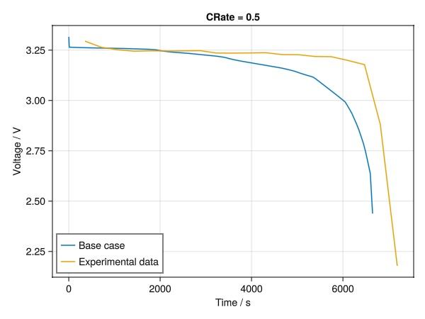
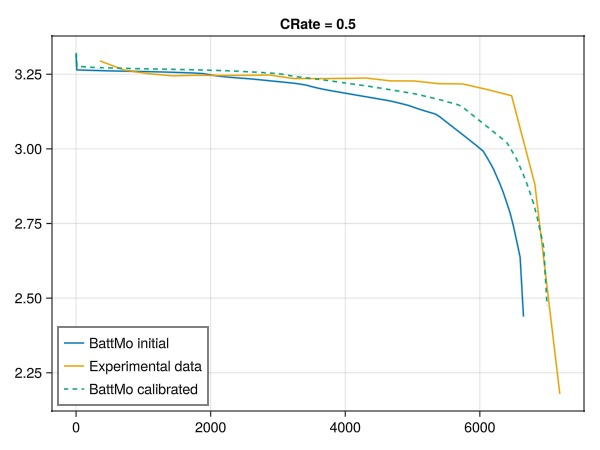
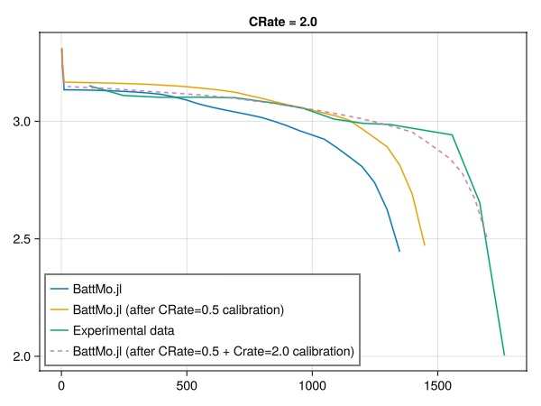
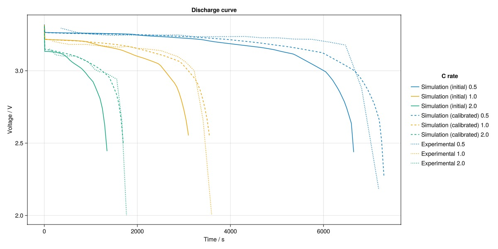

# Gradient-based parameter calibration of a lithium-ion battery model {#Gradient-based-parameter-calibration-of-a-lithium-ion-battery-model}

This example demonstrates how to calibrate a lithium-ion battery against data model using BattMo.jl. The example uses a two-step calibration process:
1. We first calibrate the model against a 0.5C discharge curve (adjusting stoichiometric coefficients and maximum concentration in the active material)
  
2. We then calibrate the model against a 2.0C discharge curve (adjusting reaction rate constants and diffusion coefficients in the active material)
  

Finally, we compare the results of the calibrated model against the experimental data for discharge rates of 0.5C, 1.0C, and 2.0C.

## Load packages and set up helper functions {#Load-packages-and-set-up-helper-functions}

```julia
using BattMo, Jutul
using CSV
using DataFrames
using GLMakie

function get_tV(x)
    t = [state[:Control][:Controller].time for state in x[:states]]
    V = [state[:Control][:Phi][1] for state in x[:states]]
    return (t, V)
end

function get_tV(x::DataFrame)
    return (x[:, 1], x[:, 2])
end
```


```
get_tV (generic function with 2 methods)
```


## Load the experimental data and set up a base case {#Load-the-experimental-data-and-set-up-a-base-case}

```julia
battmo_base = normpath(joinpath(pathof(BattMo) |> splitdir |> first, ".."))
exdata = joinpath(battmo_base, "examples", "example_data")
df_05 = CSV.read(joinpath(exdata, "Xu_2015_voltageCurve_05C.csv"), DataFrame)
df_1 = CSV.read(joinpath(exdata, "Xu_2015_voltageCurve_1C.csv"), DataFrame)
df_2 = CSV.read(joinpath(exdata, "Xu_2015_voltageCurve_2C.csv"), DataFrame)

dfs = [df_05, df_1, df_2]

cell_parameters = load_cell_parameters(; from_default_set = "Xu2015")
cycling_protocol = load_cycling_protocol(; from_default_set = "CCDischarge")

cycling_protocol["LowerVoltageLimit"] = 2.25
model_setup = LithiumIonBattery()

cycling_protocol["DRate"] = 0.5
sim = Simulation(model_setup, cell_parameters, cycling_protocol)
output0 = solve(sim)

t0, V0 = get_tV(output0)
t_exp_05, V_exp_05 = get_tV(df_05)
t_exp_1, V_exp_1 = get_tV(df_1)

fig = Figure()
ax = Axis(fig[1, 1], title = "CRate = 0.5", xlabel = "Time / s", ylabel = "Voltage / V")
lines!(ax, t0, V0, label = "Base case")
lines!(ax, t_exp_05, V_exp_05, label = "Experimental data")
axislegend(position = :lb)
fig
```



## Set up the first calibration {#Set-up-the-first-calibration}

We select the following parameters to calibrate:
- &quot;StoichiometricCoefficientAtSOC100&quot; at both electrodes
  
- &quot;StoichiometricCoefficientAtSOC0&quot; at both electrodes
  
- &quot;MaximumConcentration&quot; of both electrodes
  

We also set bounds for these parameters to ensure they remain physically meaningful and possible to simulate. The objective function is the sum of squares: $\sum_i (V_i - V_{exp,i})^2$, where $V_i$ is the voltage from the model and $V_{exp,i}$ is the voltage from the experimental data at step $i$.

We print the setup as a table to give the user the opportunity to review the setup before calibration starts.

```julia
vc05 = VoltageCalibration(t_exp_05, V_exp_05, sim)

free_calibration_parameter!(vc05,
    ["NegativeElectrode","ActiveMaterial", "StoichiometricCoefficientAtSOC100"];
    lower_bound = 0.0, upper_bound = 1.0)
free_calibration_parameter!(vc05,
    ["PositiveElectrode","ActiveMaterial", "StoichiometricCoefficientAtSOC100"];
    lower_bound = 0.0, upper_bound = 1.0)
```


```
VoltageCalibration([357.76627218934914, 715.9763313609469, 1074.1863905325445, 1432.396449704142, 1790.6065088757396, 2148.816568047337, 2507.0266272189347, 2877.5887573964496, 3223.44674556213, 3594.0088757396447, 3952.2189349112427, 4310.42899408284, 4668.639053254437, 5026.8491124260345, 5385.059171597633, 5743.2692307692305, 6101.479289940828, 6472.041420118343, 6817.899408284024, 7188.461538461537], [3.2943262673632967, 3.2638600156322126, 3.2518999695748874, 3.2446281622882482, 3.246486083133996, 3.245753135185418, 3.246253934281757, 3.2472569925301102, 3.2356583102522136, 3.2351808720466657, 3.2359284205519883, 3.237169467875278, 3.227800290612279, 3.2273140920726844, 3.2184384136276525, 3.217458716270091, 3.1992065602836877, 3.177878797019038, 2.8807910485472883, 2.179051790010771], Simulation(BattMo.run_battery, LithiumIonBattery("Setup object for a P2D lithium-ion model", {
    "RampUp" => "Sinusoidal"
    "Metadata" =>     {
        "Description" => "Default model settings for a P2D simulation including a current ramp up, excluding current collectors and SEI effects."
        "Title" => "P2D"
    }
    "TransportInSolid" => "FullDiffusion"
    "ModelFramework" => "P2D"
}, true), {
    "Electrolyte" =>     {
        "TransferenceNumber" => 0.363
        "Description" => "1.5 mol/l LiPF6 dissolved in a mixture of ethylene carbonate (EC):  dimethyl carbonate (DMC) (1:1)"
        "DiffusionCoefficient" =>         {
            "FilePath" => "function_parameters_Xu2015.jl"
            "FunctionName" => "electrolyte_diffusivity_Xu_2015"
        }
        "IonicConductivity" =>         {
            "FilePath" => "function_parameters_Xu2015.jl"
            "FunctionName" => "electrolyte_conductivity_Xu_2015"
        }
        "Density" => 1210
        "ChargeNumber" => 1
        "Concentration" => 1500
    }
    "Cell" =>     {
        "ElectrodeGeometricSurfaceArea" => 0.007035
        "NominalCapacity" => 16.5
        "ElectrodeWidth" => 0.067
        "ElectrodeLength" => 0.105
        "Name" => "LP2770120"
        "Case" => "Pouch"
        "NominalVoltage" => 3.2
    }
    "Metadata" =>     {
        "Description" => "Parameter set of a commercial Type LP2770120 prismatic LiFePO4/graphite cell, for an electrochemical pseudo-two-dimensional (P2D) model."
        "Source" => "https://doi.org/10.1016/j.energy.2014.11.073"
        "Models" =>         {
            "CurrentCollectors" => "Generic"
            "RampUp" => "Sinusoidal"
            "TransportInSolid" => "FullDiffusion"
            "ModelFramework" => Any["P2D", "P4D Pouch"]
        }
        "Title" => "Xu2015"
    }
    "PositiveElectrode" =>     {
        "ActiveMaterial" =>         {
            "ActivationEnergyOfDiffusion" => 20000
            "NumberOfElectronsTransfered" => 1
            "StoichiometricCoefficientAtSOC0" => 0.999
            "OpenCircuitPotential" =>             {
                "FilePath" => "function_parameters_Xu2015.jl"
                "FunctionName" => "open_circuit_potential_lfp_Xu_2015"
            }
            "ReactionRateConstant" => 3.626e-11
            "MassFraction" => 1.0
            "StoichiometricCoefficientAtSOC100" => 0.14778
            "ActivationEnergyOfReaction" => 4000
            "MaximumConcentration" => 26390
            "VolumetricSurfaceArea" => 1878261
            "Description" => "LiFePO4"
            "DiffusionCoefficient" => 1.25e-15
            "ParticleRadius" => 1.15e-6
            "Density" => 1500
            "ElectronicConductivity" => 0.01
            "ChargeTransferCoefficient" => 0.5
        }
        "ElectrodeCoating" =>         {
            "BruggemanCoefficient" => 1.5
            "EffectiveDensity" => 1080
            "Thickness" => 9.2e-5
        }
        "Binder" =>         {
            "Description" => "Unknown"
            "MassFraction" => 0.0
            "Density" => 1100.0
            "ElectronicConductivity" => 100.0
        }
        "CurrentCollector" =>         {
            "Description" => "Aluminum"
            "TabLength" => 0.01
            "Density" => 2700
            "ElectronicConductivity" => 3.83e7
            "Thickness" => 1.6e-5
            "TabWidth" => 0.015
        }
        "ConductiveAdditive" =>         {
            "Description" => "Unknown"
            "MassFraction" => 0.0
            "Density" => 1950.0
            "ElectronicConductivity" => 100.0
        }
    }
    "Separator" =>     {
        "Density" => 779
        "BruggemanCoefficient" => 1.5
        "Thickness" => 2.0e-5
        "Porosity" => 0.4
    }
    "NegativeElectrode" =>     {
        "ActiveMaterial" =>         {
            "ActivationEnergyOfDiffusion" => 4000
            "NumberOfElectronsTransfered" => 1
            "StoichiometricCoefficientAtSOC0" => 0.001
            "OpenCircuitPotential" =>             {
                "FilePath" => "function_parameters_Xu2015.jl"
                "FunctionName" => "open_circuit_potential_graphite_Xu_2015"
            }
            "ReactionRateConstant" => 1.764e-11
            "MassFraction" => 1.0
            "StoichiometricCoefficientAtSOC100" => 0.51873811
            "ActivationEnergyOfReaction" => 4000
            "MaximumConcentration" => 31540
            "VolumetricSurfaceArea" => 142373
            "Description" => "Graphite"
            "DiffusionCoefficient" => 3.9e-14
            "ParticleRadius" => 1.475e-5
            "Density" => 2660
            "ElectronicConductivity" => 2
            "ChargeTransferCoefficient" => 0.5
        }
        "ElectrodeCoating" =>         {
            "BruggemanCoefficient" => 1.5
            "EffectiveDensity" => 1862
            "Thickness" => 5.9e-5
        }
        "Binder" =>         {
            "Description" => "Unknown"
            "MassFraction" => 0.0
            "Density" => 1100.0
            "ElectronicConductivity" => 100.0
        }
        "CurrentCollector" =>         {
            "Description" => "Copper"
            "TabLength" => 0.01
            "Density" => 8900
            "ElectronicConductivity" => 6.33e7
            "Thickness" => 9.0e-6
            "TabWidth" => 0.015
        }
        "ConductiveAdditive" =>         {
            "Description" => "Unknown"
            "MassFraction" => 0.0
            "Density" => 1950.0
            "ElectronicConductivity" => 100.0
        }
    }
}, {
    "TotalNumberOfCycles" => 0
    "InitialControl" => "discharging"
    "InitialStateOfCharge" => 0.99
    "InitialTemperature" => 298.15
    "Metadata" =>     {
        "Description" => "Parameter set for a constant current discharging protocol."
        "Title" => "CCDischarge"
    }
    "DRate" => 0.5
    "LowerVoltageLimit" => 2.25
    "Protocol" => "CC"
    "UpperVoltageLimit" => 4.1
}, {
    "Grid" => Any[]
    "TimeStepDuration" => 50
    "GridPoints" =>     {
        "PositiveElectrodeCoating" => 10
        "Separator" => 3
        "NegativeElectrodeActiveMaterial" => 5
        "PositiveElectrodeCurrentCollectorTabLength" => 3
        "NegativeElectrodeCoating" => 10
        "NegativeElectrodeCurrentCollector" => 2
        "ElectrodeLength" => 10
        "NegativeElectrodeCurrentCollectorTabLength" => 3
        "PositiveElectrodeCurrentCollector" => 2
        "PositiveElectrodeCurrentCollectorTabWidth" => 3
        "ElectrodeWidth" => 10
        "PositiveElectrodeActiveMaterial" => 5
        "NegativeElectrodeCurrentCollectorTabWidth" => 3
    }
    "RampUpTime" => 10
    "RampUpSteps" => 5
}, true), {
    ["NegativeElectrode", "ActiveMaterial", "StoichiometricCoefficientAtSOC100"] => (v0 = 0.51873811, vmin = 0.0, vmax = 1.0)
    ["PositiveElectrode", "ActiveMaterial", "StoichiometricCoefficientAtSOC100"] => (v0 = 0.14778, vmin = 0.0, vmax = 1.0)
}, missing, missing)
```


&quot;StoichiometricCoefficientAtSOC0&quot; at both electrodes

```julia
free_calibration_parameter!(vc05,
    ["NegativeElectrode","ActiveMaterial", "StoichiometricCoefficientAtSOC0"];
    lower_bound = 0.0, upper_bound = 1.0)
free_calibration_parameter!(vc05,
    ["PositiveElectrode","ActiveMaterial", "StoichiometricCoefficientAtSOC0"];
    lower_bound = 0.0, upper_bound = 1.0)
```


```
VoltageCalibration([357.76627218934914, 715.9763313609469, 1074.1863905325445, 1432.396449704142, 1790.6065088757396, 2148.816568047337, 2507.0266272189347, 2877.5887573964496, 3223.44674556213, 3594.0088757396447, 3952.2189349112427, 4310.42899408284, 4668.639053254437, 5026.8491124260345, 5385.059171597633, 5743.2692307692305, 6101.479289940828, 6472.041420118343, 6817.899408284024, 7188.461538461537], [3.2943262673632967, 3.2638600156322126, 3.2518999695748874, 3.2446281622882482, 3.246486083133996, 3.245753135185418, 3.246253934281757, 3.2472569925301102, 3.2356583102522136, 3.2351808720466657, 3.2359284205519883, 3.237169467875278, 3.227800290612279, 3.2273140920726844, 3.2184384136276525, 3.217458716270091, 3.1992065602836877, 3.177878797019038, 2.8807910485472883, 2.179051790010771], Simulation(BattMo.run_battery, LithiumIonBattery("Setup object for a P2D lithium-ion model", {
    "RampUp" => "Sinusoidal"
    "Metadata" =>     {
        "Description" => "Default model settings for a P2D simulation including a current ramp up, excluding current collectors and SEI effects."
        "Title" => "P2D"
    }
    "TransportInSolid" => "FullDiffusion"
    "ModelFramework" => "P2D"
}, true), {
    "Electrolyte" =>     {
        "TransferenceNumber" => 0.363
        "Description" => "1.5 mol/l LiPF6 dissolved in a mixture of ethylene carbonate (EC):  dimethyl carbonate (DMC) (1:1)"
        "DiffusionCoefficient" =>         {
            "FilePath" => "function_parameters_Xu2015.jl"
            "FunctionName" => "electrolyte_diffusivity_Xu_2015"
        }
        "IonicConductivity" =>         {
            "FilePath" => "function_parameters_Xu2015.jl"
            "FunctionName" => "electrolyte_conductivity_Xu_2015"
        }
        "Density" => 1210
        "ChargeNumber" => 1
        "Concentration" => 1500
    }
    "Cell" =>     {
        "ElectrodeGeometricSurfaceArea" => 0.007035
        "NominalCapacity" => 16.5
        "ElectrodeWidth" => 0.067
        "ElectrodeLength" => 0.105
        "Name" => "LP2770120"
        "Case" => "Pouch"
        "NominalVoltage" => 3.2
    }
    "Metadata" =>     {
        "Description" => "Parameter set of a commercial Type LP2770120 prismatic LiFePO4/graphite cell, for an electrochemical pseudo-two-dimensional (P2D) model."
        "Source" => "https://doi.org/10.1016/j.energy.2014.11.073"
        "Models" =>         {
            "CurrentCollectors" => "Generic"
            "RampUp" => "Sinusoidal"
            "TransportInSolid" => "FullDiffusion"
            "ModelFramework" => Any["P2D", "P4D Pouch"]
        }
        "Title" => "Xu2015"
    }
    "PositiveElectrode" =>     {
        "ActiveMaterial" =>         {
            "ActivationEnergyOfDiffusion" => 20000
            "NumberOfElectronsTransfered" => 1
            "StoichiometricCoefficientAtSOC0" => 0.999
            "OpenCircuitPotential" =>             {
                "FilePath" => "function_parameters_Xu2015.jl"
                "FunctionName" => "open_circuit_potential_lfp_Xu_2015"
            }
            "ReactionRateConstant" => 3.626e-11
            "MassFraction" => 1.0
            "StoichiometricCoefficientAtSOC100" => 0.14778
            "ActivationEnergyOfReaction" => 4000
            "MaximumConcentration" => 26390
            "VolumetricSurfaceArea" => 1878261
            "Description" => "LiFePO4"
            "DiffusionCoefficient" => 1.25e-15
            "ParticleRadius" => 1.15e-6
            "Density" => 1500
            "ElectronicConductivity" => 0.01
            "ChargeTransferCoefficient" => 0.5
        }
        "ElectrodeCoating" =>         {
            "BruggemanCoefficient" => 1.5
            "EffectiveDensity" => 1080
            "Thickness" => 9.2e-5
        }
        "Binder" =>         {
            "Description" => "Unknown"
            "MassFraction" => 0.0
            "Density" => 1100.0
            "ElectronicConductivity" => 100.0
        }
        "CurrentCollector" =>         {
            "Description" => "Aluminum"
            "TabLength" => 0.01
            "Density" => 2700
            "ElectronicConductivity" => 3.83e7
            "Thickness" => 1.6e-5
            "TabWidth" => 0.015
        }
        "ConductiveAdditive" =>         {
            "Description" => "Unknown"
            "MassFraction" => 0.0
            "Density" => 1950.0
            "ElectronicConductivity" => 100.0
        }
    }
    "Separator" =>     {
        "Density" => 779
        "BruggemanCoefficient" => 1.5
        "Thickness" => 2.0e-5
        "Porosity" => 0.4
    }
    "NegativeElectrode" =>     {
        "ActiveMaterial" =>         {
            "ActivationEnergyOfDiffusion" => 4000
            "NumberOfElectronsTransfered" => 1
            "StoichiometricCoefficientAtSOC0" => 0.001
            "OpenCircuitPotential" =>             {
                "FilePath" => "function_parameters_Xu2015.jl"
                "FunctionName" => "open_circuit_potential_graphite_Xu_2015"
            }
            "ReactionRateConstant" => 1.764e-11
            "MassFraction" => 1.0
            "StoichiometricCoefficientAtSOC100" => 0.51873811
            "ActivationEnergyOfReaction" => 4000
            "MaximumConcentration" => 31540
            "VolumetricSurfaceArea" => 142373
            "Description" => "Graphite"
            "DiffusionCoefficient" => 3.9e-14
            "ParticleRadius" => 1.475e-5
            "Density" => 2660
            "ElectronicConductivity" => 2
            "ChargeTransferCoefficient" => 0.5
        }
        "ElectrodeCoating" =>         {
            "BruggemanCoefficient" => 1.5
            "EffectiveDensity" => 1862
            "Thickness" => 5.9e-5
        }
        "Binder" =>         {
            "Description" => "Unknown"
            "MassFraction" => 0.0
            "Density" => 1100.0
            "ElectronicConductivity" => 100.0
        }
        "CurrentCollector" =>         {
            "Description" => "Copper"
            "TabLength" => 0.01
            "Density" => 8900
            "ElectronicConductivity" => 6.33e7
            "Thickness" => 9.0e-6
            "TabWidth" => 0.015
        }
        "ConductiveAdditive" =>         {
            "Description" => "Unknown"
            "MassFraction" => 0.0
            "Density" => 1950.0
            "ElectronicConductivity" => 100.0
        }
    }
}, {
    "TotalNumberOfCycles" => 0
    "InitialControl" => "discharging"
    "InitialStateOfCharge" => 0.99
    "InitialTemperature" => 298.15
    "Metadata" =>     {
        "Description" => "Parameter set for a constant current discharging protocol."
        "Title" => "CCDischarge"
    }
    "DRate" => 0.5
    "LowerVoltageLimit" => 2.25
    "Protocol" => "CC"
    "UpperVoltageLimit" => 4.1
}, {
    "Grid" => Any[]
    "TimeStepDuration" => 50
    "GridPoints" =>     {
        "PositiveElectrodeCoating" => 10
        "Separator" => 3
        "NegativeElectrodeActiveMaterial" => 5
        "PositiveElectrodeCurrentCollectorTabLength" => 3
        "NegativeElectrodeCoating" => 10
        "NegativeElectrodeCurrentCollector" => 2
        "ElectrodeLength" => 10
        "NegativeElectrodeCurrentCollectorTabLength" => 3
        "PositiveElectrodeCurrentCollector" => 2
        "PositiveElectrodeCurrentCollectorTabWidth" => 3
        "ElectrodeWidth" => 10
        "PositiveElectrodeActiveMaterial" => 5
        "NegativeElectrodeCurrentCollectorTabWidth" => 3
    }
    "RampUpTime" => 10
    "RampUpSteps" => 5
}, true), {
    ["PositiveElectrode", "ActiveMaterial", "StoichiometricCoefficientAtSOC0"] => (v0 = 0.999, vmin = 0.0, vmax = 1.0)
    ["NegativeElectrode", "ActiveMaterial", "StoichiometricCoefficientAtSOC100"] => (v0 = 0.51873811, vmin = 0.0, vmax = 1.0)
    ["PositiveElectrode", "ActiveMaterial", "StoichiometricCoefficientAtSOC100"] => (v0 = 0.14778, vmin = 0.0, vmax = 1.0)
    ["NegativeElectrode", "ActiveMaterial", "StoichiometricCoefficientAtSOC0"] => (v0 = 0.001, vmin = 0.0, vmax = 1.0)
}, missing, missing)
```


&quot;MaximumConcentration&quot; of both electrodes

```julia
free_calibration_parameter!(vc05,
    ["NegativeElectrode","ActiveMaterial", "MaximumConcentration"];
    lower_bound = 10000.0, upper_bound = 1e5)
free_calibration_parameter!(vc05,
    ["PositiveElectrode","ActiveMaterial", "MaximumConcentration"];
    lower_bound = 10000.0, upper_bound = 1e5)

print_calibration_overview(vc05)
```


```
NegativeElectrode: Active calibration parameters
┌──────────────────────────────────────────────────┬───────────────┬────────────────────┐
│                                             Name │ Initial value │             Bounds │
├──────────────────────────────────────────────────┼───────────────┼────────────────────┤
│              ActiveMaterial.MaximumConcentration │         31540 │ 10000.0 - 100000.0 │
│ ActiveMaterial.StoichiometricCoefficientAtSOC100 │      0.518738 │          0.0 - 1.0 │
│   ActiveMaterial.StoichiometricCoefficientAtSOC0 │         0.001 │          0.0 - 1.0 │
└──────────────────────────────────────────────────┴───────────────┴────────────────────┘
PositiveElectrode: Active calibration parameters
┌──────────────────────────────────────────────────┬───────────────┬────────────────────┐
│                                             Name │ Initial value │             Bounds │
├──────────────────────────────────────────────────┼───────────────┼────────────────────┤
│              ActiveMaterial.MaximumConcentration │         26390 │ 10000.0 - 100000.0 │
│   ActiveMaterial.StoichiometricCoefficientAtSOC0 │         0.999 │          0.0 - 1.0 │
│ ActiveMaterial.StoichiometricCoefficientAtSOC100 │       0.14778 │          0.0 - 1.0 │
└──────────────────────────────────────────────────┴───────────────┴────────────────────┘
```


### Solve the first calibration problem {#Solve-the-first-calibration-problem}

The calibration is performed by solving the optimization problem. This makes use of the adjoint method implemented in Jutul.jl and the LBFGS algorithm.

```julia
solve(vc05);
cell_parameters_calibrated = vc05.calibrated_cell_parameters;
print_calibration_overview(vc05)
```


```
Calibration: Starting calibration of 6 parameters.
It:   0 | val: 3.886e-02 | ls-its: NaN | pgrad: 6.480e+00
It:   1 | val: 1.829e-02 | ls-its: 1 | pgrad: 6.480e+00
It:   2 | val: 4.321e-03 | ls-its: 4 | pgrad: 1.097e+00
It:   3 | val: 4.278e-03 | ls-its: 2 | pgrad: 1.386e-01
It:   4 | val: 4.275e-03 | ls-its: 1 | pgrad: 2.249e-02
It:   5 | val: 4.273e-03 | ls-its: 1 | pgrad: 1.506e-02
It:   6 | val: 4.261e-03 | ls-its: 1 | pgrad: 1.534e-02
It:   7 | val: 4.242e-03 | ls-its: 1 | pgrad: 5.334e-02
It:   8 | val: 4.089e-03 | ls-its: 1 | pgrad: 7.754e-02
LBFGS: Line search unable to succeed in 5 iterations ...
LBFGS: Hessian not updated during iteration 9
It:   9 | val: 3.073e-03 | ls-its: 5 | pgrad: 2.324e-01
LBFGS: Line search unable to succeed in 5 iterations ...
LBFGS: Hessian not updated during iteration 10
It:  10 | val: 3.073e-03 | ls-its: 5 | pgrad: 2.898e-01
Calibration: Calibration finished in 129.213621195 seconds.
NegativeElectrode: Active calibration parameters
┌──────────────────────────────────────────────────┬───────────────┬────────────────────┬─────────────────┬──────────┐
│                                             Name │ Initial value │             Bounds │ Optimized value │   Change │
├──────────────────────────────────────────────────┼───────────────┼────────────────────┼─────────────────┼──────────┤
│              ActiveMaterial.MaximumConcentration │         31540 │ 10000.0 - 100000.0 │         22039.3 │  -30.12% │
│ ActiveMaterial.StoichiometricCoefficientAtSOC100 │      0.518738 │          0.0 - 1.0 │        0.546901 │    5.43% │
│   ActiveMaterial.StoichiometricCoefficientAtSOC0 │         0.001 │          0.0 - 1.0 │       0.0263285 │ 2532.85% │
└──────────────────────────────────────────────────┴───────────────┴────────────────────┴─────────────────┴──────────┘
PositiveElectrode: Active calibration parameters
┌──────────────────────────────────────────────────┬───────────────┬────────────────────┬─────────────────┬─────────┐
│                                             Name │ Initial value │             Bounds │ Optimized value │  Change │
├──────────────────────────────────────────────────┼───────────────┼────────────────────┼─────────────────┼─────────┤
│              ActiveMaterial.MaximumConcentration │         26390 │ 10000.0 - 100000.0 │         29159.3 │  10.49% │
│   ActiveMaterial.StoichiometricCoefficientAtSOC0 │         0.999 │          0.0 - 1.0 │        0.998849 │  -0.02% │
│ ActiveMaterial.StoichiometricCoefficientAtSOC100 │       0.14778 │          0.0 - 1.0 │          0.1328 │ -10.14% │
└──────────────────────────────────────────────────┴───────────────┴────────────────────┴─────────────────┴─────────┘
```


## Compare the results of the calibration against the experimental data {#Compare-the-results-of-the-calibration-against-the-experimental-data}

We can now compare the results of the calibrated model against the experimental data for the 0.5C discharge curve.

```julia
sim_opt = Simulation(model_setup, cell_parameters_calibrated, cycling_protocol)
output_opt = solve(sim_opt);
t_opt, V_opt = get_tV(output_opt)

fig = Figure()
ax = Axis(fig[1, 1], title = "CRate = 0.5")
lines!(ax, t0, V0, label = "BattMo initial")
lines!(ax, t_exp_05, V_exp_05, label = "Experimental data")
lines!(ax, t_opt, V_opt, label = "BattMo calibrated", linestyle = :dash)
axislegend(position = :lb)
fig
```



## Set up the second calibration {#Set-up-the-second-calibration}

The second calibration is performed against the 2.0C discharge curve. In the same manner as for the first discharge curve, we set up a set of parameters to calibrate against experimental data. The parameters are:
- The reaction rate constant of both electrodes
  
- The diffusion coefficient of both electrodes
  

The calibration this time around starts from the parameters calibrated in the first step, so we use the `cell_parameters_calibrated` from the first `solve` call when defining the new object:

```julia
t_exp_2, V_exp_2 = get_tV(df_2)

cycling_protocol2 = deepcopy(cycling_protocol)
cycling_protocol2["DRate"] = 2.0
sim2 = Simulation(model_setup, cell_parameters_calibrated, cycling_protocol2)
output2 = solve(sim2);
t2, V2 = get_tV(output2)

sim2_0 = Simulation(model_setup, cell_parameters, cycling_protocol2)
output2_0 = solve(sim2_0);
t2_0, V2_0 = get_tV(output2_0)

vc2 = VoltageCalibration(t_exp_2, V_exp_2, sim2)

free_calibration_parameter!(vc2,
    ["NegativeElectrode","ActiveMaterial", "ReactionRateConstant"];
    lower_bound = 1e-16, upper_bound = 1e-10)
free_calibration_parameter!(vc2,
    ["PositiveElectrode","ActiveMaterial", "ReactionRateConstant"];
    lower_bound = 1e-16, upper_bound = 1e-10)

free_calibration_parameter!(vc2,
    ["NegativeElectrode","ActiveMaterial", "DiffusionCoefficient"];
    lower_bound = 1e-16, upper_bound = 1e-12)
free_calibration_parameter!(vc2,
    ["PositiveElectrode","ActiveMaterial", "DiffusionCoefficient"];
    lower_bound = 1e-16, upper_bound = 1e-12)
print_calibration_overview(vc2)
```


```
✔️ Validation of CellParameters passed: No issues found.
──────────────────────────────────────────────────
✔️ Validation of CyclingProtocol passed: No issues found.
──────────────────────────────────────────────────
✔️ Validation of SimulationSettings passed: No issues found.
──────────────────────────────────────────────────
Jutul: Simulating 33 minutes, 0.0002274 nanoseconds as 44 report steps
╭────────────────┬──────────┬──────────────┬──────────╮
│ Iteration type │ Avg/step │ Avg/ministep │    Total │
│                │ 34 steps │ 35 ministeps │ (wasted) │
├────────────────┼──────────┼──────────────┼──────────┤
│ Newton         │  3.11765 │      3.02857 │  106 (3) │
│ Linearization  │  4.11765 │          4.0 │  140 (3) │
│ Linear solver  │  3.08824 │          3.0 │  105 (2) │
│ Precond apply  │      0.0 │          0.0 │    0 (0) │
╰────────────────┴──────────┴──────────────┴──────────╯
╭───────────────┬────────┬────────────┬──────────╮
│ Timing type   │   Each │   Relative │    Total │
│               │     ms │ Percentage │       ms │
├───────────────┼────────┼────────────┼──────────┤
│ Properties    │ 0.3268 │    18.29 % │  34.6441 │
│ Equations     │ 0.1536 │    11.36 % │  21.5074 │
│ Assembly      │ 0.0685 │     5.07 % │   9.5940 │
│ Linear solve  │ 0.1660 │     9.29 % │  17.5977 │
│ Linear setup  │ 0.0000 │     0.00 % │   0.0000 │
│ Precond apply │ 0.0000 │     0.00 % │   0.0000 │
│ Update        │ 0.0545 │     3.05 % │   5.7818 │
│ Convergence   │ 0.0681 │     5.03 % │   9.5276 │
│ Input/Output  │ 0.0226 │     0.42 % │   0.7896 │
│ Other         │ 0.8483 │    47.49 % │  89.9247 │
├───────────────┼────────┼────────────┼──────────┤
│ Total         │ 1.7865 │   100.00 % │ 189.3669 │
╰───────────────┴────────┴────────────┴──────────╯
✔️ Validation of CellParameters passed: No issues found.
──────────────────────────────────────────────────
✔️ Validation of CyclingProtocol passed: No issues found.
──────────────────────────────────────────────────
✔️ Validation of SimulationSettings passed: No issues found.
──────────────────────────────────────────────────
Jutul: Simulating 33 minutes, 0.0002274 nanoseconds as 44 report steps
╭────────────────┬──────────┬──────────────┬──────────╮
│ Iteration type │ Avg/step │ Avg/ministep │    Total │
│                │ 32 steps │ 33 ministeps │ (wasted) │
├────────────────┼──────────┼──────────────┼──────────┤
│ Newton         │   3.8125 │      3.69697 │  122 (3) │
│ Linearization  │   4.8125 │      4.66667 │  154 (3) │
│ Linear solver  │  3.78125 │      3.66667 │  121 (2) │
│ Precond apply  │      0.0 │          0.0 │    0 (0) │
╰────────────────┴──────────┴──────────────┴──────────╯
╭───────────────┬────────┬────────────┬──────────╮
│ Timing type   │   Each │   Relative │    Total │
│               │     ms │ Percentage │       ms │
├───────────────┼────────┼────────────┼──────────┤
│ Properties    │ 0.3016 │    29.49 % │  36.8003 │
│ Equations     │ 0.1482 │    18.29 % │  22.8217 │
│ Assembly      │ 0.0643 │     7.94 % │   9.9072 │
│ Linear solve  │ 0.1621 │    15.85 % │  19.7793 │
│ Linear setup  │ 0.0000 │     0.00 % │   0.0000 │
│ Precond apply │ 0.0000 │     0.00 % │   0.0000 │
│ Update        │ 0.0520 │     5.08 % │   6.3449 │
│ Convergence   │ 0.0653 │     8.06 % │  10.0524 │
│ Input/Output  │ 0.0233 │     0.62 % │   0.7681 │
│ Other         │ 0.1502 │    14.68 % │  18.3222 │
├───────────────┼────────┼────────────┼──────────┤
│ Total         │ 1.0229 │   100.00 % │ 124.7961 │
╰───────────────┴────────┴────────────┴──────────╯
NegativeElectrode: Active calibration parameters
┌─────────────────────────────────────┬───────────────┬───────────────────┐
│                                Name │ Initial value │            Bounds │
├─────────────────────────────────────┼───────────────┼───────────────────┤
│ ActiveMaterial.DiffusionCoefficient │       3.9e-14 │ 1.0e-16 - 1.0e-12 │
│ ActiveMaterial.ReactionRateConstant │     1.764e-11 │ 1.0e-16 - 1.0e-10 │
└─────────────────────────────────────┴───────────────┴───────────────────┘
PositiveElectrode: Active calibration parameters
┌─────────────────────────────────────┬───────────────┬───────────────────┐
│                                Name │ Initial value │            Bounds │
├─────────────────────────────────────┼───────────────┼───────────────────┤
│ ActiveMaterial.ReactionRateConstant │     3.626e-11 │ 1.0e-16 - 1.0e-10 │
│ ActiveMaterial.DiffusionCoefficient │      1.25e-15 │ 1.0e-16 - 1.0e-12 │
└─────────────────────────────────────┴───────────────┴───────────────────┘
```


### Solve the second calibration problem {#Solve-the-second-calibration-problem}

```julia
cell_parameters_calibrated2, = solve(vc2);
print_calibration_overview(vc2)
```


```
Calibration: Starting calibration of 4 parameters.
It:   0 | val: 4.731e-02 | ls-its: NaN | pgrad: 3.418e+01
Warning: Resetting 'm' to number of parameters: m = 4
It:   1 | val: 3.674e-03 | ls-its: 1 | pgrad: 3.417e+01
It:   2 | val: 2.755e-03 | ls-its: 2 | pgrad: 4.283e-01
LBFGS: Line search at max step size, Wolfe conditions not satisfied for this step
LBFGS: Hessian not updated during iteration 3
It:   3 | val: 1.468e-03 | ls-its: 1 | pgrad: 2.583e-01
It:   4 | val: 1.422e-03 | ls-its: 1 | pgrad: 3.235e-01
It:   5 | val: 1.384e-03 | ls-its: 1 | pgrad: 6.237e-02
It:   6 | val: 1.323e-03 | ls-its: 1 | pgrad: 4.813e-02
It:   7 | val: 1.317e-03 | ls-its: 1 | pgrad: 9.650e-03
It:   8 | val: 1.287e-03 | ls-its: 1 | pgrad: 9.665e-03
It:   9 | val: 1.209e-03 | ls-its: 2 | pgrad: 1.520e-02
It:  10 | val: 9.666e-04 | ls-its: 2 | pgrad: 8.773e-03
It:  11 | val: 9.134e-04 | ls-its: 2 | pgrad: 1.138e-02
It:  12 | val: 9.017e-04 | ls-its: 2 | pgrad: 1.569e-02
It:  13 | val: 8.986e-04 | ls-its: 2 | pgrad: 1.506e-02
It:  14 | val: 8.977e-04 | ls-its: 2 | pgrad: 1.395e-02
Calibration: Calibration finished in 45.239176772 seconds.
NegativeElectrode: Active calibration parameters
┌─────────────────────────────────────┬───────────────┬───────────────────┬─────────────────┬─────────┐
│                                Name │ Initial value │            Bounds │ Optimized value │  Change │
├─────────────────────────────────────┼───────────────┼───────────────────┼─────────────────┼─────────┤
│ ActiveMaterial.DiffusionCoefficient │       3.9e-14 │ 1.0e-16 - 1.0e-12 │     1.16689e-13 │  199.2% │
│ ActiveMaterial.ReactionRateConstant │     1.764e-11 │ 1.0e-16 - 1.0e-10 │     1.06629e-11 │ -39.55% │
└─────────────────────────────────────┴───────────────┴───────────────────┴─────────────────┴─────────┘
PositiveElectrode: Active calibration parameters
┌─────────────────────────────────────┬───────────────┬───────────────────┬─────────────────┬────────┐
│                                Name │ Initial value │            Bounds │ Optimized value │ Change │
├─────────────────────────────────────┼───────────────┼───────────────────┼─────────────────┼────────┤
│ ActiveMaterial.ReactionRateConstant │     3.626e-11 │ 1.0e-16 - 1.0e-10 │     3.60201e-11 │ -0.66% │
│ ActiveMaterial.DiffusionCoefficient │      1.25e-15 │ 1.0e-16 - 1.0e-12 │         1.0e-16 │ -92.0% │
└─────────────────────────────────────┴───────────────┴───────────────────┴─────────────────┴────────┘
```


## Compare the results of the second calibration against the experimental data {#Compare-the-results-of-the-second-calibration-against-the-experimental-data}

We can now compare the results of the calibrated model against the experimental data for the 2.0C discharge curve. We compare three simulations against the experimental data:
1. The initial simulation with the original parameters.
  
2. The simulation with the parameters calibrated against the 0.5C discharge curve.
  
3. The simulation with the parameters calibrated against the 0.5C and 2.0C discharge curves.
  

```julia
sim_c2 = Simulation(model_setup, cell_parameters_calibrated2, cycling_protocol2)
output2_c = solve(sim_c2, accept_invalid = false);

t2_c = [state[:Control][:Controller].time for state in output2_c[:states]]
V2_c = [state[:Control][:Phi][1] for state in output2_c[:states]]

fig = Figure()
ax = Axis(fig[1, 1], title = "CRate = 2.0")
lines!(ax, t2_0, V2_0, label = "BattMo.jl")
lines!(ax, t2, V2, label = "BattMo.jl (after CRate=0.5 calibration)")

lines!(ax, t_exp_2, V_exp_2, label = "Experimental data")
lines!(ax, t2_c, V2_c, label = "BattMo.jl (after CRate=0.5 + Crate=2.0 calibration)", linestyle = :dash)
axislegend(position = :lb)
fig
```



## Compare the results of the calibrated model against the experimental data {#Compare-the-results-of-the-calibrated-model-against-the-experimental-data}

We can now compare the results of the calibrated model against the experimental data for the 0.5C, 1.0C, and 2.0C discharge curves.

Note that we did not calibrate the model for the 1.0C discharge curve, but we still obtain a good fit.

```julia
CRates = [0.5, 1.0, 2.0]
outputs_base = []
outputs_calibrated = []

for CRate in CRates
	cycling_protocol["DRate"] = CRate
	simuc = Simulation(model_setup, cell_parameters, cycling_protocol)

	output = solve(simuc, info_level = -1)
	push!(outputs_base, (CRate = CRate, output = output))

    simc = Simulation(model_setup, cell_parameters_calibrated2, cycling_protocol)
	output_c = solve(simc, info_level = -1)

    push!(outputs_calibrated, (CRate = CRate, output = output_c))
end

colors = Makie.wong_colors()

fig = Figure(size = (1200, 600))
ax = Axis(fig[1, 1], ylabel = "Voltage / V", xlabel = "Time / s", title = "Discharge curve")

for (i, data) in enumerate(outputs_base)
    t_i, V_i = get_tV(data.output)
    lines!(ax, t_i, V_i, label = "Simulation (initial) $(round(data.CRate, digits = 2))", color = colors[i])
end

for (i, data) in enumerate(outputs_calibrated)
    t_i, V_i = get_tV(data.output)
	lines!(ax, t_i, V_i, label = "Simulation (calibrated) $(round(data.CRate, digits = 2))", color = colors[i], linestyle = :dash)
end

for (i, df) in enumerate(dfs)
    t_i, V_i = get_tV(df)
    label = "Experimental $(round(CRates[i], digits = 2))"
	lines!(ax, t_i, V_i, linestyle = :dot, label = label, color = colors[i])
end

fig[1, 2] = Legend(fig, ax, "C rate", framevisible = false)
fig
```



## Example on GitHub {#Example-on-GitHub}

If you would like to run this example yourself, it can be downloaded from the BattMo.jl GitHub repository [as a script](https://github.com/BattMoTeam/BattMo.jl/blob/main/examples/example_calibration.jl), or as a [Jupyter Notebook](https://github.com/BattMoTeam/BattMo.jl/blob/gh-pages/dev/final_site/notebooks/example_calibration.ipynb)


---


_This page was generated using [Literate.jl](https://github.com/fredrikekre/Literate.jl)._
