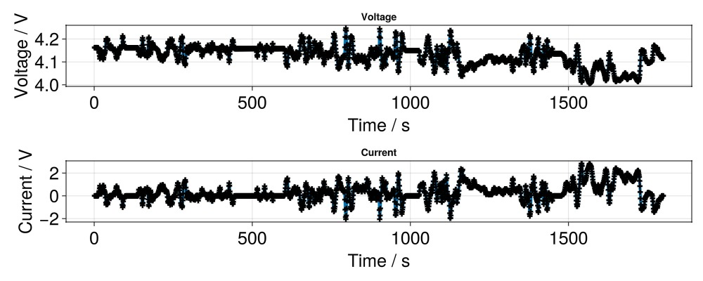

```julia
using BattMo, GLMakie


model_setup = LithiumIonBattery()
cell_parameters = load_cell_parameters(; from_default_set = "Chen2020")
simulation_settings = load_simulation_settings(; from_default_set = "P2D")
simulation_settings["TimeStepDuration"] = 1


cycling_protocol = load_cycling_protocol(; from_default_set = "user_defined_current_function")

cycling_protocol["TotalTime"] = 1800

sim_current = Simulation(model_setup, cell_parameters, cycling_protocol; simulation_settings);

output2 = solve(sim_current);


states2 = output2[:states]

t = [state[:Control][:Controller].time for state in states2]
E = [state[:Control][:Phi][1] for state in states2]
I = [state[:Control][:Current][1] for state in states2]

f = Figure(size = (1000, 400))

ax = Axis(f[1, 1], title = "Voltage", xlabel = "Time / s", ylabel = "Voltage / V",
	xlabelsize = 25,
	ylabelsize = 25,
	xticklabelsize = 25,
	yticklabelsize = 25,
)
scatterlines!(ax, t, E; linewidth = 4, markersize = 10, marker = :cross, markercolor = :black)

f

ax = Axis(f[2, 1], title = "Current", xlabel = "Time / s", ylabel = "Current / V",
	xlabelsize = 25,
	ylabelsize = 25,
	xticklabelsize = 25,
	yticklabelsize = 25,
)
scatterlines!(ax, t, I; linewidth = 4, markersize = 10, marker = :cross, markercolor = :black)

f
```



## Example on GitHub {#Example-on-GitHub}

If you would like to run this example yourself, it can be downloaded from the BattMo.jl GitHub repository [as a script](https://github.com/BattMoTeam/BattMo.jl/blob/main/examples/example_run_current_function.jl), or as a [Jupyter Notebook](https://github.com/BattMoTeam/BattMo.jl/blob/gh-pages/dev/final_site/notebooks/example_run_current_function.ipynb)


---


_This page was generated using [Literate.jl](https://github.com/fredrikekre/Literate.jl)._
