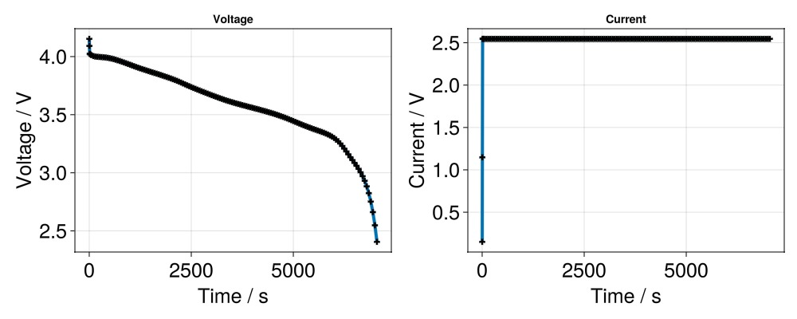

# How to run a simulation {#How-to-run-a-simulation}

BattMo simulations replicates the voltage-current response of a cell. To run a Battmo simulation, the basic workflow is:
- Set up cell parameters
  
- Set up a cycling protocol
  
- Select a model
  
- Prepare a simulation
  
- Run the simulation
  
- Inspect and visualize the outputs of the simulation
  

To start, we load BattMo (battery models and simulations) and GLMakie (plotting).

```julia
using BattMo, GLMakie
```


BattMo stores cell parameters, cycling protocols and settings in a user-friendly JSON format to facilitate reuse. For our example, we read the cell parameter set from a NMC811 vs Graphite-SiOx cell whose parameters were determined in the [Chen 2020 paper](https://doi.org/10.1149/1945-7111/ab9050). We also read an example cycling protocol for a simple Constant Current Discharge.

```julia
cell_parameters = load_cell_parameters(; from_default_set = "Chen2020")
cycling_protocol = load_cycling_protocol(; from_default_set = "CCDischarge")
```


Next, we select the Lithium-Ion Battery Model with default model settings. A model can be thought as a mathematical implementation of the electrochemical and transport phenomena occuring in a real battery cell. The implementation consist of a system of partial differential equations and their corresponding parameters, constants and boundary conditions. The default Lithium-Ion Battery Model selected below corresponds to a basic P2D model, where neither current collectors nor thermal effects are considered.

```julia
model_setup = LithiumIonBattery()
```


```
LithiumIonBattery("Setup object for a P2D lithium-ion model", {
    "RampUp" => "Sinusoidal"
    "Metadata" =>     {
        "Description" => "Default model settings for a P2D simulation including a current ramp up, excluding current collectors and SEI effects."
        "Title" => "P2D"
    }
    "TransportInSolid" => "FullDiffusion"
    "ModelFramework" => "P2D"
}, true)
```


Then we setup a Simulation by passing the model, cell parameters and a cycling protocol. A Simulation can be thought as a procedure to predict how the cell responds to the cycling protocol, by solving the equations in the model using the cell parameters passed. We first prepare the simulation:

```julia
sim = Simulation(model_setup, cell_parameters, cycling_protocol);
```


```
✔️ Validation of CellParameters passed: No issues found.
──────────────────────────────────────────────────
✔️ Validation of CyclingProtocol passed: No issues found.
──────────────────────────────────────────────────
✔️ Validation of SimulationSettings passed: No issues found.
──────────────────────────────────────────────────
```


When the simulation is prepared, there are some validation checks happening in the background, which verify whether the cell parameters, cycling protocol and settings are sensible and complete to run a simulation. It is good practice to ensure that the Simulation has been properly configured by checking if has passed the validation procedure:

```julia
sim.is_valid
```


```
true
```


Now we can run the simulation

```julia
output = solve(sim;)
```


```
Jutul: Simulating 2 hours, 12 minutes as 163 report steps
╭────────────────┬───────────┬───────────────┬──────────╮
│ Iteration type │  Avg/step │  Avg/ministep │    Total │
│                │ 146 steps │ 146 ministeps │ (wasted) │
├────────────────┼───────────┼───────────────┼──────────┤
│ Newton         │   2.32877 │       2.32877 │  340 (0) │
│ Linearization  │   3.32877 │       3.32877 │  486 (0) │
│ Linear solver  │   2.32877 │       2.32877 │  340 (0) │
│ Precond apply  │       0.0 │           0.0 │    0 (0) │
╰────────────────┴───────────┴───────────────┴──────────╯
╭───────────────┬─────────┬────────────┬────────╮
│ Timing type   │    Each │   Relative │  Total │
│               │      ms │ Percentage │      s │
├───────────────┼─────────┼────────────┼────────┤
│ Properties    │  0.0539 │     0.22 % │ 0.0183 │
│ Equations     │  8.2146 │    48.55 % │ 3.9923 │
│ Assembly      │  1.3716 │     8.11 % │ 0.6666 │
│ Linear solve  │  1.7612 │     7.28 % │ 0.5988 │
│ Linear setup  │  0.0000 │     0.00 % │ 0.0000 │
│ Precond apply │  0.0000 │     0.00 % │ 0.0000 │
│ Update        │  1.1625 │     4.81 % │ 0.3953 │
│ Convergence   │  1.6682 │     9.86 % │ 0.8108 │
│ Input/Output  │  0.3143 │     0.56 % │ 0.0459 │
│ Other         │  4.9881 │    20.62 % │ 1.6960 │
├───────────────┼─────────┼────────────┼────────┤
│ Total         │ 24.1880 │   100.00 % │ 8.2239 │
╰───────────────┴─────────┴────────────┴────────╯
```


The ouput is a NamedTuple storing the results of the simulation within multiple dictionaries. Let&#39;s plot the cell current and cell voltage over time and make a plot with the GLMakie package.

```julia
states = output[:states]

t = [state[:Control][:Controller].time for state in states]
E = [state[:Control][:Phi][1] for state in states]
I = [state[:Control][:Current][1] for state in states]


f = Figure(size = (1000, 400))

ax = Axis(f[1, 1], title = "Voltage", xlabel = "Time / s", ylabel = "Voltage / V",
	xlabelsize = 25,
	ylabelsize = 25,
	xticklabelsize = 25,
	yticklabelsize = 25,
)
scatterlines!(ax, t, E; linewidth = 4, markersize = 10, marker = :cross, markercolor = :black)

f

ax = Axis(f[1, 2], title = "Current", xlabel = "Time / s", ylabel = "Current / V",
	xlabelsize = 25,
	ylabelsize = 25,
	xticklabelsize = 25,
	yticklabelsize = 25,
)
scatterlines!(ax, t, I; linewidth = 4, markersize = 10, marker = :cross, markercolor = :black)

f
```



## Example on GitHub {#Example-on-GitHub}

If you would like to run this example yourself, it can be downloaded from the BattMo.jl GitHub repository [as a script](https://github.com/BattMoTeam/BattMo.jl/blob/main/examples/2_run_a_simulation.jl), or as a [Jupyter Notebook](https://github.com/BattMoTeam/BattMo.jl/blob/gh-pages/dev/final_site/notebooks/2_run_a_simulation.ipynb)


---


_This page was generated using [Literate.jl](https://github.com/fredrikekre/Literate.jl)._
