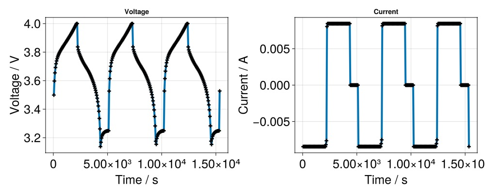
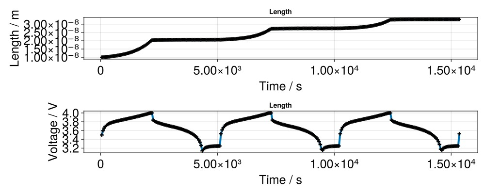

# Selecting a model {#Selecting-a-model}

As mentioned in the first tutorial, a model can be thought as a mathematical implementation of the electrochemical and transport phenomena occuring in a real battery cell. The implementation consist of a system of partial differential equations and their corresponding parameters, constants, boundary conditions and assumptions.

The default Lithium-Ion Battery Model corresponds to a basic P2D model, where neither current collectors, degradation nor thermal effects are considered. BattMo has implemented several variants of the Lithium-Ion Battery Model, which can be accessed by _configuring the model object_. In this tutorial, we’ll configure a P2D model with degradation driven by SEI (Solid Electrolyte Interphase) growth.

### Load BattMo and Model Settings {#Load-BattMo-and-Model-Settings}

```julia
using BattMo, GLMakie
```


Let’s begin by loading the default model settings for a P2D simulation. This will return a ModelSettings object:

```julia
model_settings = load_model_settings(; from_default_set = "P2D")
```


We can inspect all current settings with:

```julia
model_settings.all
```


```
Dict{String, Any} with 4 entries:
  "RampUp"           => "Sinusoidal"
  "Metadata"         => {…
  "TransportInSolid" => "FullDiffusion"
  "ModelFramework"   => "P2D"
```


By default, the "SEIModel" parameter is set to false. Since we want to observe SEI-driven degradation effects, we’ll specify which SEI model we'd like to use, and with that enable the use of the SEI model during the simulation. Let's have a look at which models are available to include in the settings:

```julia
print_submodels_info()
```


```
================================================================================
ℹ️  Submodels Information
================================================================================
Parameter                     Options                       Documentation
--------------------------------------------------------------------------------
CurrentCollectors             Generic                       -
SEIModel                      Bolay                         ]8;;https://battmoteam.github.io/BattMo.jl/dev/manuals/user_guide/sei_model\visit]8;;\
ModelFramework                P2D, P4D Pouch                ]8;;https://battmoteam.github.io/BattMo.jl/dev/manuals/user_guide/pxd_model\visit]8;;\
RampUp                        Sinusoidal                    ]8;;https://battmoteam.github.io/BattMo.jl/dev/manuals/user_guide/ramp_up\visit]8;;\
TransportInSolid              FullDiffusion                 -
```


For the SEI model, we can see there's one model to enable which is the "Bolay" model. We enable it in the model settings:

```julia
model_settings["SEIModel"] = "Bolay"
model_settings.all
```


```
Dict{String, Any} with 5 entries:
  "SEIModel"         => "Bolay"
  "RampUp"           => "Sinusoidal"
  "Metadata"         => {…
  "TransportInSolid" => "FullDiffusion"
  "ModelFramework"   => "P2D"
```


### Initialize the Model {#Initialize-the-Model}

Let’s now create the battery model using the modified settings:

```julia
model_setup = LithiumIonBattery(; model_settings);
```


```
✔️ Validation of ModelSettings passed: No issues found.
──────────────────────────────────────────────────
```


When setting up the model, the LithiumIonBattery constructor runs a validation on the model_settings. In this case, because we set the "SEIModel" parameter to true, the validator provides a warning that we should define which SEI model we would like to use. If we ignore any warnings and pass the model to the Simulation constructor then we get an error. Let's create such a situation:

```julia
model_settings["SEIModel"] = "Bola"


model_setup = LithiumIonBattery(; model_settings);
```


```
🔍 Validation of ModelSettings failed with 1 issue:

──────────────────────────────────────────────────
──────────────────────────────────────────────────
Issue 1:
📍 Where:       [SEIModel]
🔢 Provided:    Bola
🔑 Rule:        enum = ["Bolay"]
🛠  Issue:       Value must be one of: Bolay

──────────────────────────────────────────────────
```


We get a warning that a validation issue has been encountered. For now we ignore it:

```julia
cell_parameters_sei = load_cell_parameters(; from_default_set = "SEI_example")
cccv_protocol = load_cycling_protocol(; from_default_set = "CCCV")

	sim = Simulation(model_setup, cell_parameters_sei, cccv_protocol)
```


```
Oops! Your Model object is not valid. 🛑

TIP: Validation happens when instantiating the Model object.
Check the warnings to see exactly where things went wrong. 🔍
```


As expected, this results in an error because we didn't specify the SEI model correctly.

### Specify SEI Model and Rebuild {#Specify-SEI-Model-and-Rebuild}

Let's resolve the issue again and run the simulation:

```julia
model_settings["SEIModel"] = "Bolay"
```


Now rebuild the model:

```julia
model_setup = LithiumIonBattery(; model_settings);
```


```
✔️ Validation of ModelSettings passed: No issues found.
──────────────────────────────────────────────────
```


Now we can setup the simulation and run it.

```julia
sim = Simulation(model_setup, cell_parameters_sei, cccv_protocol)
output = solve(sim)
```


```
✔️ Validation of CellParameters passed: No issues found.
──────────────────────────────────────────────────
✔️ Validation of CyclingProtocol passed: No issues found.
──────────────────────────────────────────────────
✔️ Validation of SimulationSettings passed: No issues found.
──────────────────────────────────────────────────
Jutul: Simulating 15 hours as 1080 report steps
╭────────────────┬───────────┬───────────────┬─────────────╮
│ Iteration type │  Avg/step │  Avg/ministep │       Total │
│                │ 308 steps │ 435 ministeps │    (wasted) │
├────────────────┼───────────┼───────────────┼─────────────┤
│ Newton         │    7.2013 │       5.09885 │ 2218 (1320) │
│ Linearization  │   8.61364 │       6.09885 │ 2653 (1408) │
│ Linear solver  │    7.2013 │       5.09885 │ 2218 (1320) │
│ Precond apply  │       0.0 │           0.0 │       0 (0) │
╰────────────────┴───────────┴───────────────┴─────────────╯
╭───────────────┬──────────┬────────────┬────────╮
│ Timing type   │     Each │   Relative │  Total │
│               │       μs │ Percentage │      s │
├───────────────┼──────────┼────────────┼────────┤
│ Properties    │  49.7111 │     5.00 % │ 0.1103 │
│ Equations     │ 174.8276 │    21.02 % │ 0.4638 │
│ Assembly      │  73.2536 │     8.81 % │ 0.1943 │
│ Linear solve  │ 272.2418 │    27.36 % │ 0.6038 │
│ Linear setup  │   0.0000 │     0.00 % │ 0.0000 │
│ Precond apply │   0.0000 │     0.00 % │ 0.0000 │
│ Update        │  59.2822 │     5.96 % │ 0.1315 │
│ Convergence   │  70.8424 │     8.52 % │ 0.1879 │
│ Input/Output  │  20.3207 │     0.40 % │ 0.0088 │
│ Other         │ 228.3523 │    22.95 % │ 0.5065 │
├───────────────┼──────────┼────────────┼────────┤
│ Total         │ 995.0445 │   100.00 % │ 2.2070 │
╰───────────────┴──────────┴────────────┴────────╯
```


## Plot of voltage and current {#Plot-of-voltage-and-current}

```julia
states = output[:states]

t = [state[:Control][:Controller].time for state in states]
E = [state[:Control][:Phi][1] for state in states]
I = [state[:Control][:Current][1] for state in states]

f = Figure(size = (1000, 400))

ax = Axis(f[1, 1],
	title = "Voltage",
	xlabel = "Time / s",
	ylabel = "Voltage / V",
	xlabelsize = 25,
	ylabelsize = 25,
	xticklabelsize = 25,
	yticklabelsize = 25,
)

scatterlines!(ax,
	t,
	E;
	linewidth = 4,
	markersize = 10,
	marker = :cross,
	markercolor = :black,
	label = "Julia",
)

ax = Axis(f[1, 2],
	title = "Current",
	xlabel = "Time / s",
	ylabel = "Current / A",
	xlabelsize = 25,
	ylabelsize = 25,
	xticklabelsize = 25,
	yticklabelsize = 25,
)

scatterlines!(ax,
	t,
	I;
	linewidth = 4,
	markersize = 10,
	marker = :cross,
	markercolor = :black,
	label = "Julia",
)
```



## Plot of SEI length {#Plot-of-SEI-length}

We recover the SEI length from the `state` output

```julia
seilength = [state[:NeAm][:SEIlength][end] for state in states]

f = Figure(size = (1000, 400))

ax = Axis(f[1, 1],
	title = "Length",
	xlabel = "Time / s",
	ylabel = "Length / m",
	xlabelsize = 25,
	ylabelsize = 25,
	xticklabelsize = 25,
	yticklabelsize = 25,
)

scatterlines!(ax,
	t,
	seilength;
	linewidth = 4,
	markersize = 10,
	marker = :cross,
	markercolor = :black)

ax = Axis(f[2, 1],
	title = "Length",
	xlabel = "Time / s",
	ylabel = "Voltage / V",
	xlabelsize = 25,
	ylabelsize = 25,
	xticklabelsize = 25,
	yticklabelsize = 25,
)

scatterlines!(ax,
	t,
	E;
	linewidth = 4,
	markersize = 10,
	marker = :cross,
	markercolor = :black)
```



## Example on GitHub {#Example-on-GitHub}

If you would like to run this example yourself, it can be downloaded from the BattMo.jl GitHub repository [as a script](https://github.com/BattMoTeam/BattMo.jl/blob/main/examples/4_select_a_model.jl), or as a [Jupyter Notebook](https://github.com/BattMoTeam/BattMo.jl/blob/gh-pages/dev/final_site/notebooks/4_select_a_model.ipynb)


---


_This page was generated using [Literate.jl](https://github.com/fredrikekre/Literate.jl)._
