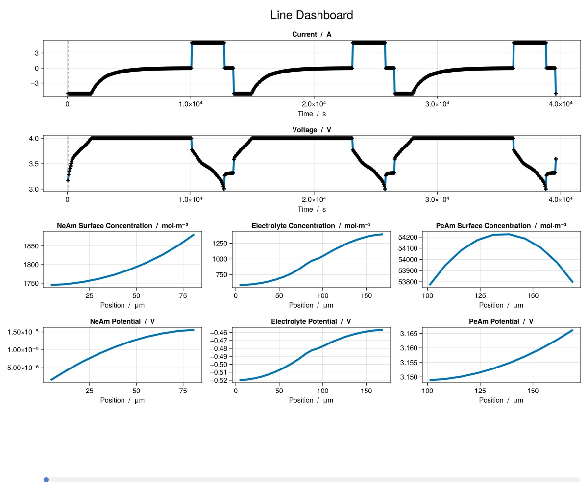

```julia
using BattMo, GLMakie

model_settings = load_model_settings(; from_default_set = "P2D")
model_settings["SEIModel"] = "Bolay"
cell_parameters = load_cell_parameters(; from_default_set = "Chen2020")
cycling_protocol = load_cycling_protocol(; from_default_set = "CCCV")
simulation_settings = load_simulation_settings(; from_default_set = "P2D")

model_setup = LithiumIonBattery(; model_settings)

sim = Simulation(model_setup, cell_parameters, cycling_protocol);

output = solve(sim;)

print_output_overview(output)


time_series = get_output_time_series(output)
states = get_output_states(output)
metrics = get_output_metrics(output)

@info metrics[:RoundTripEfficiency]
```


```ansi
✔️ Validation of ModelSettings passed: No issues found.
──────────────────────────────────────────────────
✔️ Validation of CellParameters passed: No issues found.
──────────────────────────────────────────────────
✔️ Validation of CyclingProtocol passed: No issues found.
──────────────────────────────────────────────────
✔️ Validation of SimulationSettings passed: No issues found.
──────────────────────────────────────────────────
Jutul: Simulating 15 hours as 1080 report steps
╭────────────────┬───────────┬───────────────┬────────────╮
│ Iteration type │  Avg/step │  Avg/ministep │      Total │
│                │ 793 steps │ 838 ministeps │   (wasted) │
├────────────────┼───────────┼───────────────┼────────────┤
│ Newton         │   2.73518 │       2.58831 │ 2169 (440) │
│ Linearization  │   3.79067 │       3.58711 │ 3006 (469) │
│ Linear solver  │   2.73392 │       2.58711 │ 2168 (439) │
│ Precond apply  │       0.0 │           0.0 │      0 (0) │
╰────────────────┴───────────┴───────────────┴────────────╯
╭───────────────┬─────────┬────────────┬─────────╮
│ Timing type   │    Each │   Relative │   Total │
│               │      ms │ Percentage │       s │
├───────────────┼─────────┼────────────┼─────────┤
│ Properties    │  0.1317 │     1.00 % │  0.2856 │
│ Equations     │  2.6696 │    27.98 % │  8.0248 │
│ Assembly      │  1.4054 │    14.73 % │  4.2248 │
│ Linear solve  │  0.5784 │     4.37 % │  1.2545 │
│ Linear setup  │  0.0000 │     0.00 % │  0.0000 │
│ Precond apply │  0.0000 │     0.00 % │  0.0000 │
│ Update        │  1.6455 │    12.45 % │  3.5692 │
│ Convergence   │  2.1889 │    22.95 % │  6.5799 │
│ Input/Output  │  0.2601 │     0.76 % │  0.2180 │
│ Other         │  2.0836 │    15.76 % │  4.5193 │
├───────────────┼─────────┼────────────┼─────────┤
│ Total         │ 13.2209 │   100.00 % │ 28.6760 │
╰───────────────┴─────────┴────────────┴─────────╯

Case: TIME_SERIES
==================================================
Variable                           Unit
--------------------------------------------------
Current                            A
Time                               s
Voltage                            V
==================================================

Case: METRICS
==================================================
Variable                           Unit
--------------------------------------------------
ChargeCapacity                     Ah
ChargeEnergy                       J
CycleNumber                        1
DischargeCapacity                  Ah
DischargeEnergy                    J
RoundTripEfficiency                %
==================================================

Case: STATES
==================================================
Variable                           Unit
--------------------------------------------------
ElectrolyteCharge                  C
ElectrolyteConcentration           mol·m⁻³
ElectrolyteConductivity            S·m⁻¹
ElectrolyteDiffusivity             m2·s
ElectrolyteMass                    g
ElectrolytePotential               V
NeAmConcentration                  mol·L⁻¹
NeAmPotential                      V
NeAmSurfaceConcentration           mol·L⁻¹
NormalizedSEIThickness             m
NormalizedSEIVoltageDrop           V
PeAmCharge                         C
PeAmConcentration                  mol·L⁻¹
PeAmOpenCircuitPotential           V
PeAmPotential                      V
PeAmSurfaceConcentration           mol·L⁻¹
PeAmTemperature                    T
SEIThickness                       m
SEIVoltageDrop                     V
==================================================
[ Info: [77.4128460950647, 88.6738137269977, 88.63390818941055, NaN]
```


Plot a pre-defined dashboard

```julia
plot_dashboard(output)
```



Or create your own dashboard

```julia
NeAm_end_index = simulation_settings["GridResolution"]["NegativeElectrodeCoating"]

plot_output(
	output,
	[
		["SEIThickness vs Time at Position index 1", "SEIThickness vs Time at Position index $NeAm_end_index"],
		["NeAmConcentration vs Time and Position at Radius index 1"],
	];
	layout = (2, 1),
)
```


## Example on GitHub {#Example-on-GitHub}

If you would like to run this example yourself, it can be downloaded from the BattMo.jl GitHub repository [as a script](https://github.com/BattMoTeam/BattMo.jl/blob/main/examples/example_1d_plotting.jl), or as a [Jupyter Notebook](https://github.com/BattMoTeam/BattMo.jl/blob/gh-pages/dev/final_site/notebooks/example_1d_plotting.ipynb)


---


_This page was generated using [Literate.jl](https://github.com/fredrikekre/Literate.jl)._
