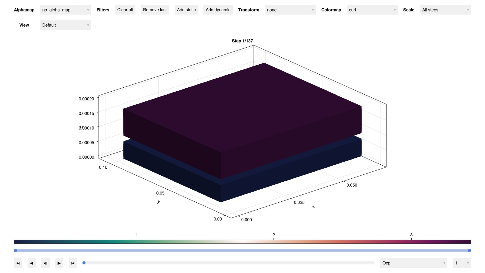

```julia
using BattMo, GLMakie, Jutul

cell_parameters = load_cell_parameters(; from_default_set = "Xu2015")
cycling_protocol = load_cycling_protocol(; from_default_set = "CCDischarge")
model_settings = load_model_settings(; from_default_set = "P4D_pouch")
simulation_settings = load_simulation_settings(; from_default_set = "P4D_pouch")

model_setup = LithiumIonBattery(; model_settings)

sim = Simulation(model_setup, cell_parameters, cycling_protocol; simulation_settings);
output = solve(sim)

plot_interactive_3d(output; colormap = :curl)
```



## Example on GitHub {#Example-on-GitHub}

If you would like to run this example yourself, it can be downloaded from the BattMo.jl GitHub repository [as a script](https://github.com/BattMoTeam/BattMo.jl/blob/main/examples/example_3D_pouch.jl), or as a [Jupyter Notebook](https://github.com/BattMoTeam/BattMo.jl/blob/gh-pages/dev/final_site/notebooks/example_3D_pouch.ipynb)


---


_This page was generated using [Literate.jl](https://github.com/fredrikekre/Literate.jl)._
