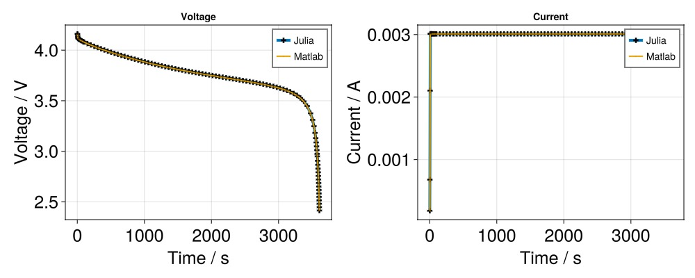

# An example using Matlab input {#An-example-using-Matlab-input}

## We prepare the input. {#We-prepare-the-input.}

```julia
using Jutul, BattMo, GLMakie
```


We load the matlab input file

```julia
name = "p2d_40"
fn = string(dirname(pathof(BattMo)), "/../test/data/matlab_files/", name, ".mat")
inputparams = load_matlab_battmo_input(fn)
```


We want to compare the solution obtained in julia with the solution computed in Matlab. We set the option to load the reference states computed in matlab, which are included in the matlab input file.

```julia
inputparams["use_state_ref"] = true
```


We prepare a hook that will be used by the simulator. In this hook, we modify the tolerance for the current collector. This is necessary because the very high conductivity of the current collector introduces round-off error **when** the current collectors are used in a P**2**D model. We should in fact use effective conductivities for the current collector for one-dimensional model.

```julia
function hook(simulator,
	model,
	state0,
	forces,
	timesteps,
	cfg)

	names = [:Elyte,
		:NeAm,
		:Control,
		:PeAm]

	if inputparams["model"]["include_current_collectors"]
		names = append!(names, [:PeCc, :NeCc])
	end

	for name in names
		cfg[:tolerances][name][:default] = 1e-8
	end

end
```


## We run the simulation and retrieve the output {#We-run-the-simulation-and-retrieve-the-output}

```julia
output = run_battery(inputparams;
	hook = hook,
	max_step = nothing);
states = output[:states]

t = [state[:Control][:Controller].time for state in states]
E = [state[:Control][:Phi][1] for state in states]
I = [state[:Control][:Current][1] for state in states]

nsteps = size(states, 1)
```


```ansi
Jutul: Simulating 1 hour, 9.505 seconds as 103 report steps
╭────────────────┬───────────┬───────────────┬──────────╮
│ Iteration type │  Avg/step │  Avg/ministep │    Total │
│                │ 103 steps │ 103 ministeps │ (wasted) │
├────────────────┼───────────┼───────────────┼──────────┤
│ Newton         │   2.42718 │       2.42718 │  250 (0) │
│ Linearization  │   3.42718 │       3.42718 │  353 (0) │
│ Linear solver  │   2.42718 │       2.42718 │  250 (0) │
│ Precond apply  │       0.0 │           0.0 │    0 (0) │
╰────────────────┴───────────┴───────────────┴──────────╯
╭───────────────┬─────────┬────────────┬─────────╮
│ Timing type   │    Each │   Relative │   Total │
│               │      ms │ Percentage │       s │
├───────────────┼─────────┼────────────┼─────────┤
│ Properties    │  0.2428 │     0.39 % │  0.0607 │
│ Equations     │ 19.5703 │    44.32 % │  6.9083 │
│ Assembly      │  5.4387 │    12.32 % │  1.9198 │
│ Linear solve  │  0.3953 │     0.63 % │  0.0988 │
│ Linear setup  │  0.0000 │     0.00 % │  0.0000 │
│ Precond apply │  0.0000 │     0.00 % │  0.0000 │
│ Update        │  3.1180 │     5.00 % │  0.7795 │
│ Convergence   │  6.0884 │    13.79 % │  2.1492 │
│ Input/Output  │  1.3463 │     0.89 % │  0.1387 │
│ Other         │ 14.1280 │    22.66 % │  3.5320 │
├───────────────┼─────────┼────────────┼─────────┤
│ Total         │ 62.3483 │   100.00 % │ 15.5871 │
╰───────────────┴─────────┴────────────┴─────────╯
```


## We retrieve the reference states computed in matlab. {#We-retrieve-the-reference-states-computed-in-matlab.}

```julia
statesref = inputparams["states"]
timeref   = t
Eref      = [state["Control"]["E"] for state in statesref[1:nsteps]]
Iref      = [state["Control"]["I"] for state in statesref[1:nsteps]]
```


## We plot the results and compare the two simulations {#We-plot-the-results-and-compare-the-two-simulations}

```julia
f = Figure(size = (1000, 400))

ax = Axis(f[1, 1],
	title = "Voltage",
	xlabel = "Time / s",
	ylabel = "Voltage / V",
	xlabelsize = 25,
	ylabelsize = 25,
	xticklabelsize = 25,
	yticklabelsize = 25,
)

scatterlines!(ax,
	t,
	E;
	linewidth = 4,
	markersize = 10,
	marker = :cross,
	markercolor = :black,
	label = "Julia",
)


scatterlines!(ax,
	t,
	Eref;
	linewidth = 2,
	marker = :cross,
	markercolor = :black,
	markersize = 1,
	label = "Matlab")
axislegend()

ax = Axis(f[1, 2],
	title = "Current",
	xlabel = "Time / s",
	ylabel = "Current / A",
	xlabelsize = 25,
	ylabelsize = 25,
	xticklabelsize = 25,
	yticklabelsize = 25,
)

scatterlines!(ax,
	t,
	I;
	linewidth = 4,
	markersize = 10,
	marker = :cross,
	markercolor = :black,
	label = "Julia",
)

scatterlines!(ax,
	t,
	Iref;
	linewidth = 2,
	marker = :cross,
	markercolor = :black,
	markersize = 1,
	label = "Matlab")
axislegend()
```


We observe a perfect match between the Matlab and Julia simulations.


## Example on GitHub {#Example-on-GitHub}

If you would like to run this example yourself, it can be downloaded from the BattMo.jl GitHub repository [as a script](https://github.com/BattMoTeam/BattMo.jl/blob/main/examples/example_battery.jl), or as a [Jupyter Notebook](https://github.com/BattMoTeam/BattMo.jl/blob/gh-pages/dev/final_site/notebooks/example_battery.ipynb)


---


_This page was generated using [Literate.jl](https://github.com/fredrikekre/Literate.jl)._
