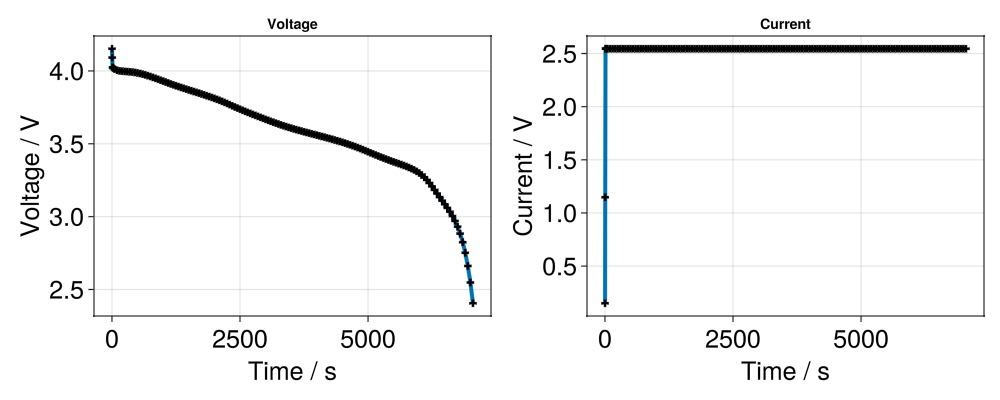

# Handling simulation outputs {#Handling-simulation-outputs}

In this tutorial we will explore the outputs of a simulation for interesting tasks:
- Plot voltage and current curves
  
- Plot overpotentials
  
- Plot cell states in space and time
  
- Save outputs
  
- Load outputs.
  

Lets start with loading some pre-defined cell parameters, cycling protocols, and running a simulation.

```julia
using BattMo, GLMakie

cell_parameters = load_cell_parameters(; from_default_set = "Chen2020")
cycling_protocol = load_cycling_protocol(; from_default_set = "CCDischarge")

model_setup = LithiumIonBattery()

sim = Simulation(model_setup, cell_parameters, cycling_protocol);

output = solve(sim)
```


```ansi
✔️ Validation of ModelSettings passed: No issues found.
──────────────────────────────────────────────────
✔️ Validation of CellParameters passed: No issues found.
──────────────────────────────────────────────────
✔️ Validation of CyclingProtocol passed: No issues found.
──────────────────────────────────────────────────
✔️ Validation of SimulationSettings passed: No issues found.
──────────────────────────────────────────────────
Jutul: Simulating 2 hours, 12 minutes as 163 report steps
╭────────────────┬───────────┬───────────────┬──────────╮
│ Iteration type │  Avg/step │  Avg/ministep │    Total │
│                │ 146 steps │ 146 ministeps │ (wasted) │
├────────────────┼───────────┼───────────────┼──────────┤
│ Newton         │   2.32877 │       2.32877 │  340 (0) │
│ Linearization  │   3.32877 │       3.32877 │  486 (0) │
│ Linear solver  │   2.32877 │       2.32877 │  340 (0) │
│ Precond apply  │       0.0 │           0.0 │    0 (0) │
╰────────────────┴───────────┴───────────────┴──────────╯
╭───────────────┬──────────┬────────────┬──────────╮
│ Timing type   │     Each │   Relative │    Total │
│               │       μs │ Percentage │       ms │
├───────────────┼──────────┼────────────┼──────────┤
│ Properties    │  34.4043 │     3.96 % │  11.6975 │
│ Equations     │ 288.7257 │    47.50 % │ 140.3207 │
│ Assembly      │  61.3144 │    10.09 % │  29.7988 │
│ Linear solve  │ 161.3272 │    18.57 % │  54.8513 │
│ Linear setup  │   0.0000 │     0.00 % │   0.0000 │
│ Precond apply │   0.0000 │     0.00 % │   0.0000 │
│ Update        │  45.5553 │     5.24 % │  15.4888 │
│ Convergence   │  61.7744 │    10.16 % │  30.0223 │
│ Input/Output  │  21.1965 │     1.05 % │   3.0947 │
│ Other         │  29.7602 │     3.43 % │  10.1185 │
├───────────────┼──────────┼────────────┼──────────┤
│ Total         │ 868.8015 │   100.00 % │ 295.3925 │
╰───────────────┴──────────┴────────────┴──────────╯
```


Now we&#39;ll have a look into what the output entail. The ouput is of type NamedTuple and contains multiple dicts. Lets print the keys of each dict.

```julia
keys(output)
```


```ansi
(:states, :cellSpecifications, :reports, :inputparams, :extra)
```


So we can see the the output contains state data, cell specifications, reports on the simulation, the input parameters of the simulation, and some extra data. The most important dicts, that we&#39;ll dive a bit deeper into, are the states and cell specifications. First let&#39;s see how the states output is structured.

### States {#States}

```julia
states = output[:states]
typeof(states)
```


```ansi
Vector{OrderedDict{Symbol, Any}} (alias for Array{OrderedCollections.OrderedDict{Symbol, Any}, 1})
```


As we can see, the states output is a Vector that contains dicts.

```julia
keys(states)
```


```ansi
145-element LinearIndices{1, Tuple{Base.OneTo{Int64}}}:
   1
   2
   3
   4
   5
   6
   7
   8
   9
  10
   ⋮
 137
 138
 139
 140
 141
 142
 143
 144
 145
```


In this case it consists of 77 dicts. Each dict represents a time step in the simulation and each time step stores quantities divided into battery component related group. This structure agrees with the overal model structure of BattMo.

```julia
initial_state = states[1]
keys(initial_state)
```


```ansi
KeySet for a OrderedCollections.OrderedDict{Symbol, Any} with 5 entries. Keys:
  :NeAm
  :Elyte
  :PeAm
  :Control
  :substates
```


So each time step contains quantities related to the electrolyte, the negative electrode active material, the cycling control, and the positive electrode active material. Lets print the stored quantities for each group.

Electrolyte keys:

```julia
keys(initial_state[:Elyte])
```


```ansi
KeySet for a OrderedCollections.OrderedDict{Symbol, Any} with 6 entries. Keys:
  :Phi
  :C
  :Charge
  :Mass
  :Conductivity
  :Diffusivity
```


Negative electrode active material keys:

```julia
keys(initial_state[:NeAm])
```


```ansi
KeySet for a OrderedCollections.OrderedDict{Symbol, Any} with 6 entries. Keys:
  :Phi
  :Cp
  :Cs
  :Charge
  :Ocp
  :Temperature
```


Positive electrode active material keys:

```julia
keys(initial_state[:PeAm])
```


```ansi
KeySet for a OrderedCollections.OrderedDict{Symbol, Any} with 6 entries. Keys:
  :Phi
  :Cp
  :Cs
  :Charge
  :Ocp
  :Temperature
```


Control keys:

```julia
keys(initial_state[:Control])
```


```ansi
KeySet for a OrderedCollections.OrderedDict{Symbol, Any} with 3 entries. Keys:
  :Phi
  :Current
  :Controller
```


### Cell specifications {#Cell-specifications}

Now lets see what quantities are stored within the cellSpecifications dict in the simulation output.

```julia
cell_specifications = output[:cellSpecifications];
keys(cell_specifications)
```


```ansi
KeySet for a Dict{Any, Any} with 4 entries. Keys:
  "NegativeElectrodeCapacity"
  "MaximumEnergy"
  "PositiveElectrodeCapacity"
  "Mass"
```


Let&#39;s say we want to plot the cell current and cell voltage over time. First we&#39;ll retrieve these three quantities from the output.

```julia
states = output[:states]

t = [state[:Control][:Controller].time for state in states]
E = [state[:Control][:Phi][1] for state in states]
I = [state[:Control][:Current][1] for state in states]
```


Now we can use GLMakie to create a plot. Lets first plot the cell voltage.

```julia
f = Figure(size = (1000, 400))

ax = Axis(f[1, 1],
	title = "Voltage",
	xlabel = "Time / s",
	ylabel = "Voltage / V",
	xlabelsize = 25,
	ylabelsize = 25,
	xticklabelsize = 25,
	yticklabelsize = 25,
)


scatterlines!(ax,
	t,
	E;
	linewidth = 4,
	markersize = 10,
	marker = :cross,
	markercolor = :black,
)
```


And the cell current.

```julia
ax = Axis(f[1, 2],
	title = "Current",
	xlabel = "Time / s",
	ylabel = "Current / V",
	xlabelsize = 25,
	ylabelsize = 25,
	xticklabelsize = 25,
	yticklabelsize = 25,
)


scatterlines!(ax,
	t,
	I;
	linewidth = 4,
	markersize = 10,
	marker = :cross,
	markercolor = :black,
)
```



## Retrieving other quantities {#Retrieving-other-quantities}

Concentration

```julia
negative_electrode_surface_concentration = Array([[state[:NeAm][:Cs] for state in states]]);
positive_electrode_surface_concentration = Array([[state[:PeAm][:Cs] for state in states]]);
negative_electrode_particle_concentration = Array([[state[:NeAm][:Cp] for state in states]]);
positive_electrode_particle_concentration = Array([[state[:PeAm][:Cp] for state in states]]);
electrolyte_concentration = [state[:Elyte][:C] for state in states];
```


Potential

```julia
negative_electrode_potential = [state[:NeAm][:Phi] for state in states];
electrolyte_potential = [state[:Elyte][:Phi] for state in states];
positive_electrode_potential = [state[:PeAm][:Phi] for state in states];
```


Grid wrapper: We need Jutul to get the grid wrapper.

```julia
using Jutul

extra = output[:extra]
model = extra[:model]
negative_electrode_grid_wrap = physical_representation(model[:NeAm]);
electrolyte_grid_wrap = physical_representation(model[:Elyte]);
positive_electrode_grid_wrap = physical_representation(model[:PeAm]);
```


Mesh cell centroids coordinates

```julia
centroids_NeAm = negative_electrode_grid_wrap[:cell_centroids, Cells()];
centroids_Elyte = electrolyte_grid_wrap[:cell_centroids, Cells()];
print(centroids_Elyte)
centroids_PeAm = positive_electrode_grid_wrap[:cell_centroids, Cells()];
```


```ansi
[4.259999999999998e-6 1.2780000000000001e-5 2.1299999999999993e-5 2.981999999999999e-5 3.834000000000001e-5 4.6859999999999975e-5 5.538e-5 6.39e-5 7.241999999999997e-5 8.094000000000001e-5 8.720000000000003e-5 9.119999999999998e-5 9.520000000000001e-5 0.00010098000000000003 0.00010854000000000003 0.00011610000000000004 0.00012366000000000002 0.00013122000000000003 0.00013878000000000002 0.00014634 0.00015389999999999995 0.00016146 0.00016901999999999998; 0.051350000000000014 0.05135000000000001 0.05134999999999999 0.05135000000000001 0.05135000000000001 0.05134999999999998 0.05135000000000002 0.051350000000000014 0.051350000000000014 0.051350000000000014 0.051350000000000014 0.05134999999999997 0.051350000000000014 0.051349999999999965 0.05134999999999999 0.05134999999999997 0.051349999999999965 0.05134999999999997 0.05134999999999998 0.05134999999999999 0.05134999999999998 0.05134999999999999 0.051349999999999986; 0.4999999999999998 0.4999999999999999 0.49999999999999983 0.5 0.5 0.49999999999999994 0.5000000000000002 0.5 0.5 0.5 0.5 0.49999999999999994 0.5 0.4999999999999998 0.5 0.4999999999999999 0.4999999999999998 0.4999999999999999 0.49999999999999994 0.4999999999999999 0.5 0.5 0.5000000000000001]
```


Boundary faces coordinates

```julia
boundaries_NeAm = negative_electrode_grid_wrap[:boundary_centroids, BoundaryFaces()];
boundaries_Elyte = electrolyte_grid_wrap[:boundary_centroids, BoundaryFaces()];
boundaries_PeAm = positive_electrode_grid_wrap[:boundary_centroids, BoundaryFaces()];
```


UPDATE WITH NEW OUTPUT API

### The simulation output {#The-simulation-output}

### Access overpotentials {#Access-overpotentials}

### Plot cell states {#Plot-cell-states}

### Save and load outputs {#Save-and-load-outputs}

## Example on GitHub {#Example-on-GitHub}

If you would like to run this example yourself, it can be downloaded from the BattMo.jl GitHub repository [as a script](https://github.com/BattMoTeam/BattMo.jl/blob/main/examples/3_handle_outputs.jl), or as a [Jupyter Notebook](https://github.com/BattMoTeam/BattMo.jl/blob/gh-pages/dev/final_site/notebooks/3_handle_outputs.ipynb)


---


_This page was generated using [Literate.jl](https://github.com/fredrikekre/Literate.jl)._
